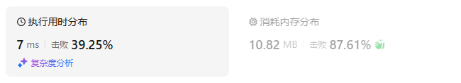
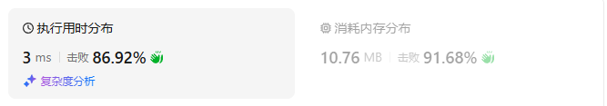
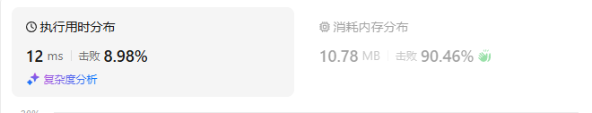
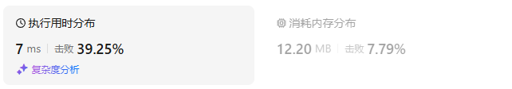
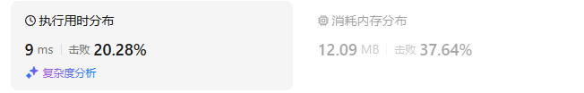
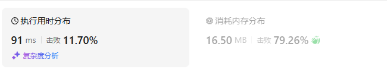
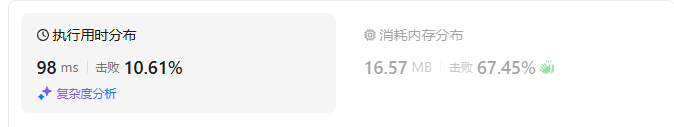
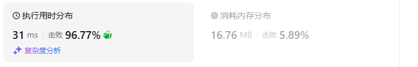
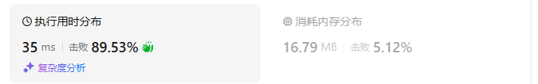

# 496下一个更大元素I

[496. 下一个更大元素 I - 力扣（LeetCode）](https://leetcode.cn/problems/next-greater-element-i/description/)

## 题目描述

`nums1` 中数字 `x` 的 **下一个更大元素** 是指 `x` 在 `nums2` 中对应位置 **右侧** 的 **第一个** 比 `x` 大的元素。

给你两个 **没有重复元素** 的数组 `nums1` 和 `nums2` ，下标从 **0** 开始计数，其中`nums1` 是 `nums2` 的子集。

对于每个 `0 <= i < nums1.length` ，找出满足 `nums1[i] == nums2[j]` 的下标 `j` ，并且在 `nums2` 确定 `nums2[j]` 的 **下一个更大元素** 。如果不存在下一个更大元素，那么本次查询的答案是 `-1` 。

返回一个长度为 `nums1.length` 的数组 `ans` 作为答案，满足 `ans[i]` 是如上所述的 **下一个更大元素** 。

 

**示例 1：**

```
输入：nums1 = [4,1,2], nums2 = [1,3,4,2].
输出：[-1,3,-1]
解释：nums1 中每个值的下一个更大元素如下所述：
- 4 ，用加粗斜体标识，nums2 = [1,3,4,2]。不存在下一个更大元素，所以答案是 -1 。
- 1 ，用加粗斜体标识，nums2 = [1,3,4,2]。下一个更大元素是 3 。
- 2 ，用加粗斜体标识，nums2 = [1,3,4,2]。不存在下一个更大元素，所以答案是 -1 。
```

**示例 2：**

```
输入：nums1 = [2,4], nums2 = [1,2,3,4].
输出：[3,-1]
解释：nums1 中每个值的下一个更大元素如下所述：
- 2 ，用加粗斜体标识，nums2 = [1,2,3,4]。下一个更大元素是 3 。
- 4 ，用加粗斜体标识，nums2 = [1,2,3,4]。不存在下一个更大元素，所以答案是 -1 。
```

 

**提示：**

- `1 <= nums1.length <= nums2.length <= 1000`
- `0 <= nums1[i], nums2[i] <= 104`
- `nums1`和`nums2`中所有整数 **互不相同**
- `nums1` 中的所有整数同样出现在 `nums2` 中

 

**进阶：**你可以设计一个时间复杂度为 `O(nums1.length + nums2.length)` 的解决方案吗？

## 我的C++解法

第一种想法是对Nums2进行遍历，维护一个单调栈，使得栈底到栈顶对应的nums2中的数据递增，存入的是索引值。如果当前元素大，直接弹出元素，ans[pop_back] = num2[i]。依照这样的思路创建一个ans数组

然后遍历nums1数组，查找在nums2中的索引，压入ans[index]的结果。这样看来时间复杂度很高，因为每个元素都要进行查找

```cpp
class Solution {
public:
    vector<int> nextGreaterElement(vector<int>& nums1, vector<int>& nums2) {
        // 单调栈，对nums2从左向右遍历
        // 保证大元素在底层
        int n = nums2.size();
        vector<int> stack;
        vector<int> ans(n,-1);
        stack.push_back(0);
        for(int i=1;i<n;i++){
            while(stack.size() && nums2[i]>nums2[stack.back()]){
                // 当前元素大于栈顶元素，栈顶出栈，当前元素尝试入栈
                int cur = stack.back();
                ans[cur] = nums2[i];
                stack.pop_back();
            }
            stack.push_back(i);
        }
        // while(stack.size()){
        //     int cur = stack.back()
        //     ans[cur] = -1;
        //     stack.pop_back();
        // }
        // 下一步是在nums2中找nums1中数据的索引，然后把对应的ans值保存下来。这是一个比较暴力的做法
        vector<int> res;
        for(int x:nums1){
            auto it = find(nums2.begin(),nums2.end(),x);
            res.emplace_back(ans[it-nums2.begin()]);
        }
        return res;
    }
};
```

结果：



如何进行优化？使得没有最后的查询过程？不妨直接确定一个ans 的时候直接查找nums1，因为nums1是短于nums2的

```cpp
class Solution {
public:
    vector<int> nextGreaterElement(vector<int>& nums1, vector<int>& nums2) {
        // 单调栈，对nums2从左向右遍历
        // 保证大元素在底层
        int n = nums2.size();
        int m = nums1.size();
        vector<int> stack;
        vector<int> ans(m,-1);
        stack.push_back(0);
        for(int i=1;i<n;i++){
            while(stack.size() && nums2[i]>nums2[stack.back()]){
                // 当前元素大于栈顶元素，栈顶出栈，当前元素尝试入栈
                int cur = stack.back();
                auto it = find(nums1.begin(),nums1.end(),nums2[cur]);
                if(it!=nums1.end()){
                    ans[it-nums1.begin()] = nums2[i];
                }
                stack.pop_back();
            }
            stack.push_back(i);
        }
        return ans;
    }
};
```

结果：



好好好好好好

这是从左往右访问nums2，那么从右往左的思路呢？

私以为还是要维护一个递增的单调栈

```cpp
class Solution {
public:
    vector<int> nextGreaterElement(vector<int>& nums1, vector<int>& nums2) {
        // 单调栈，对nums2从右向左遍历
        // 保证大元素在底层
        int n = nums2.size();
        int m = nums1.size();
        vector<int> stack;
        vector<int> ans(m,-1);
        stack.push_back(n-1);
        for(int i=n-2;i>=0;i--){
            while(stack.size() && nums2[i]>nums2[stack.back()]){
                // 当前元素大于栈顶元素，栈顶出栈，当前元素尝试入栈
                stack.pop_back();
            }
            auto it = find(nums1.begin(),nums1.end(),nums2[i]);
            if(it!=nums1.end() && stack.size()!=0){
                ans[it-nums1.begin()] = nums2[stack.back()];
            }            
            stack.push_back(i);
        }
        return ans;
    }
};
```

结果：



真是奇了怪了，为什么时间这么高呢

## C++参考答案

### 从右往左

```cpp
class Solution {
public:
    vector<int> nextGreaterElement(vector<int>& nums1, vector<int>& nums2) {
        unordered_map<int, int> idx;
        for (int i = 0; i < nums1.size(); i++) {
            idx[nums1[i]] = i;
        }
        vector<int> ans(nums1.size(), -1);
        stack<int> st;
        for (int i = nums2.size() - 1; i >= 0; i--) {
            int x = nums2[i];
            while (!st.empty() && x >= st.top()) {
                // 由于 x 的出现，栈顶元素永远不会是左边元素的「下一个更大元素」
                st.pop();
            }
            if (!st.empty() && idx.contains(x)) { // x 在 nums1 中
                ans[idx[x]] = st.top(); // 记录答案
            }
            st.push(x);
        }
        return ans;
    }
};
```

结果：



- 时间复杂度：O(*n*+*m*)，其中 *n* 是 *nums*1 的长度，*m* 是 *nums*2 的长度。虽然我们写了个二重循环，但站在每个元素的视角看，这个元素在二重循环中最多入栈出栈各一次，因此二重循环的循环次数**之和**是 O(*m*)。
- 空间复杂度：O(*n*+*m*)。

### 从左往右

```cpp
class Solution {
public:
    vector<int> nextGreaterElement(vector<int>& nums1, vector<int>& nums2) {
        unordered_map<int, int> idx;
        for (int i = 0; i < nums1.size(); i++) {
            idx[nums1[i]] = i;
        }
        vector<int> ans(nums1.size(), -1);
        stack<int> st;
        for (int x : nums2) {
            while (!st.empty() && x > st.top()) {
                // x 是栈顶的下一个更大元素
                // 既然栈顶已经算出答案，弹出
                ans[idx[st.top()]] = x; // 记录答案
                st.pop();
            }
            if (idx.contains(x)) { // x 在 nums1 中
                st.push(x); // 只需把在 nums1 中的元素入栈
            }
        }
        return ans;
    }
};
```

结果：



- 时间复杂度：O(*n*+*m*)，其中 *n* 是 *nums*1 的长度，*m* 是 *nums*2 的长度。虽然我们写了个二重循环，但站在每个元素的视角看，这个元素在二重循环中最多入栈出栈各一次，因此二重循环的循环次数**之和**是 O(*m*)。
- 空间复杂度：O(*n*)。由于只把在 *nums*1 中的元素入栈，所以栈的大小不会超过 *n*。注意题目保证 *nums*2 的所有元素互不相同，所以栈中没有相同元素。

## C++收获

### C++中的contains函数

<center>关键词：contians<center>

在C++中，`contains` 是一个标准库函数，它属于 `<iterator>` 头文件中的 `std` 命名空间。`contains` 函数用于检查一个范围内是否存在某个特定的值。这个函数是C++20标准引入的，因此它在C++20之前的版本中不可用。

和py中的` x in list `效果一致

#### 函数原型

```cpp
template <class ForwardIterator, class T>
bool contains(ForwardIterator first, ForwardIterator last, const T& value);
```

#### 参数

- `first, last`: 这是一对迭代器，定义了要搜索的范围。`first` 指向范围的开始，而 `last` 指向范围的结束（不包含在内）。
- `value`: 这是要搜索的值。

#### 返回值

- 如果在由 `first` 和 `last` 定义的范围内找到了 `value`，则返回 `true`。
- 否则返回 `false`。

#### 使用示例

```cpp
#include <iostream>
#include <vector>
#include <algorithm>

int main() {
    std::vector<int> vec = {1, 2, 3, 4, 5};

    // 检查是否存在值3
    bool hasThree = std::contains(vec.begin(), vec.end(), 3);
    std::cout << "Contains 3: " << hasThree << std::endl;

    // 检查是否存在值6
    bool hasSix = std::contains(vec.begin(), vec.end(), 6);
    std::cout << "Contains 6: " << hasSix << std::endl;

    return 0;
}
```

也可以直接对容器（可以是数组、vector、哈希表等）进行.contains方法来查找是否有x元素。

下例子对idx哈希表进行查找，查找的是键是否在哈希表中。

```cpp
unordered_map<int, int> idx;
for (int i = 0; i < nums1.size(); i++) {
    idx[nums1[i]] = i;
}

if (idx.contains(x)) { // x 在 nums1 中
    st.push(x); // 只需把在 nums1 中的元素入栈
}
```

#### 输出

```
Contains 3: 1
Contains 6: 0
```

#### 注意事项

1. **性能**：`contains` 函数的时间复杂度通常是 O(n)，因为它需要遍历整个范围来检查值是否存在。
2. **C++20**：这个函数是C++20中引入的，如果你使用的是C++20之前的编译器，你需要使用其他方法来实现相同的功能，例如使用 `std::find` 来检查值是否存在。
3. **迭代器类型**：`contains` 需要前向迭代器（ForwardIterator），这意味着它适用于大多数容器，如 `std::vector`、`std::list`、`std::deque` 等，但不适用于像 `std::array` 这样的数组类型，因为它们不提供迭代器。

这个函数提供了一种简洁的方式来检查容器中是否存在某个元素，使得代码更加直观和易于理解。


## 我的python解答

从左到右遍历

```python
class Solution:
    def nextGreaterElement(self, nums1: List[int], nums2: List[int]) -> List[int]:
        stack = []
        m, n = len(nums1), len(nums2)
        ans = [-1]*m
        index = [0]*m
        for i in range(m):
            index[i] = nums2.index(nums1[i])

        stack.append(0)
        for i in range(1,n):
            while len(stack) and nums2[i]>nums2[stack[-1]]:
                cur = stack.pop()
                if cur in index:
                    ans[nums1.index(nums2[cur])] = nums2[i]
            stack.append(i)
        return ans
```

结果：



从右向左遍历

```python
class Solution:
    def nextGreaterElement(self, nums1: List[int], nums2: List[int]) -> List[int]:
        stack = []
        m, n = len(nums1), len(nums2)
        ans = [-1]*m
        index = [0]*m
        for i in range(m):
            index[i] = nums2.index(nums1[i])

        stack.append(n-1)
        for i in range(n-2,-1,-1):
            while len(stack) and nums2[i]>nums2[stack[-1]]:
                stack.pop()
            if i in index and len(stack)!=0:
                ans[nums1.index(nums2[i])] = nums2[stack[-1]]
            stack.append(i)
        return ans
```

结果：



## python参考答案

### 方法一：从右到左

从右往左倒着遍历，栈中记录下一个更大元素的「候选项」。

由于左边更大元素会「挡住」右边更小的元素，所以右边更小的元素是无用信息（不会成为左边元素的下一个更大元素），这会导致栈底（右边）大，栈顶（左边）小。

对于本题，先把 *nums*1 的每个元素及其下标记录到一个哈希表 *idx* 中。然后遍历 *nums*2，维护单调栈。如果栈不为空且 *x*=*nums*2[*i*] 在 *nums*1 中，则把栈顶元素记录到答案 *ans*[*idx*[*x*]] 中。

```py
class Solution:
    def nextGreaterElement(self, nums1: List[int], nums2: List[int]) -> List[int]:
        idx = {x: i for i, x in enumerate(nums1)}
        ans = [-1] * len(nums1)
        st = []
        for x in reversed(nums2):
            while st and x >= st[-1]:
                # 由于 x 的出现，栈顶元素永远不会是左边元素的「下一个更大元素」
                st.pop()
            if st and x in idx:  # x 在 nums1 中
                ans[idx[x]] = st[-1]  # 记录答案
            st.append(x)
        return ans
```

结果：



- 时间复杂度：O(*n*+*m*)，其中 *n* 是 *nums*1 的长度，*m* 是 *nums*2 的长度。虽然我们写了个二重循环，但站在每个元素的视角看，这个元素在二重循环中最多入栈出栈各一次，因此二重循环的循环次数**之和**是 O(*m*)。
- 空间复杂度：O(*n*+*m*)。

### 方法二：从左到右

栈中记录还没算出「下一个更大元素」的那些数。

只要遍历到比栈顶元素更大的数，就意味着栈顶元素找到了答案，记录答案，并弹出栈顶。

注意我们只需把在 *nums*1 中的元素入栈。**这种写法的空间复杂度比方法一更优**，见下面的复杂度分析。

```py
class Solution:
    def nextGreaterElement(self, nums1: List[int], nums2: List[int]) -> List[int]:
        idx = {x: i for i, x in enumerate(nums1)}
        ans = [-1] * len(nums1)
        st = []
        for x in nums2:
            while st and x > st[-1]:
                # x 是栈顶的下一个更大元素
                # 既然栈顶已经算出答案，弹出
                ans[idx[st.pop()]] = x  # 记录答案
            if x in idx:  # x 在 nums1 中
                st.append(x)  # 只需把在 nums1 中的元素入栈
        return ans
```

结果：



复杂度分析

- 时间复杂度：O(*n*+*m*)，其中 *n* 是 *nums*1 的长度，*m* 是 *nums*2 的长度。虽然我们写了个二重循环，但站在每个元素的视角看，这个元素在二重循环中最多入栈出栈各一次，因此二重循环的循环次数**之和**是 O(*m*)。
- 空间复杂度：O(*n*)。由于只把在 *nums*1 中的元素入栈，所以栈的大小不会超过 *n*。注意题目保证 *nums*2 的所有元素互不相同，所以栈中没有相同元素。

## python收获

### py实现把列表元素和索引映射到哈希表

<center>关键词：列表的哈希映射<center>

<center>关键词：list的哈希映射<center>

```python
idx = {x: i for i, x in enumerate(nums1)}
```


在Python中，可以使用字典（`dict`）来实现一个哈希表，将列表中的元素及其索引映射到哈希表中。下面是一个简单的示例代码，它将列表中的每个元素及其对应的索引存储到一个字典中：

```python
def map_elements_to_hashtable(lst):
    hashtable = {}
    for index, element in enumerate(lst):
        hashtable[element] = index
    return hashtable

# 示例列表
my_list = ['apple', 'banana', 'cherry', 'date']

# 调用函数并打印结果
hashtable = map_elements_to_hashtable(my_list)
print(hashtable)
```

在这个例子中，`map_elements_to_hashtable` 函数接受一个列表 `lst` 作为参数，然后使用 `enumerate` 函数遍历列表，`enumerate` 会同时返回元素的索引和值。然后，将元素作为键，索引作为值，存储到字典 `hashtable` 中。

请注意，如果列表中有重复的元素，字典中只会保留最后一个元素的索引，因为字典的键是唯一的。

如果你需要保留所有元素及其索引，可以使用列表作为字典的值：

```python
def map_elements_to_hashtable_with_duplicates(lst):
    hashtable = {}
    for index, element in enumerate(lst):
        if element in hashtable:
            hashtable[element].append(index)
        else:
            hashtable[element] = [index]
    return hashtable

# 示例列表
my_list = ['apple', 'banana', 'cherry', 'apple']

# 调用函数并打印结果
hashtable = map_elements_to_hashtable_with_duplicates(my_list)
print(hashtable)
```

在这个修改后的版本中，如果遇到重复的元素，我们会将索引追加到该元素对应的列表中，这样就可以保留所有元素及其索引了。