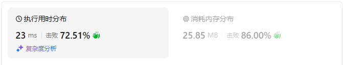
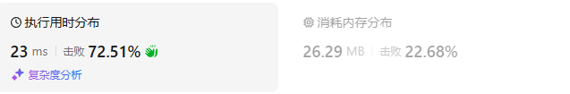
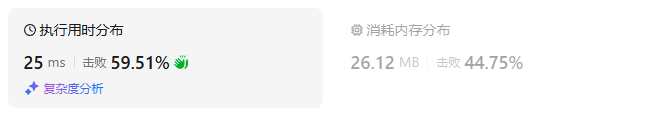
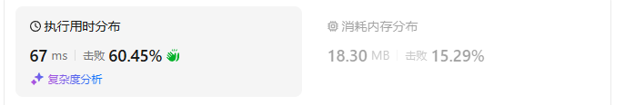
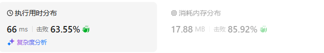
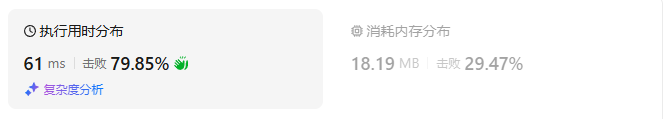

# 503下一个更大元素II（中等）

[503. 下一个更大元素 II - 力扣（LeetCode）](https://leetcode.cn/problems/next-greater-element-ii/description/)

## 题目描述

给定一个循环数组 `nums` （ `nums[nums.length - 1]` 的下一个元素是 `nums[0]` ），返回 *`nums` 中每个元素的 **下一个更大元素*** 。

数字 `x` 的 **下一个更大的元素** 是按数组遍历顺序，这个数字之后的第一个比它更大的数，这意味着你应该循环地搜索它的下一个更大的数。如果不存在，则输出 `-1` 。

 

**示例 1:**

```
输入: nums = [1,2,1]
输出: [2,-1,2]
解释: 第一个 1 的下一个更大的数是 2；
数字 2 找不到下一个更大的数； 
第二个 1 的下一个最大的数需要循环搜索，结果也是 2。
```

**示例 2:**

```
输入: nums = [1,2,3,4,3]
输出: [2,3,4,-1,4]
```

 

**提示:**

- `1 <= nums.length <= 104`
- `-109 <= nums[i] <= 109`

## 我的C++解法

说白了，维护一个单调栈，最多两次即可确定所有的答案

直接模n也是可以的

```cpp
class Solution {
public:
    vector<int> nextGreaterElements(vector<int>& nums) {
        vector<int> stack;// 单调栈
        int n = nums.size();
        vector<int> ans(n,-1);
        // 从左到右遍历,最多两轮即可确定所有数字的下一个最大
        for(int i=0;i<n;i++){
            while(stack.size() && nums[i]>nums[stack.back()]){
                int tmp = stack.back();
                stack.pop_back();
                ans[tmp] = nums[i];
            }
            stack.push_back(i);
        }
        for(int i=0;i<n;i++){
            while(stack.size() && nums[i]>nums[stack.back()]){
                int tmp = stack.back();
                stack.pop_back();
                ans[tmp] = nums[i];
            }
            stack.push_back(i);
        }
        return ans;
    }
};
```

结果：



## C++参考答案

### 从右到左

```cpp
class Solution {
public:
    vector<int> nextGreaterElements(vector<int>& nums) {
        int n = nums.size();
        vector<int> ans(n, -1);
        stack<int> st;
        for (int i = 2 * n - 1; i >= 0; i--) {
            int x = nums[i % n];
            while (!st.empty() && x >= st.top()) {
                // 由于 x 的出现，栈顶元素永远不会是左边元素的「下一个更大元素」
                st.pop();
            }
            if (i < n && !st.empty()) {
                ans[i] = st.top();
            }
            st.push(x);
        }
        return ans;
    }
};
```

结果：



- 时间复杂度：O(*n*)，其中 *n* 是 *nums* 的长度。虽然我们写了个二重循环，但站在每个元素的视角看，这个元素在二重循环中最多入栈出栈各一次，因此循环次数**之和**是 O(*n*)，所以时间复杂度是 O(*n*)。
- 空间复杂度：O(*n*)。

### 从左到右

```cpp
class Solution {
public:
    vector<int> nextGreaterElements(vector<int>& nums) {
        int n = nums.size();
        vector<int> ans(n, -1);
        stack<int> st;
        for (int i = 0; i < 2 * n; i++) {
            int x = nums[i % n];
            while (!st.empty() && x > nums[st.top()]) {
                // x 是 nums[st.top()] 的下一个更大元素
                // 既然 nums[st.top()] 已经算出答案，则从栈顶弹出
                ans[st.top()] = x;
                st.pop();
            }
            if (i < n) {
                st.push(i);
            }
        }
        return ans;
    }
};
```

结果：



- 时间复杂度：O(*n*)，其中 *n* 是 *nums* 的长度。虽然我们写了个二重循环，但站在每个元素的视角看，这个元素在二重循环中最多入栈出栈各一次，因此循环次数**之和**是 O(*n*)，所以时间复杂度是 O(*n*)。
- 空间复杂度：O(*n*)。

## C++收获


## 我的python解答

```python
class Solution:
    def nextGreaterElements(self, nums: List[int]) -> List[int]:
        # 从左到右
        n = len(nums)
        stack = []
        ans = [-1]*n
        for i,x in enumerate(nums):
            while len(stack) and x>nums[stack[-1]]:
                tmp = stack.pop()
                ans[tmp] = x
            stack.append(i)
        for i,x in enumerate(nums):
            while len(stack) and x>nums[stack[-1]]:
                tmp = stack.pop()
                ans[tmp] = x
            stack.append(i)
        return ans
```

结果：



## python参考答案

### 从右到左

```py
class Solution:
    def nextGreaterElements(self, nums: List[int]) -> List[int]:
        n = len(nums)
        ans = [-1] * n
        st = []
        for i in range(n * 2 - 1, -1, -1):
            x = nums[i % n]
            while st and x >= st[-1]:
                # 由于 x 的出现，栈顶元素永远不会是左边元素的「下一个更大元素」
                st.pop()
            if st and i < n:
                ans[i] = st[-1]
            st.append(x)
        return ans
```

结果：



### 从左到右

```py
class Solution:
    def nextGreaterElements(self, nums: List[int]) -> List[int]:
        n = len(nums)
        ans = [-1] * n
        st = []
        for i in range(n * 2):
            x = nums[i % n]
            while st and x > nums[st[-1]]:
                # x 是 nums[st[-1]] 的下一个更大元素
                # 既然 nums[st[-1]] 已经算出答案，则从栈顶弹出
                ans[st.pop()] = x
            if i < n:
                st.append(i)
        return ans
```

结果：



## python收获