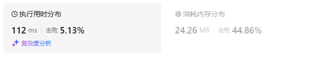
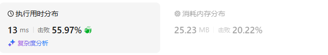
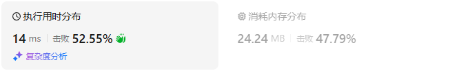
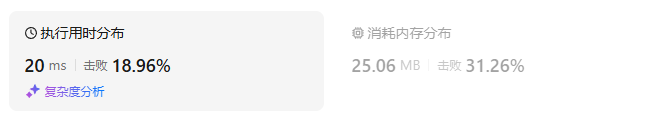
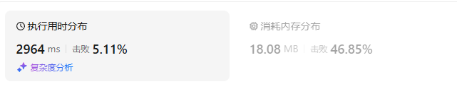
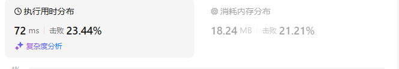
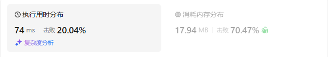
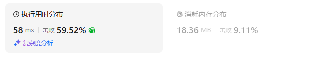

# 42接雨水（困难）

[42. 接雨水 - 力扣（LeetCode）](https://leetcode.cn/problems/trapping-rain-water/description/)

## 题目描述

给定 `n` 个非负整数表示每个宽度为 `1` 的柱子的高度图，计算按此排列的柱子，下雨之后能接多少雨水。

 

**示例 1：**


```
输入：height = [0,1,0,2,1,0,1,3,2,1,2,1]
输出：6
解释：上面是由数组 [0,1,0,2,1,0,1,3,2,1,2,1] 表示的高度图，在这种情况下，可以接 6 个单位的雨水（蓝色部分表示雨水）。 
```

**示例 2：**

```
输入：height = [4,2,0,3,2,5]
输出：9
```

 

**提示：**

- `n == height.length`
- `1 <= n <= 2 * 104`
- `0 <= height[i] <= 105`

## 我的C++解法

### 从左到右遍历

我的初始思路：

构建单调栈，使得栈中元素从底向上递减。如果遇到大于栈底元素的数字，则把所有元素出战，出战次数为n。求出栈底元素和出战元素之差的最小值。。。

后面的思路忘了，反正就是模拟了一遍发现可行。

在实现的时候突然发现，不使用栈，直接在原始数组上修改元素也是可以的。

定义left为左边界（最大元素），如果当前元素大于left对应的值，则`ans+= height[j] - height[left] for i in range(left,i-1)`,相当于把当前元素左侧的所有元素补齐为左边界。然后更新当前元素为左边界

如果当前元素不更新左边界，则：如果小于左侧元素，则不变化，如果大于左侧元素，则把left+1到i-1之间的所有小于当前元素的给补充为当前元素

```cpp
class Solution {
public:
    int trap(vector<int>& height) {
        // 必须要有高有低，然后以低为准
        // 如果计算相邻之间的差距
        // 从左向右遍历，计算当前元素与下一个相邻元素之间的差距
        // 模拟了一下，思路：读取元素与数组首部进行比较，如果大于首部，则全部弹出，取min
        // 不大于首部，则把所有小于当前元素的都改为当前元素，变化量累加
        // vector<int> stack;
        int n = height.size();
        // 压入索引值呢还是数据呢?感觉压入数据的话方便计算
        // stack.push_back(height[0]);
        // for(int i=1;i<n;i++){
        //     if(height[i]>stack.front()){
        //         // 当前元素大于最大元素，需要全部出栈
        //         // wait a min，突然想起来并不需要用栈，直接在原数组中修改值即可
        //     }
        // }
        int ans = 0;
        int left = 0;// 左侧边界初始为0
        for(int i=1;i<n;i++){
            int cur = height[i];
            if(cur>height[left]){
                // 需要更新left的索引为当前的i。遍历left到当前元素，求最小差值
                int left_boundry = height[left];
                for(int j = left;j<i;j++){
                    ans += (left_boundry-height[j]);
                    height[j] = left_boundry;
                }
                left = i;
            }
            else{
                // 不用更新最底层
                if(height[i]>height[i-1]){
                    // 非递减，需要变更元素
                    for(int j=left+1;j<i;j++){
                        if(height[j]<height[i]){
                            ans += (height[i] - height[j]);
                            height[j] = height[i];
                        }
                    }
                }
            }
        }
        return ans;
    }
};
```

结果：



## C++参考答案

### 前后缀分解

```cpp
class Solution {
public:
    int trap(vector<int>& height) {
        int n = height.size();
        vector<int> pre_max(n); // pre_max[i] 表示从 height[0] 到 height[i] 的最大值
        pre_max[0] = height[0];
        for (int i = 1; i < n; i++) {
            pre_max[i] = max(pre_max[i - 1], height[i]);
        }

        vector<int> suf_max(n); // suf_max[i] 表示从 height[i] 到 height[n-1] 的最大值
        suf_max[n - 1] = height[n - 1];
        for (int i = n - 2; i >= 0; i--) {
            suf_max[i] = max(suf_max[i + 1], height[i]);
        }

        int ans = 0;
        for (int i = 0; i < n; i++) {
            ans += min(pre_max[i], suf_max[i]) - height[i]; // 累加每个水桶能接多少水
        }
        return ans;
    }
};
```

结果：



- 时间复杂度：O(*n*)，其中 *n* 为 *height* 的长度。
- 空间复杂度：O(*n*)。

### 双向指针

```cpp
class Solution {
public:
    int trap(vector<int>& height) {
        int ans = 0, left = 0, right = height.size() - 1, pre_max = 0, suf_max = 0;
        while (left < right) {
            pre_max = max(pre_max, height[left]);
            suf_max = max(suf_max, height[right]);
            ans += pre_max < suf_max ? pre_max - height[left++] : suf_max - height[right--];
        }
        return ans;
    }
};
```

结果：



- 时间复杂度：O(*n*)，其中 *n* 为 *height* 的长度。
- 空间复杂度：O(1)，仅用到若干额外变量。

### 单调栈

```cpp
class Solution {
public:
    int trap(vector<int>& height) {
        int ans = 0;
        stack<int> st;
        for (int i = 0; i < height.size(); i++) {
            while (!st.empty() && height[i] >= height[st.top()]) {
                int bottom_h = height[st.top()];
                st.pop();
                if (st.empty()) {
                    break;
                }
                int left = st.top();
                int dh = min(height[left], height[i]) - bottom_h; // 面积的高
                ans += dh * (i - left - 1);
            }
            st.push(i);
        }
        return ans;
    }
};
```

结果：



- 时间复杂度：O(*n*)，其中 *n* 为 *height* 的长度。虽然我们写了个二重循环，但站在每个元素的视角看，这个元素在二重循环中最多入栈出栈各一次，因此循环次数**之和**是 O(*n*)，所以时间复杂度是 O(*n*)。
- 空间复杂度：O(min(*n*,*U*))，其中 *U*=max(*height*)−min(*height*)+1。注意栈中没有重复元素，在 *height* 值域很小的情况下，空间复杂度主要取决于 *height* 的值域范围。

## C++收获


## 我的python解答

### 从左到右

```python
class Solution:
    def trap(self, height: List[int]) -> int:
        # 从左到右
        n = len(height)
        ans = 0
        left = 0
        for i in range(1,n):
            if height[i]>height[left]:
                left_boundry = height[left]
                for j in range(left,i):
                    ans += (left_boundry - height[j])
                    height[j] = height[i]
                left = i
            else:
                if height[i]>height[i-1]:
                    for j in range(left+1,i):
                        if height[j]<height[i]:
                            ans += (height[i] - height[j])
                            height[j] = height[i]
        return ans
```

结果：



## python参考答案

### 前后缀分解

```py
class Solution:
    def trap(self, height: List[int]) -> int:
        n = len(height)
        pre_max = [0] * n  # pre_max[i] 表示从 height[0] 到 height[i] 的最大值
        pre_max[0] = height[0]
        for i in range(1, n):
            pre_max[i] = max(pre_max[i - 1], height[i])

        suf_max = [0] * n  # suf_max[i] 表示从 height[i] 到 height[n-1] 的最大值
        suf_max[-1] = height[-1]
        for i in range(n - 2, -1, -1):
            suf_max[i] = max(suf_max[i + 1], height[i])

        ans = 0
        for h, pre, suf in zip(height, pre_max, suf_max):
            ans += min(pre, suf) - h  # 累加每个水桶能接多少水
        return ans
```

结果：



- 时间复杂度：O(*n*)，其中 *n* 为 *height* 的长度。
- 空间复杂度：O(*n*)。

### 双向指针

```py
class Solution:
    def trap(self, height: List[int]) -> int:
        ans = left = pre_max = suf_max = 0
        right = len(height) - 1
        while left < right:
            pre_max = max(pre_max, height[left])
            suf_max = max(suf_max, height[right])
            if pre_max < suf_max:
                ans += pre_max - height[left]
                left += 1
            else:
                ans += suf_max - height[right]
                right -= 1
        return ans
```

结果：



- 时间复杂度：O(*n*)，其中 *n* 为 *height* 的长度。
- 空间复杂度：O(1)，仅用到若干额外变量。

### 单调栈

```py
class Solution:
    def trap(self, height: List[int]) -> int:
        ans = 0
        st = []
        for i, h in enumerate(height):
            while st and h >= height[st[-1]]:
                bottom_h = height[st.pop()]
                if not st:  # len(st) == 0
                    break
                left = st[-1]
                dh = min(height[left], h) - bottom_h  # 面积的高
                ans += dh * (i - left - 1)
            st.append(i)
        return ans
```

结果：



- 时间复杂度：O(*n*)，其中 *n* 为 *height* 的长度。虽然我们写了个二重循环，但站在每个元素的视角看，这个元素在二重循环中最多入栈出栈各一次，因此循环次数**之和**是 O(*n*)，所以时间复杂度是 O(*n*)。
- 空间复杂度：O(min(*n*,*U*))，其中 *U*=max(*height*)−min(*height*)+1。注意栈中没有重复元素，在 *height* 值域很小的情况下，空间复杂度主要取决于 *height* 的值域范围。

## python收获