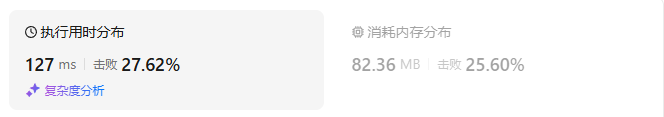

# 84柱状图中最大的矩形（困难）

[84. 柱状图中最大的矩形 - 力扣（LeetCode）](https://leetcode.cn/problems/largest-rectangle-in-histogram/description/)

## 题目描述

给定 *n* 个非负整数，用来表示柱状图中各个柱子的高度。每个柱子彼此相邻，且宽度为 1 。

求在该柱状图中，能够勾勒出来的矩形的最大面积。

 

**示例 1:**


```
输入：heights = [2,1,5,6,2,3]
输出：10
解释：最大的矩形为图中红色区域，面积为 10
```

**示例 2：**


```
输入： heights = [2,4]
输出： 4
```

 

**提示：**

- `1 <= heights.length <=105`
- `0 <= heights[i] <= 104`

## 我的C++解法

如果在昨天的基础上，外层遍历，如果只计算以当前元素为最小元素的结果呢？不太行啊，比如5，3，4，按照这个思路的话最大分别是5，6，4，而不是预期的9，6，4了

真没辙了，看答案了

## C++参考答案

首先，面积最大矩形的高度**一定是** *heights* **中的元素**。


假设 *h*=*heights*[*i*] 是矩形的高度，那么矩形的宽度最大是多少？我们需要知道：

- 在 *i* 左侧的**小于** *h* 的最近元素的下标 *left*，如果不存在则为 −1。求出了 *left*，那么 *left*+1 就是在 *i* 左侧的**大于等于** *h* 的最近元素的下标。
- 在 *i* 右侧的**小于** *h* 的最近元素的下标 *right*，如果不存在则为 *n*。求出了 *right*，那么 *right*−1 就是在 *i* 右侧的**大于等于** *h* 的最近元素的下标。

比如示例 1（上图），选择 *i*=2 这个柱子作为矩形高，那么左边小于 *heights*[2]=5 的最近元素的下标为 *left*=1，右边小于 *heights*[2]=5 的最近元素的下标为 *right*=4。

那么矩形的宽度就是 *right*−*left*−1=4−1−1=2，矩形面积为 *h*⋅(*right*−*left*−1)=5⋅2=10。

枚举 *i*，计算对应的矩形面积，更新答案的最大值。

如何快速计算 *left* 和 *right*？这可以用单调栈求出。

```cpp
class Solution {
public:
    int largestRectangleArea(vector<int> &heights) {
        int n = heights.size();
        vector<int> left(n, -1);
        stack<int> st;
        for (int i = 0; i < n; i++) {
            while (!st.empty() && heights[i] <= heights[st.top()]) {
                st.pop();
            }
            if (!st.empty()) {
                left[i] = st.top();
            }
            st.push(i);
        }

        vector<int> right(n, n);
        st = stack<int>();
        for (int i = n - 1; i >= 0; i--) {
            while (!st.empty() && heights[i] <= heights[st.top()]) {
                st.pop();
            }
            if (!st.empty()) {
                right[i] = st.top();
            }
            st.push(i);
        }

        int ans = 0;
        for (int i = 0; i < n; i++) {
            ans = max(ans, heights[i] * (right[i] - left[i] - 1));
        }
        return ans;
    }
};
```

结果：



- 时间复杂度：O(*n*)，其中 *n* 为 *heights* 的长度。
- 空间复杂度：O(*n*)。

## C++收获


## 我的python解答


## python参考答案

```py
class Solution:
    def largestRectangleArea(self, heights: List[int]) -> int:
        n = len(heights)
        left = [-1] * n
        st = []
        for i, x in enumerate(heights):
            while st and x <= heights[st[-1]]:
                st.pop()
            if st:
                left[i] = st[-1]
            st.append(i)

        right = [n] * n
        st.clear()
        for i in range(n - 1, -1, -1):
            x = heights[i]
            while st and x <= heights[st[-1]]:
                st.pop()
            if st:
                right[i] = st[-1]
            st.append(i)

        ans = 0
        for h, l, r in zip(heights, left, right):
            ans = max(ans, h * (r - l - 1))
        return ans
```

结果：


## python收获