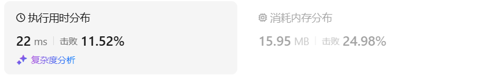
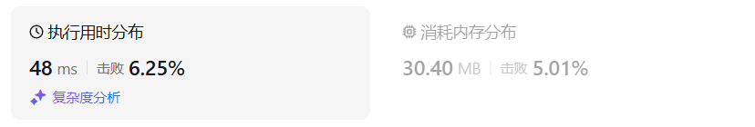
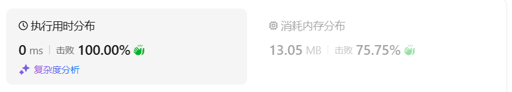
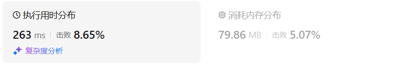
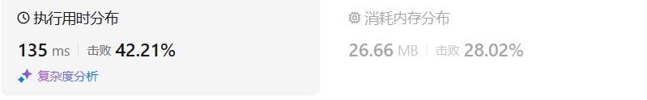
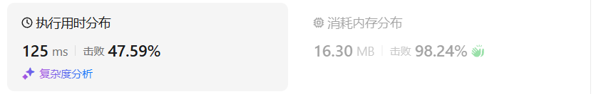
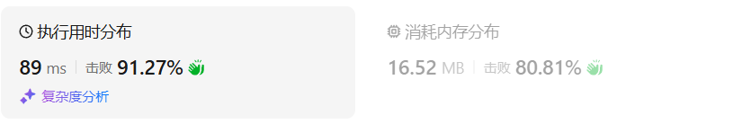

# 188买卖股票的最佳时机IV（困难）

[188. 买卖股票的最佳时机 IV - 力扣（LeetCode）](https://leetcode.cn/problems/best-time-to-buy-and-sell-stock-iv/description/)

## 题目描述

给你一个整数数组 `prices` 和一个整数 `k` ，其中 `prices[i]` 是某支给定的股票在第 `i` 天的价格。

设计一个算法来计算你所能获取的最大利润。你最多可以完成 `k` 笔交易。也就是说，你最多可以买 `k` 次，卖 `k` 次。

**注意：**你不能同时参与多笔交易（你必须在再次购买前出售掉之前的股票）。

 

**示例 1：**

```
输入：k = 2, prices = [2,4,1]
输出：2
解释：在第 1 天 (股票价格 = 2) 的时候买入，在第 2 天 (股票价格 = 4) 的时候卖出，这笔交易所能获得利润 = 4-2 = 2 。
```

**示例 2：**

```
输入：k = 2, prices = [3,2,6,5,0,3]
输出：7
解释：在第 2 天 (股票价格 = 2) 的时候买入，在第 3 天 (股票价格 = 6) 的时候卖出, 这笔交易所能获得利润 = 6-2 = 4 。
     随后，在第 5 天 (股票价格 = 0) 的时候买入，在第 6 天 (股票价格 = 3) 的时候卖出, 这笔交易所能获得利润 = 3-0 = 3 。
```

 

**提示：**

- `1 <= k <= 100`
- `1 <= prices.length <= 1000`
- `0 <= prices[i] <= 1000`

## 我的C++解法

### 记忆化搜索

```cpp
class Solution {
public:
    int maxProfit(int k, vector<int>& prices) {
        int n = prices.size();
        vector<vector<array<int,2>>> memo(n,vector<array<int,2>>(k+1,{-1,-1}));
        auto dfs = [&](auto&& dfs,int i,int k,bool hold)->int{
            if(i<0 || k<=0) return hold? INT_MIN/2: 0;
            int& res = memo[i][k][hold];
            if(res!=-1){
                return res;
            }
            if(hold){
                return res = max(dfs(dfs,i-1,k,true),dfs(dfs,i-1,k-1,false)-prices[i]);
            }
            return res = max(dfs(dfs,i-1,k,false),dfs(dfs,i-1,k,true)+prices[i]);
        };
        return dfs(dfs,n-1,k,false);
    }
};
```

结果：



### 递推

```cpp
class Solution {
public:
    int maxProfit(int k, vector<int>& prices) {
        int n = prices.size();
        vector<vector<vector<int>>> dp(n+1,vector<vector<int>>(k+1,vector<int>(2,0)));
        for(int i=0;i<=k;i++){
            dp[0][i][1] = INT_MIN/2;
        }
        for(int i=0;i<=n;i++){
            dp[i][0][1] = INT_MIN/2;
        }
        for(int i=0;i<n;i++){
            for(int j=k;j>0;j--){
                dp[i+1][j][1] = max(dp[i][j][1],dp[i][j-1][0]-prices[i]);
                dp[i+1][j][0] = max(dp[i][j][1]+prices[i],dp[i][j][0]);
            }
        }
        return dp[n][k][0];
    }
};
```

结果：



### 空间优化

```cpp
class Solution {
public:
    int maxProfit(int k, vector<int>& prices) {
        int n = prices.size();
        vector<vector<vector<int>>> dp(2,vector<vector<int>>(k+1,vector<int>(2,0)));
        for(int i=0;i<=k;i++){
            dp[0][i][1] = INT_MIN/2;
        }
        for(int i=0;i<2;i++){
            dp[i][0][1] = INT_MIN/2;
        }
        for(int i=0;i<n;i++){
            for(int j=k;j>0;j--){
                dp[(i+1)%2][j][1] = max(dp[i%2][j][1],dp[i%2][j-1][0]-prices[i]);
                dp[(i+1)%2][j][0] = max(dp[i%2][j][1]+prices[i],dp[i%2][j][0]);
            }
        }
        return dp[n%2][k][0];
    }
};
```

结果：


### 继续优化

```cpp
class Solution {
public:
    int maxProfit(int k, vector<int>& prices) {
        int n = prices.size();
        vector<vector<int>> dp(k+1,vector<int>(2,0));
        for(int i=0;i<=k;i++){
            dp[i][1] = INT_MIN/2;
        }
        for(int i=0;i<n;i++){
            for(int j=k;j>0;j--){
                dp[j][1] = max(dp[j][1],dp[j-1][0]-prices[i]);
                dp[j][0] = max(dp[j][1]+prices[i],dp[j][0]);
            }
        }
        return dp[k][0];
    }
};
```

结果：



## C++参考答案

使用二维数组 dp[i][j] ：第i天的状态为j，所剩下的最大现金是dp[i][j]

j的状态表示为：

- 0 表示不操作
- 1 第一次买入
- 2 第一次卖出
- 3 第二次买入
- 4 第二次卖出
- .....

**大家应该发现规律了吧 ，除了0以外，偶数就是卖出，奇数就是买入**。

题目要求是至多有K笔交易，那么j的范围就定义为 2 * k + 1 就可以了。

所以二维dp数组的C++定义为：

```cpp
vector<vector<int>> dp(prices.size(), vector<int>(2 * k + 1, 0));
```

dp\[i][1]，**表示的是第i天，买入股票的状态，并不是说一定要第i天买入股票**


达到dp\[i][1]状态，有两个具体操作：

- 操作一：第i天买入股票了，那么dp\[i][1] = dp\[i - 1][0] - prices\[i]
- 操作二：第i天没有操作，而是沿用前一天买入的状态，即：dp\[i][1] = dp\[i - 1][1]

选最大的，所以 dp\[i][1] = max(dp\[i - 1][0] - prices\[i], dp\[i - 1][1]);

同理dp\[i][2]也有两个操作：

- 操作一：第i天卖出股票了，那么dp\[i][2] = dp\[i - 1][1] + prices\[i]
- 操作二：第i天没有操作，沿用前一天卖出股票的状态，即：dp\[i][2] = dp\[i - 1][2]

所以dp\[i][2] = max(dp\[i - 1][1] + prices\[i], dp\[i - 1][2])

同理可以类比剩下的状态，代码如下：

```cpp
for (int j = 0; j < 2 * k - 1; j += 2) {
    dp[i][j + 1] = max(dp[i - 1][j + 1], dp[i - 1][j] - prices[i]);
    dp[i][j + 2] = max(dp[i - 1][j + 2], dp[i - 1][j + 1] + prices[i]);
}
```

**本题和[动态规划：123.买卖股票的最佳时机III (opens new window)](https://programmercarl.com/0123.买卖股票的最佳时机III.html)最大的区别就是这里要类比j为奇数是买，偶数是卖的状态**。


第0天没有操作，这个最容易想到，就是0，即：dp\[0][0] = 0;第0天做第一次买入的操作，dp\[0][1] = -prices[0];**可以推出dp\[0][j]当j为奇数的时候都初始化为 -prices[0]**

```cpp
class Solution {
public:
    int maxProfit(int k, vector<int>& prices) {

        if (prices.size() == 0) return 0;
        vector<vector<int>> dp(prices.size(), vector<int>(2 * k + 1, 0));
        for (int j = 1; j < 2 * k; j += 2) {
            dp[0][j] = -prices[0];
        }
        for (int i = 1;i < prices.size(); i++) {
            for (int j = 0; j < 2 * k - 1; j += 2) {
                dp[i][j + 1] = max(dp[i - 1][j + 1], dp[i - 1][j] - prices[i]);
                dp[i][j + 2] = max(dp[i - 1][j + 2], dp[i - 1][j + 1] + prices[i]);
            }
        }
        return dp[prices.size() - 1][2 * k];
    }
};
```

- 时间复杂度: O(n * k)，其中 n 为 prices 的长度
- 空间复杂度: O(n * k)

## C++收获


## 我的python解答

说白了这个题和昨天的一模一样，无非就是把参数2换成了k

### 记忆化搜索

```python
class Solution:
    def maxProfit(self, k: int, prices: List[int]) -> int:
        n = len(prices)
        @cache
        def dfs(i:int,k:int,hold:bool):
            if i<0 or k<=0:
                return -inf if hold else 0
            if hold:
                return max(dfs(i-1,k,True),dfs(i-1,k-1,False)-prices[i])
            return max(dfs(i-1,k,True)+prices[i],dfs(i-1,k,False))
        return dfs(n-1,k,False)
```

结果：



### 递推

```python
class Solution:
    def maxProfit(self, k: int, prices: List[int]) -> int:
        n = len(prices)
        f = [[[0]*2 for _ in range(k+1)] for _ in range(n+1)]
        for i in range(k+1):
            f[0][i][1] = -inf
        for i in range(n+1):
            f[i][0][1] = -inf
        for i,price in enumerate(prices):
            for j in range(k,0,-1):
                f[i+1][j][1] = max(f[i][j][1],f[i][j-1][0]-price)
                f[i+1][j][0] = max(f[i][j][1]+price,f[i][j][0])
        return f[n][k][0]
```

结果：



### 空间优化

```python
class Solution:
    def maxProfit(self, k: int, prices: List[int]) -> int:
        n = len(prices)
        f = [[[0]*2 for _ in range(k+1)] for _ in range(2)]
        for i in range(k+1):
            f[0][i][1] = -inf
        for i in range(2):
            f[i][0][1] = -inf
        for i,price in enumerate(prices):
            for j in range(k,0,-1):
                f[(i+1)%2][j][1] = max(f[i%2][j][1],f[i%2][j-1][0]-price)
                f[(i+1)%2][j][0] = max(f[i%2][j][1]+price,f[i%2][j][0])
        return f[n%2][k][0]
```

结果：



### 继续优化

```python
class Solution:
    def maxProfit(self, k: int, prices: List[int]) -> int:
        n = len(prices)
        f = [[0]*2 for _ in range(k+1)]
        for i in range(k+1):
            f[i][1] = -inf
        for price in prices:
            for j in range(k,0,-1):
                # tmp1, tmp2 = f[j][1], f[j][0]
                # f[j][1], f[j][0] = max(tmp1,f[j-1][0]-price), max(tmp1+price,tmp2)
                f[j][1], f[j][0] = max(f[j][1],f[j-1][0]-price), max(f[j][1]+price,f[j][0])
                # f[j][0] = max(f[j][1]+price,f[j][0])
        return f[k][0]
```

结果：



## python参考答案

```python
class Solution:
    def maxProfit(self, k: int, prices: List[int]) -> int:
        if len(prices) == 0:
            return 0
        dp = [[0] * (2*k+1) for _ in range(len(prices))]
        for j in range(1, 2*k, 2):
            dp[0][j] = -prices[0]
        for i in range(1, len(prices)):
            for j in range(0, 2*k-1, 2):
                dp[i][j+1] = max(dp[i-1][j+1], dp[i-1][j] - prices[i])
                dp[i][j+2] = max(dp[i-1][j+2], dp[i-1][j+1] + prices[i])
        return dp[-1][2*k]
```

```python
class Solution:
    def maxProfit(self, k: int, prices: List[int]) -> int:
        if len(prices) == 0: return 0
        dp = [0] * (2*k + 1)
        for i in range(1,2*k,2):
            dp[i] = -prices[0]
        for i in range(1,len(prices)):
            for j in range(1,2*k + 1):
                if j % 2:
                    dp[j] = max(dp[j],dp[j-1]-prices[i])
                else:
                    dp[j] = max(dp[j],dp[j-1]+prices[i])
        return dp[2*k]
```

## python收获