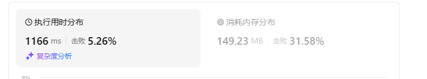
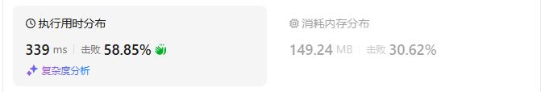
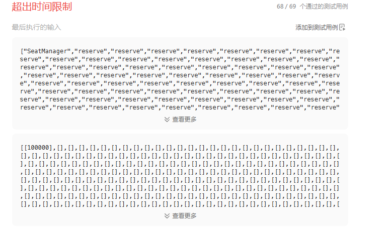
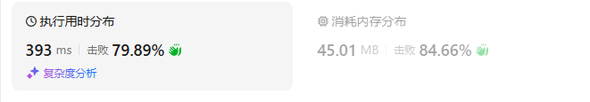
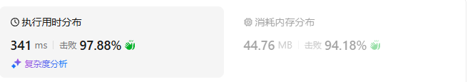

# 1845座位预约管理系统（中等）

[1845. 座位预约管理系统 - 力扣（LeetCode）](https://leetcode.cn/problems/seat-reservation-manager/description/)

## 题目描述

请你设计一个管理 `n` 个座位预约的系统，座位编号从 `1` 到 `n` 。

请你实现 `SeatManager` 类：

- `SeatManager(int n)` 初始化一个 `SeatManager` 对象，它管理从 `1` 到 `n` 编号的 `n` 个座位。所有座位初始都是可预约的。
- `int reserve()` 返回可以预约座位的 **最小编号** ，此座位变为不可预约。
- `void unreserve(int seatNumber)` 将给定编号 `seatNumber` 对应的座位变成可以预约。

 

**示例 1：**

```
输入：
["SeatManager", "reserve", "reserve", "unreserve", "reserve", "reserve", "reserve", "reserve", "unreserve"]
[[5], [], [], [2], [], [], [], [], [5]]
输出：
[null, 1, 2, null, 2, 3, 4, 5, null]

解释：
SeatManager seatManager = new SeatManager(5); // 初始化 SeatManager ，有 5 个座位。
seatManager.reserve();    // 所有座位都可以预约，所以返回最小编号的座位，也就是 1 。
seatManager.reserve();    // 可以预约的座位为 [2,3,4,5] ，返回最小编号的座位，也就是 2 。
seatManager.unreserve(2); // 将座位 2 变为可以预约，现在可预约的座位为 [2,3,4,5] 。
seatManager.reserve();    // 可以预约的座位为 [2,3,4,5] ，返回最小编号的座位，也就是 2 。
seatManager.reserve();    // 可以预约的座位为 [3,4,5] ，返回最小编号的座位，也就是 3 。
seatManager.reserve();    // 可以预约的座位为 [4,5] ，返回最小编号的座位，也就是 4 。
seatManager.reserve();    // 唯一可以预约的是座位 5 ，所以返回 5 。
seatManager.unreserve(5); // 将座位 5 变为可以预约，现在可预约的座位为 [5] 。
```

 

**提示：**

- `1 <= n <= 105`
- `1 <= seatNumber <= n`
- 每一次对 `reserve` 的调用，题目保证至少存在一个可以预约的座位。
- 每一次对 `unreserve` 的调用，题目保证 `seatNumber` 在调用函数前都是被预约状态。
- 对 `reserve` 和 `unreserve` 的调用 **总共** 不超过 `105` 次。

## 我的C++解法

```cpp
class SeatManager {
public:
    int min_index;
    vector<int> seats;
    SeatManager(int n) {
        seats.clear();
        seats.resize(n);//0表示没有人使用，可以被占座
        min_index = 0;
    }
    
    int reserve() {
        seats[min_index] = 1;
        int tmp = min_index;
        for(int i=min_index+1;i<seats.size();i++){
            if(seats[i]==0){
                min_index = i;
                break;
            }
        }
        return tmp;
    }
    
    void unreserve(int seatNumber) {
        if(min_index>seatNumber)    min_index = seatNumber;
        seats[seatNumber] = 0;
    }
};

/**
 * Your SeatManager object will be instantiated and called as such:
 * SeatManager* obj = new SeatManager(n);
 * int param_1 = obj->reserve();
 * obj->unreserve(seatNumber);
 */
```

但是这样的话三个函数都不相关啊，直接报错了。

原来报错是因为座位的坐标直接从1开始，而不是从0开始。

```cpp
class SeatManager {
private:
    int min_index;
    vector<int> seats;

public:

    SeatManager(int n) {
        // seats.clear();
        // seats.resize(n);//0表示没有人使用，可以被占座
        for(int i=0;i<n;i++){
            seats.push_back(0);
        }
        min_index = 0;
    }
    
    int reserve() {
        seats[min_index] = 1;
        int tmp = min_index;
        for(int i=min_index+1;i<seats.size();i++){
            if(seats[i]==0){
                min_index = i;
                break;
            }
        }
        if(min_index==tmp)  min_index = seats.size();
        return tmp+1;
    }
    
    void unreserve(int seatNumber) {
        if(seatNumber-1 < min_index)    min_index = seatNumber-1;
        seats[seatNumber-1] = 0;
    }
};

/**
 * Your SeatManager object will be instantiated and called as such:
 * SeatManager* obj = new SeatManager(n);
 * int param_1 = obj->reserve();
 * obj->unreserve(seatNumber);
 */
```

结果：



## C++参考答案

### 方法一：维护可预约的座位

我们需要一个数据结构维护可预约的座位：

- reserve：查找并删除最小值。
- unreserve：添加元素。

**最小堆**完美符合上述要求：

- 初始化：把 1,2,3,⋯,*n* 全部入堆。
- reserve：弹出并返回堆顶。
- unreserve：把 *seatNumber* 入堆。

```cpp
class SeatManager {
    priority_queue<int, vector<int>, greater<>> available;

public:
    SeatManager(int n) {
        for (int i = 1; i <= n; i++) {
            available.push(i);
        }
    }

    int reserve() {
        int seatNumber = available.top();
        available.pop();
        return seatNumber;
    }

    void unreserve(int seatNumber) {
        available.push(seatNumber);
    }
};
```

结果：



- 时间复杂度：初始化为 O(*n*) 或 O(*n*log*n*)，取决于实现。reserve 和 unreserve 均为 O(log*n*)。
- 空间复杂度：O(*n*)。

### 方法二：维护取消预约的座位

方法一的时空复杂度均和 *n* 有关，如果把数据范围改成 *n*≤109，就会超时/爆内存。这种情况下要怎么做？

#### 思路

想象有一个空房间，一开始没有椅子。

如果有人进入了房间（reserve），我们可以**添加一把新的椅子**给人坐（如果没有空出来的椅子）。

如果有人离开了椅子（unreserve），后面来的人**不需要新的椅子，直接坐空出来的椅子**就行。直到所有椅子都被坐满，此时必须要添加一把新的椅子给人坐。

#### 实现

用一个变量 *seats* 表示目前房间内有多少把椅子，初始值为 0。用一个最小堆 *available* 维护空出来的椅子编号，初始为空。

- 对于 unreserve(*seatNumber*)，把 *seatNumber* 入堆。
- 对于 reserve，如果堆不为空（有空出来的椅子），就弹出并返回堆顶；否则把 *seats* 加一（添加一把新的椅子），然后返回 *seats*。

```cpp
class SeatManager {
    int seats = 0;
    priority_queue<int, vector<int>, greater<>> available;

public:
    SeatManager(int) {}

    int reserve() {
        if (!available.empty()) { // 有空出来的椅子
            int seatNumber = available.top(); // 坐编号最小的
            available.pop();
            return seatNumber;
        }
        return ++seats; // 添加一把新的椅子
    }

    void unreserve(int seatNumber) {
        available.push(seatNumber); // 有人离开了椅子
    }
};
```

结果：


- 时间复杂度：初始化为 O(1)，reserve 和 unreserve 均为 O(log*q*)，其中 *q* 是 unreserve 的调用次数。
- 空间复杂度：O(*q*)。

## C++收获


## 我的python解答

```python
class SeatManager:
    def __init__(self, n: int):
        self.seats = []
        self.min_index = 0
        for _ in range(n):
            self.seats.append(0)
        self.min_index = 0

    def reserve(self) -> int:
        self.seats[self.min_index] = 1
        tmp = self.min_index
        for i in range(self.min_index+1,len(self.seats)):
            if self.seats[i]==0:
                self.min_index = i
                break
        if self.min_index==tmp:
            self.min_index = len(self.seats)
        return tmp+1


    def unreserve(self, seatNumber: int) -> None:
        if self.min_index>seatNumber-1:
            self.min_index = seatNumber-1
        self.seats[seatNumber-1] = 0


# Your SeatManager object will be instantiated and called as such:
# obj = SeatManager(n)
# param_1 = obj.reserve()
# obj.unreserve(seatNumber)
```

结果：超时了



## python参考答案

```py
class SeatManager:
    def __init__(self, n: int):
        self.available = list(range(1, n + 1))  # 有序数组无需堆化

    def reserve(self) -> int:
        return heappop(self.available)

    def unreserve(self, seatNumber: int) -> None:
        heappush(self.available, seatNumber)
```

结果：



```py
class SeatManager:
    def __init__(self, _: int):
        self.seats = 0  # 一开始没有椅子
        self.available = []

    def reserve(self) -> int:
        if self.available:  # 有空出来的椅子
            return heappop(self.available)  # 坐编号最小的
        self.seats += 1  # 添加一把新的椅子
        return self.seats

    def unreserve(self, seatNumber: int) -> None:
        heappush(self.available, seatNumber)  # 有人离开了椅子
```

结果：



## python收获