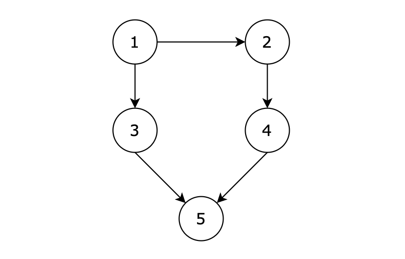
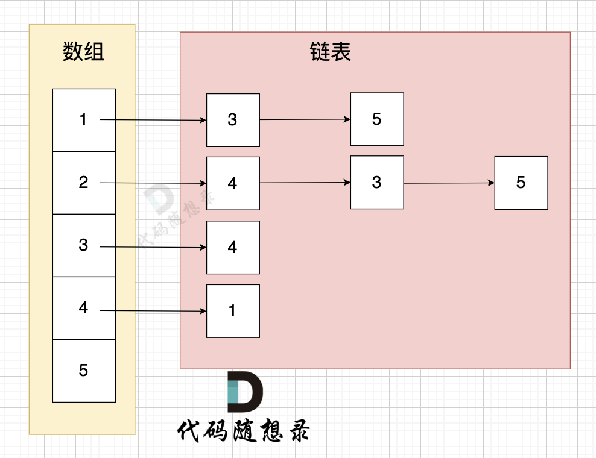

# 98所有可达路径

[98. 所有可达路径 (kamacoder.com)](https://kamacoder.com/problempage.php?pid=1170)

## 题目描述

###### 题目描述

给定一个有 n 个节点的有向无环图，节点编号从 1 到 n。请编写一个函数，找出并返回所有从节点 1 到节点 n 的路径。每条路径应以节点编号的列表形式表示。

###### 输入描述

第一行包含两个整数 N，M，表示图中拥有 N 个节点，M 条边

后续 M 行，每行包含两个整数 s 和 t，表示图中的 s 节点与 t 节点中有一条路径

###### 输出描述

输出所有的可达路径，路径中所有节点之间空格隔开，每条路径独占一行，存在多条路径，路径输出的顺序可任意。如果不存在任何一条路径，则输出 -1。

**注意输出的序列中，最后一个节点后面没有空格！** 例如正确的答案是 `1 3 5`,而不是 `1 3 5 `， 5后面没有空格！

###### 输入示例

```
5 5
1 3
3 5
1 2
2 4
4 5
```

###### 输出示例

```
1 3 5
1 2 4 5
```

###### 提示信息



**用例解释：**

有五个节点，其中的从 1 到达 5 的路径有两个，分别是 1 -> 3 -> 5 和 1 -> 2 -> 4 -> 5。

因为拥有多条路径，所以输出结果为：

1 3 5
1 2 4 5

或

1 2 4 5
1 3 5
都算正确。

**数据范围：**

- 图中不存在自环
- 图中不存在平行边
- 1 <= N <= 100
- 1 <= M <= 500

## 我的C++解法

关键是图的数据结构如何定义和存储？这个题我的想法是使用邻接表来表示图，但是邻接表该怎么定义呢？这个类的定义我需要好好学学怎么写。在想定义的时候，想到的是用一个链表来表示一个边表，链表的结构体怎么写我也给忘了555这就是ACM模式要学的东西，所有的东西都是自己写。

直接上答案，然后试着写一下。

## C++参考答案

###  邻接矩阵

使用邻接矩阵写法的话，需要创建一个二维数组，graph\[i][j] = 1 表示从节点i到节点j有直接路径。在本题中有n个节点，为了节点标号和下标对齐，声明了一个n+1*n+1的二维数组

`vector<vector<int>> graph(n+1,vector<int>(n+1,0))`

输入边，则使用for循环或者while循环`while(m--)`

```cpp
#include <iostream>
#include <vector>
using namespace std;
vector<vector<int>> result; // 收集符合条件的路径
vector<int> path; // 1节点到终点的路径

void dfs (const vector<vector<int>>& graph, int x, int n) {
    // 当前遍历的节点x 到达节点n 
    if (x == n) { // 找到符合条件的一条路径
        result.push_back(path);
        return;
    }
    for (int i = 1; i <= n; i++) { // 遍历节点x链接的所有节点
        if (graph[x][i] == 1) { // 找到 x链接的节点
            path.push_back(i); // 遍历到的节点加入到路径中来
            dfs(graph, i, n); // 进入下一层递归
            path.pop_back(); // 回溯，撤销本节点
        }
    }
}

int main() {
    int n, m, s, t;
    cin >> n >> m;

    // 节点编号从1到n，所以申请 n+1 这么大的数组
    vector<vector<int>> graph(n + 1, vector<int>(n + 1, 0));

    while (m--) {
        cin >> s >> t;
        // 使用邻接矩阵 表示无线图，1 表示 s 与 t 是相连的
        graph[s][t] = 1;
    }

    path.push_back(1); // 无论什么路径已经是从0节点出发
    dfs(graph, 1, n); // 开始遍历

    // 输出结果
    if (result.size() == 0) cout << -1 << endl;
    for (const vector<int> &pa : result) {
        for (int i = 0; i < pa.size() - 1; i++) {
            cout << pa[i] << " ";
        }
        cout << pa[pa.size() - 1]  << endl;
    }
}
```

结果：


### 邻接表

邻接表的节点表使用数组存储，边表使用链表存储。



这里表达的图是：

- 节点1 指向 节点3 和 节点5
- 节点2 指向 节点4、节点3、节点5
- 节点3 指向 节点4
- 节点4指向节点1

我们需要构造一个数组，数组里的元素是一个链表。

`vector<list<int>> graph(n+1);`这就申请到了n+1个大小的数组空间，用来存储不同的节点。其中的list是C++中的链表。

输入m个边，构造方式：

```cpp
while(m--){
    cin>>s>>t;
    // 使用邻接表，表示s->t是直接相连的
    graph[s].push_back(t);
}
```

```cpp
#include <iostream>
#include <vector>
#include <list>
using namespace std;

vector<vector<int>> result; // 收集符合条件的路径
vector<int> path; // 1节点到终点的路径

void dfs (const vector<list<int>>& graph, int x, int n) {

    if (x == n) { // 找到符合条件的一条路径
        result.push_back(path);
        return;
    }
    for (int i : graph[x]) { // 找到 x指向的节点
        path.push_back(i); // 遍历到的节点加入到路径中来
        dfs(graph, i, n); // 进入下一层递归
        path.pop_back(); // 回溯，撤销本节点
    }
}

int main() {
    int n, m, s, t;
    cin >> n >> m;

    // 节点编号从1到n，所以申请 n+1 这么大的数组
    vector<list<int>> graph(n + 1); // 邻接表
    while (m--) {
        cin >> s >> t;
        // 使用邻接表 ，表示 s -> t 是相连的
        graph[s].push_back(t);

    }

    path.push_back(1); // 无论什么路径已经是从0节点出发
    dfs(graph, 1, n); // 开始遍历

    // 输出结果
    if (result.size() == 0) cout << -1 << endl;
    for (const vector<int> &pa : result) {
        for (int i = 0; i < pa.size() - 1; i++) {
            cout << pa[i] << " ";
        }
        cout << pa[pa.size() - 1]  << endl;
    }
}
```

结果：


## C++收获

### C++中的list头文件

<center>关键词：list头文件<center>

<center>关键词：链表<center>

<center>关键词：图的邻接表存储<center>

可以使用下面这行代码来声明一个临界表：`vector<list<int>> graph(n + 1); // 邻接表`

在C++中，`<list>` 头文件是标准模板库（STL）的一部分，它定义了 `std::list` 容器类模板。`std::list` 是一个双向链表，它允许在序列的任何位置高效地插入和删除元素。与 `std::vector` 不同，`std::list` 不保证元素的顺序存储，因此它不提供对元素的随机访问。

以下是 `<list>` 头文件中定义的 `std::list` 容器的一些主要特性和操作：

#### 包含头文件

```cpp
#include <list>
```

#### 构造函数

- 默认构造函数
- 拷贝构造函数
- 移动构造函数
- 范围构造函数（C++11及以后版本）

#### 赋值操作

- 拷贝赋值运算符
- 移动赋值运算符

#### 迭代器

- `begin()`：返回指向第一个元素的迭代器。
- `end()`：返回指向“尾后元素”的迭代器。
- `rbegin()` 和 `rend()`：返回反向迭代器。

#### 容量

- `empty()`：检查容器是否为空。
- `size()`：返回容器中元素的数量。

#### 修改器

- `clear()`：清除所有元素。
- `insert()`：在指定位置插入元素。
- `emplace()`：在指定位置构造元素，避免额外的拷贝或移动。
- `erase()`：删除指定位置的元素或范围的元素。
- `push_back()`：在末尾插入元素。
- `emplace_back()`：在末尾构造元素。
- `pop_back()`：删除最后一个元素。
- `push_front()`：在头部插入元素。
- `emplace_front()`：在头部构造元素。
- `pop_front()`：删除第一个元素。
- `resize()`：调整容器大小。
- `splice()`：从另一个 `std::list` 转移元素。
- `remove()`：删除满足特定条件的元素。
- `remove_if()`：删除满足特定谓词的元素。
- `unique()`：删除连续重复元素。
- `merge()`：合并两个有序列表。
- `sort()`：对列表中的元素进行排序。

#### 访问器

- `front()`：返回第一个元素的引用。
- `back()`：返回最后一个元素的引用。

#### 观察器

- `get_allocator()`：返回与列表关联的分配器对象。

#### 示例代码

```cpp
#include <iostream>
#include <list>

int main() {
    std::list<int> lst;

    // 插入元素
    lst.push_back(10);
    lst.push_back(20);
    lst.push_front(5);

    // 遍历列表
    for (int elem : lst) {
        std::cout << elem << " ";
    }
    std::cout << std::endl;

    // 删除第一个元素
    lst.pop_front();

    // 访问元素
    std::cout << "First element: " << lst.front() << std::endl;
    std::cout << "Last element: " << lst.back() << std::endl;

    return 0;
}
```

#### 输出

```
5 10 20 
First element: 10
Last element: 20
```

#### 注意事项

1. **内存管理**：`std::list` 管理自己的内存，不需要手动分配和释放节点。
2. **性能**：由于 `std::list` 是一个链表，它的插入和删除操作通常比 `std::vector` 更快，因为不需要移动其他元素。
3. **随机访问**：`std::list` 不支持随机访问，因此不能使用下标操作符 `[]` 访问元素。
4. **空间效率**：每个 `std::list` 元素都包含额外的指针（对于双向链表来说是两个），这增加了内存开销。
5. **异常安全**：`std::list` 提供了强异常安全保证，即使在插入或删除操作中发生异常，容器的状态也会保持一致。

`std::list` 是C++ STL中非常灵活的容器之一，适合于需要频繁插入和删除元素的场景。

## 我的python解答

```python
# 邻接矩阵写法
# n,m = int(input().split(" "))
n, m = map(int, input().split())
result = []
path = []
graph = [[0]*(n+1) for _ in range(n+1)]
for i in range(m):
    # s, t = int(input().split(" "))
    s, t = map(int, input().split())
    graph[s][t] = 1

def dfs(graph,i,n,path,result):
    if i==n:
        # result.append(path)
        result.append(path.copy())
        return
    for j in range(1,n+1):
        if graph[i][j] == 1:
            path.append(j)
            dfs(graph,j,n,path,result)
            path.pop()

path.append(1)
dfs(graph,1,n,path,result)
if len(result)==0:
    print(-1)
else:
    for pa in result:
        print(' '.join(map(str, pa)))
        # for i in range(len(pa)-1):
        #     print(f'{i} ')
        # print(f'{pa[-1]}\n')
```

结果：


## python参考答案

### 临界矩阵写法：

```python
def dfs(graph, x, n, path, result):
    if x == n:
        result.append(path.copy())
        return
    for i in range(1, n + 1):
        if graph[x][i] == 1:
            path.append(i)
            dfs(graph, i, n, path, result)
            path.pop()

def main():
    n, m = map(int, input().split())
    graph = [[0] * (n + 1) for _ in range(n + 1)]

    for _ in range(m):
        s, t = map(int, input().split())
        graph[s][t] = 1

    result = []
    dfs(graph, 1, n, [1], result)

    if not result:
        print(-1)
    else:
        for path in result:
            print(' '.join(map(str, path)))

if __name__ == "__main__":
    main()
```

### 邻接表写法：

```python
from collections import defaultdict

result = []  # 收集符合条件的路径
path = []  # 1节点到终点的路径

def dfs(graph, x, n):
    if x == n:  # 找到符合条件的一条路径
        result.append(path.copy())
        return
    for i in graph[x]:  # 找到 x指向的节点
        path.append(i)  # 遍历到的节点加入到路径中来
        dfs(graph, i, n)  # 进入下一层递归
        path.pop()  # 回溯，撤销本节点

def main():
    n, m = map(int, input().split())

    graph = defaultdict(list)  # 邻接表
    for _ in range(m):
        s, t = map(int, input().split())
        graph[s].append(t)

    path.append(1)  # 无论什么路径已经是从1节点出发
    dfs(graph, 1, n)  # 开始遍历

    # 输出结果
    if not result:
        print(-1)
    for pa in result:
        print(' '.join(map(str, pa)))

if __name__ == "__main__":
    main()
```

结果：


## python收获

从py中获取int输入（中间用空格隔开）的做法：

`n, m = map(int, input().split())`

py打印的时候如果使用format，则默认是换行输出的。如果想要打印一个路径中的所有数字并以空格隔开，使用`print(' '.join(map(str, pa)))`

### python中的map函数

在Python中，`map()` 函数是一个非常有用的高阶函数，它允许你对可迭代对象（如列表、元组等）的每个元素应用一个给定的函数，并返回一个新的迭代器。

#### 函数原型

```python
map(func, *iterables)
```

#### 参数

- `func`: 一个函数，它会被应用到每个元素上。
- `*iterables`: 一个或多个可迭代对象，函数 `func` 将依次应用于这些可迭代对象的元素。

#### 返回值

- `map()` 返回一个 `map` 对象，这是一个迭代器，可以被转换为列表或其他数据结构。

#### 使用示例

```python
def square(x):
    return x * x

numbers = [1, 2, 3, 4, 5]

# 使用 map 函数
squared_numbers = map(square, numbers)

# 将结果转换为列表
print(list(squared_numbers))
```

#### 输出

```
[1, 4, 9, 16, 25]
```

#### 多个可迭代对象

`map()` 也可以接受多个可迭代对象，并将函数应用于每个可迭代对象的对应元素。

```python
def add(a, b):
    return a + b

list1 = [1, 2, 3]
list2 = [4, 5, 6]

# 使用 map 函数
result = map(add, list1, list2)

# 将结果转换为列表
print(list(result))
```

#### 输出

```
[5, 7, 9]
```

#### 注意事项

1. **Lambda 表达式**：你可以使用 `lambda` 表达式作为 `map()` 的第一个参数，这样可以在一行代码内定义和应用函数。

    ```python
    numbers = [1, 2, 3, 4, 5]
    squared_numbers = map(lambda x: x * x, numbers)
    print(list(squared_numbers))
    ```

2. **惰性求值**：`map()` 返回的是一个迭代器，这意味着它不会立即计算所有结果，而是在迭代时才计算。这可以提高效率，特别是处理大数据集时。

3. **空可迭代对象**：如果任何一个可迭代对象是空的，那么 `map()` 返回的结果也将是空的。

4. **类型限制**：`map()` 只能用于可迭代对象，不能用于非可迭代对象。

5. **性能**：对于简单的操作，使用 `map()` 通常比使用列表推导式更快。

6. **错误处理**：如果 `func` 函数抛出异常，`map()` 会停止执行并抛出异常。

7. **Python 3**：在Python 3中，`map()` 不再返回列表，而是返回一个迭代器。如果你需要一个列表，可以使用 `list()` 函数来转换。

8. **与 `filter()` 结合**：`map()` 经常与 `filter()` 函数结合使用，以过滤和转换数据。

`map()` 函数是Python中实现函数式编程风格的强大工具之一，它可以使代码更加简洁和高效。

### python中的defaultdict

<center>关键词：defaultdict<center>

<center>关键词：图的邻接表存储<center>

在Python中，`defaultdict` 是 `collections` 模块中的一个非常有用的类，它继承自内置的 `dict` 类。`defaultdict` 解决了普通字典在访问不存在的键时会抛出 `KeyError` 的问题。它允许你为字典提供一个默认值，当访问一个不存在的键时，会返回这个默认值。

#### 如何导入

首先，你需要从 `collections` 模块导入 `defaultdict`：

```python
from collections import defaultdict
```

#### 基本用法

当你创建一个 `defaultdict` 对象时，你需要提供一个函数，这个函数会在访问不存在的键时被调用，以生成默认值：

```python
# 创建一个默认值为int的defaultdict
dd = defaultdict(int)
```

在上面的例子中，如果尝试访问一个不存在的键，`defaultdict` 将使用 `int()` 函数（返回0）作为默认值。

#### 示例代码

```python
from collections import defaultdict

# 创建一个默认值为int的defaultdict
dd = defaultdict(int)

# 访问不存在的键，不会抛出KeyError，而是返回默认值0
print(dd['apple'])  # 输出: 0

# 更新键的值
dd['apple'] += 1
print(dd['apple'])  # 输出: 1

# 另一个不存在的键
print(dd['banana'])  # 输出: 0

# 创建一个默认值为list的defaultdict
dd_list = defaultdict(list)

# 访问不存在的键，返回一个空列表
print(dd_list['orange'])  # 输出: []

# 添加元素到列表
dd_list['orange'].append(1)
print(dd_list['orange'])  # 输出: [1]
```

#### 常用默认值类型

- **int**：用于计数。
- **list**：用于累积元素。
- **dict**：用于嵌套字典。
- **set**：用于累积不重复的元素。

#### 更多示例

##### 计数示例

```python
# 计数示例
word_count = defaultdict(int)

for word in ['apple', 'orange', 'apple', 'pear', 'orange', 'banana']:
    word_count[word] += 1

print(word_count)
# 输出: defaultdict(<class 'int'>, {'apple': 2, 'orange': 2, 'pear': 1, 'banana': 1})
```

##### 累积列表

```python
# 累积列表示例
items = defaultdict(list)

items['apple'].append(1)
items['apple'].append(2)
items['orange'].append(3)

print(items)
# 输出: defaultdict(<class 'list'>, {'apple': [1, 2], 'orange': [3]})
```

##### 嵌套字典

```python
# 嵌套字典示例
nested_dict = defaultdict(lambda: defaultdict(int))

nested_dict['apple']['color'] = 1
nested_dict['orange']['color'] = 1

print(nested_dict)
# 输出: defaultdict(<function <lambda> at 0x...>, {'apple': defaultdict(<class 'int'>, {'color': 1}), 'orange': defaultdict(<class 'int'>, {'color': 1})})
```

#### 注意事项

1. **默认值是可变的**：默认值（如列表和字典）是可变的，所以如果你不小心修改了默认值，它会影响所有后续的默认值生成。
2. **性能**：`defaultdict` 在访问不存在的键时，性能开销比普通字典稍高，因为它需要调用默认值生成函数。

`defaultdict` 是处理字典时非常有用的工具，特别是在你需要自动初始化默认值的情况下。