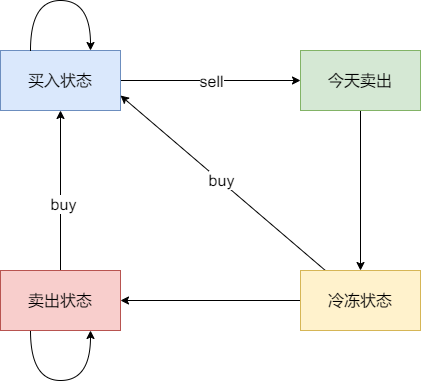

# 309买卖股票的最佳时机含冷冻期（中等）

[309. 买卖股票的最佳时机含冷冻期 - 力扣（LeetCode）](https://leetcode.cn/problems/best-time-to-buy-and-sell-stock-with-cooldown/description/)

## 题目描述

给定一个整数数组`prices`，其中第 `prices[i]` 表示第 `*i*` 天的股票价格 。

设计一个算法计算出最大利润。在满足以下约束条件下，你可以尽可能地完成更多的交易（多次买卖一支股票）:

- 卖出股票后，你无法在第二天买入股票 (即冷冻期为 1 天)。

**注意：**你不能同时参与多笔交易（你必须在再次购买前出售掉之前的股票）。

 

**示例 1:**

```
输入: prices = [1,2,3,0,2]
输出: 3 
解释: 对应的交易状态为: [买入, 卖出, 冷冻期, 买入, 卖出]
```

**示例 2:**

```
输入: prices = [1]
输出: 0
```

 

**提示：**

- `1 <= prices.length <= 5000`
- `0 <= prices[i] <= 1000`

## 我的C++解法

### 记忆化搜索

```cpp
class Solution {
public:
    int maxProfit(vector<int>& prices) {
        int n = prices.size();
        vector<array<int,2>> memo(n,{-1,-1});
        auto dfs = [&](auto&& dfs,int i,bool hold)->int{
            if(i<0) return hold? INT_MIN/2 : 0;
            int& res = memo[i][hold];
            if(res!= -1)    return res;
            if(hold)    return res = max(dfs(dfs,i-1,true),dfs(dfs,i-2,false)-prices[i]);
            return res = max(dfs(dfs,i-1,true)+prices[i],dfs(dfs,i-1,false));
        };
        return dfs(dfs,n-1,false);
    }
};
```

结果：


### 递推

```cpp
class Solution {
public:
    int maxProfit(vector<int>& prices) {
        int n = prices.size();
        vector<vector<int>> dp(n+2,vector<int>(2,0));
        dp[0][1] = dp[1][1] = INT_MIN/2;
        for(int i=0;i<n;i++){
            dp[i+2][1] = max(dp[i+1][1],dp[i][0]-prices[i]);
            dp[i+2][0] = max(dp[i+1][1]+prices[i],dp[i+1][0]);
        }
        return dp[n+1][0];
    }
};
```

结果：


### 空间优化

```cpp
class Solution {
public:
    int maxProfit(vector<int>& prices) {
        int n = prices.size();
        vector<vector<int>> dp(3,vector<int>(2,0));
        dp[0][1] = dp[1][1] = INT_MIN/2;
        for(int i=0;i<n;i++){
            dp[(i+2)%3][1] = max(dp[(i+1)%3][1],dp[i%3][0]-prices[i]);
            dp[(i+2)%3][0] = max(dp[(i+1)%3][1]+prices[i],dp[(i+1)%3][0]);
        }
        return dp[(n+1)%3][0];
    }
};
```

结果：


### 继续优化空间

```cpp
class Solution {
public:
    int maxProfit(vector<int>& prices) {
        int n = prices.size();
        int pre = 0, f0 = 0, f1 = INT_MIN/2;
        for(int i=0;i<n;i++){
            int new_f0 = max(f0,f1+prices[i]);
            f1 = max(f1,pre-prices[i]);
            pre = f0;
            f0 = new_f0;
        }
        return f0;
    }
};
```

结果：


## C++参考答案

具体可以区分出如下四个状态：

- 状态一：持有股票状态（今天买入股票，或者是之前就买入了股票然后没有操作，一直持有）
- 不持有股票状态，这里就有两种卖出股票状态
  - 状态二：保持卖出股票的状态（两天前就卖出了股票，度过一天冷冻期。或者是前一天就是卖出股票状态，一直没操作）
  - 状态三：今天卖出股票
- 状态四：今天为冷冻期状态，但冷冻期状态不可持续，只有一天！




```cpp
dp[i][0] = max(dp[i - 1][0], max(dp[i - 1][3], dp[i - 1][1]) - prices[i]);
dp[i][1] = max(dp[i - 1][1], dp[i - 1][3]);
dp[i][2] = dp[i - 1][0] + prices[i];
dp[i][3] = dp[i - 1][2];
```


```cpp
class Solution {
public:
    int maxProfit(vector<int>& prices) {
        int n = prices.size();
        if (n == 0) return 0;
        vector<vector<int>> dp(n, vector<int>(4, 0));
        dp[0][0] -= prices[0]; // 持股票
        for (int i = 1; i < n; i++) {
            dp[i][0] = max(dp[i - 1][0], max(dp[i - 1][3] - prices[i], dp[i - 1][1] - prices[i]));
            dp[i][1] = max(dp[i - 1][1], dp[i - 1][3]);
            dp[i][2] = dp[i - 1][0] + prices[i];
            dp[i][3] = dp[i - 1][2];
        }
        return max(dp[n - 1][3], max(dp[n - 1][1], dp[n - 1][2]));
    }
};
```

- 时间复杂度：O(n)
- 空间复杂度：O(n)

## C++收获


## 我的python解答

这个题和之前的区别就在于每次卖出之后有一个冷冻期无法进行任何操作，那么就只用在买入时跳过前一个即可，即遍历i-2而不是i-1

### 记忆化搜索

```python
class Solution:
    def maxProfit(self, prices: List[int]) -> int:
        n = len(prices)
        @cache
        # def dfs(i:int,hold:bool,chill:bool):
            # hold表示是否持有股票 0为未持有，1为持有
            # chill表示是否是冷冻期 0表示不是冷冻期（可以进行买入卖出操作）
            # 1表示是冷冻期（表示无法进行任何操作）        
        def dfs(i:int,hold:bool):
            # 突然想起来并不需要专门设置一个chill变量，因为每次冷冻期都是在卖出之后
            # 在卖出之后跳过一次price即可
            if i<0:
                return -inf if hold else 0
            if hold:
                return max(dfs(i-1,True),dfs(i-2,False)-prices[i])
            return max(dfs(i-1,True)+prices[i],dfs(i-1,False))
        return dfs(n-1,False)
```

结果：


### 递推

```python
class Solution:
    def maxProfit(self, prices: List[int]) -> int:
        n = len(prices)
        f = [[0]*2 for _ in range(n+2)] # n+2是因为dfs(i-2,False)
        f[0][1] = f[1][1] = -inf
        for i,price in enumerate(prices):
            f[i+2][1] = max(f[i+1][1],f[i][0]-price)
            f[i+2][0] = max(f[i+1][1]+price,f[i+1][0])
        return f[n+1][0]
```

结果：


### 空间优化

```python
class Solution:
    def maxProfit(self, prices: List[int]) -> int:
        n = len(prices)
        f = [[0]*2 for _ in range(3)] # n+2是因为dfs(i-2,False)
        f[0][1] = f[1][1] = -inf
        for i,price in enumerate(prices):
            f[(i+2)%3][1] = max(f[(i+1)%3][1],f[i%3][0]-price)
            f[(i+2)%3][0] = max(f[(i+1)%3][1]+price,f[(i+1)%3][0])
        return f[(n+1)%3][0]
```

结果：


### 继续优化空间

```python
class Solution:
    def maxProfit(self, prices: List[int]) -> int:
        pre0, f0, f1 = 0, 0, -inf
        for p in prices:
            pre0, f0, f1 = f0, max(f0,f1+p), max(f1,pre0-p)
        return f0
```

结果：


### 代码随想录的思想

```python
class Solution:
    def maxProfit(self, prices: List[int]) -> int:
        # 尝试使用代码随想录的想法
        n = len(prices)
        # 对于每一个价格，都有四种状态：
        # 0状态：持有股票
        # 1状态：没有股票的状态（已经度过冷冻期）
        # 2状态：今日卖出股票
        # 3状态：处于冷冻期当天
        dp = [[0]*4 for _ in range(n)]
        dp[0][0] -= prices[0]
        for i in range(1,n):
            dp[i][0] = max(dp[i-1][1]-prices[i],dp[i-1][0],dp[i-1][3]-prices[i])
            dp[i][1] = max(dp[i-1][3],dp[i-1][1])
            dp[i][2] = dp[i-1][0] + prices[i]
            dp[i][3] = dp[i-1][2]
        return max(dp[n-1][1],dp[n-1][2],dp[n-1][3])
```

结果：


## python参考答案

```python
from typing import List

class Solution:
    def maxProfit(self, prices: List[int]) -> int:
        n = len(prices)
        if n == 0:
            return 0
        dp = [[0] * 4 for _ in range(n)]  # 创建动态规划数组，4个状态分别表示持有股票、不持有股票且处于冷冻期、不持有股票且不处于冷冻期、不持有股票且当天卖出后处于冷冻期
        dp[0][0] = -prices[0]  # 初始状态：第一天持有股票的最大利润为买入股票的价格
        for i in range(1, n):
            dp[i][0] = max(dp[i-1][0], max(dp[i-1][3], dp[i-1][1]) - prices[i])  # 当前持有股票的最大利润等于前一天持有股票的最大利润或者前一天不持有股票且不处于冷冻期的最大利润减去当前股票的价格
            dp[i][1] = max(dp[i-1][1], dp[i-1][3])  # 当前不持有股票且处于冷冻期的最大利润等于前一天持有股票的最大利润加上当前股票的价格
            dp[i][2] = dp[i-1][0] + prices[i]  # 当前不持有股票且不处于冷冻期的最大利润等于前一天不持有股票的最大利润或者前一天处于冷冻期的最大利润
            dp[i][3] = dp[i-1][2]  # 当前不持有股票且当天卖出后处于冷冻期的最大利润等于前一天不持有股票且不处于冷冻期的最大利润
        return max(dp[n-1][3], dp[n-1][1], dp[n-1][2])  # 返回最后一天不持有股票的最大利润
```

```python
class Solution:
    def maxProfit(self, prices: List[int]) -> int:
        n = len(prices)
        if n < 2:
            return 0

        # 定义三种状态的动态规划数组
        dp = [[0] * 3 for _ in range(n)]
        dp[0][0] = -prices[0]  # 持有股票的最大利润
        dp[0][1] = 0           # 不持有股票，且处于冷冻期的最大利润
        dp[0][2] = 0           # 不持有股票，不处于冷冻期的最大利润

        for i in range(1, n):
            # 当前持有股票的最大利润等于前一天持有股票的最大利润或者前一天不持有股票且不处于冷冻期的最大利润减去当前股票的价格
            dp[i][0] = max(dp[i-1][0], dp[i-1][2] - prices[i])
            # 当前不持有股票且处于冷冻期的最大利润等于前一天持有股票的最大利润加上当前股票的价格
            dp[i][1] = dp[i-1][0] + prices[i]
            # 当前不持有股票且不处于冷冻期的最大利润等于前一天不持有股票的最大利润或者前一天处于冷冻期的最大利润
            dp[i][2] = max(dp[i-1][2], dp[i-1][1])

        # 返回最后一天不持有股票的最大利润
        return max(dp[-1][1], dp[-1][2])
```

### 记忆化搜索

```py
class Solution:
    def maxProfit(self, prices: List[int]) -> int:
        n = len(prices)
        @cache
        def dfs(i: int, hold: bool) -> int:
            if i < 0:
                return -inf if hold else 0
            if hold:
                return max(dfs(i - 1, True), dfs(i - 2, False) - prices[i])
            return max(dfs(i - 1, False), dfs(i - 1, True) + prices[i])
        return dfs(n - 1, False)
```

### 递推

```py
class Solution:
    def maxProfit(self, prices: List[int]) -> int:
        n = len(prices)
        f = [[0] * 2 for _ in range(n + 2)]
        f[1][1] = -inf
        for i, p in enumerate(prices):
            f[i + 2][0] = max(f[i + 1][0], f[i + 1][1] + p)
            f[i + 2][1] = max(f[i + 1][1], f[i][0] - p)
        return f[-1][0]
```

### 优化

```py
class Solution:
    def maxProfit(self, prices: List[int]) -> int:
        pre0, f0, f1, = 0, 0, -inf
        for p in prices:
            pre0, f0, f1 = f0, max(f0, f1 + p), max(f1, pre0 - p)
        return f0
```

## python收获