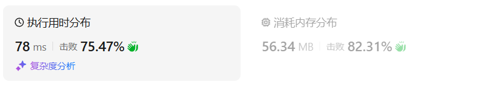

# 714买卖股票的最佳时机含手续费（中等）

[714. 买卖股票的最佳时机含手续费 - 力扣（LeetCode）](https://leetcode.cn/problems/best-time-to-buy-and-sell-stock-with-transaction-fee/description/)

## 题目描述

给定一个整数数组 `prices`，其中 `prices[i]`表示第 `i` 天的股票价格 ；整数 `fee` 代表了交易股票的手续费用。

你可以无限次地完成交易，但是你每笔交易都需要付手续费。如果你已经购买了一个股票，在卖出它之前你就不能再继续购买股票了。

返回获得利润的最大值。

**注意：**这里的一笔交易指买入持有并卖出股票的整个过程，每笔交易你只需要为支付一次手续费。

 

**示例 1：**

```
输入：prices = [1, 3, 2, 8, 4, 9], fee = 2
输出：8
解释：能够达到的最大利润:  
在此处买入 prices[0] = 1
在此处卖出 prices[3] = 8
在此处买入 prices[4] = 4
在此处卖出 prices[5] = 9
总利润: ((8 - 1) - 2) + ((9 - 4) - 2) = 8
```

**示例 2：**

```
输入：prices = [1,3,7,5,10,3], fee = 3
输出：6
```

 

**提示：**

- `1 <= prices.length <= 5 * 104`
- `1 <= prices[i] < 5 * 104`
- `0 <= fee < 5 * 104`

## 我的C++解法

### 记忆化搜索

```cpp
class Solution {
public:
    int maxProfit(vector<int>& prices, int fee) {
        int n = prices.size();
        vector<array<int,2>> memo(n,{-1,-1});
        auto dfs = [&](auto&& dfs,int i,bool hold)->int{
            if(i<0) return hold? INT_MIN/2 : 0;
            int& res = memo[i][hold];
            if(res!=-1) return res;
            if(hold)    return res = max(dfs(dfs,i-1,true),dfs(dfs,i-1,false)-prices[i]);
            return res = max(dfs(dfs,i-1,true)+prices[i]-fee,dfs(dfs,i-1,false));
        };
        return dfs(dfs,n-1,false);
    }
};
```

结果：


### 递推

```cpp
class Solution {
public:
    int maxProfit(vector<int>& prices, int fee) {
        int n = prices.size();
        vector<vector<int>> dp(n+1,vector<int>(2,0));
        dp[0][1] = INT_MIN/2;
        for(int i=0;i<n;i++){
            dp[i+1][1] = max(dp[i][1],dp[i][0]-prices[i]);
            dp[i+1][0] = max(dp[i][1]+prices[i]-fee,dp[i][0]);
        }
        return dp[n][0];
    }
};
```

结果：


### 空间优化

```cpp
class Solution {
public:
    int maxProfit(vector<int>& prices, int fee) {
        int n = prices.size();
        vector<vector<int>> dp(2,vector<int>(2,0));
        dp[0][1] = INT_MIN/2;
        for(int i=0;i<n;i++){
            dp[(i+1)%2][1] = max(dp[i%2][1],dp[i%2][0]-prices[i]);
            dp[(i+1)%2][0] = max(dp[i%2][1]+prices[i]-fee,dp[i%2][0]);
        }
        return dp[n%2][0];
    }
};
```

结果：



### 继续优化

```cpp
class Solution {
public:
    int maxProfit(vector<int>& prices, int fee) {
        int f0 = 0;
        int f1 = INT_MIN/2;
        for(int price:prices){
            int new_f0 = max(f1+price-fee,f0);
            f1 = max(f1,f0-price);
            f0 = new_f0;
        }
        return f0;
    }
};
```

结果：


## C++参考答案


## C++收获


## 我的python解答

### 记忆化搜索

```python
class Solution:
    def maxProfit(self, prices: List[int], fee: int) -> int:
        # 卖出的时候交一次手续费即可，这和之前的题目差别不大
        n = len(prices)
        @cache
        def dfs(i:int,hold:bool):
            if i<0:
                return -inf if hold else 0
            if hold:
                return max(dfs(i-1,True),dfs(i-1,False)-prices[i])
            return max(dfs(i-1,True)+prices[i]-fee,dfs(i-1,False))
        return dfs(n-1,False)
```

结果：


### 递推

```python
class Solution:
    def maxProfit(self, prices: List[int], fee: int) -> int:
        n = len(prices)
        f = [[0]*2 for _ in range(n+1)]
        f[0][1] = -inf
        for i,price in enumerate(prices):
            f[i+1][1] = max(f[i][1],f[i][0]-price)
            f[i+1][0] = max(f[i][1]+price-fee,f[i][0])
        return f[n][0]
```

结果：


### 空间优化

```python
class Solution:
    def maxProfit(self, prices: List[int], fee: int) -> int:
        n = len(prices)
        f = [[0]*2 for _ in range(2)]
        f[0][1] = -inf
        for i,price in enumerate(prices):
            f[(i+1)%2][1] = max(f[i%2][1],f[i%2][0]-price)
            f[(i+1)%2][0] = max(f[i%2][1]+price-fee,f[i%2][0])
        return f[n%2][0]
```

结果：


### 继续优化

```python
class Solution:
    def maxProfit(self, prices: List[int], fee: int) -> int:
        f0 = 0
        f1 = -inf
        for price in prices:
            # new_f0 = max(f1+price-fee,f0)
            # f1 = max(f1,f0-price)
            # f0 = new_f0
            f0,f1 = max(f1+price-fee,f0), max(f1,f0-price)
        return f0
```

结果：


## python参考答案


## python收获