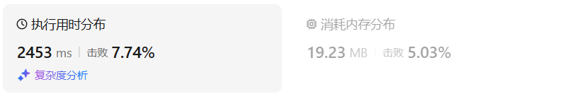
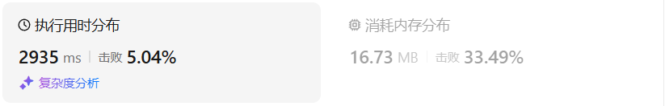

# 300最长递增子序列（中等）

[300. 最长递增子序列 - 力扣（LeetCode）](https://leetcode.cn/problems/longest-increasing-subsequence/description/)

## 题目描述

给你一个整数数组 `nums` ，找到其中最长严格递增子序列的长度。

**子序列** 是由数组派生而来的序列，删除（或不删除）数组中的元素而不改变其余元素的顺序。例如，`[3,6,2,7]` 是数组 `[0,3,1,6,2,2,7]` 的

子序列。

**示例 1：**

```
输入：nums = [10,9,2,5,3,7,101,18]
输出：4
解释：最长递增子序列是 [2,3,7,101]，因此长度为 4 。
```

**示例 2：**

```
输入：nums = [0,1,0,3,2,3]
输出：4
```

**示例 3：**

```
输入：nums = [7,7,7,7,7,7,7]
输出：1
```

 

**提示：**

- `1 <= nums.length <= 2500`
- `-104 <= nums[i] <= 104`

 

**进阶：**

- 你能将算法的时间复杂度降低到 `O(n log(n))` 吗?

## 我的C++解法


## C++参考答案


## C++收获


## 我的python解答

### 记忆化搜索

```python
class Solution:
    def lengthOfLIS(self, nums: List[int]) -> int:
        n = len(nums)
        @cache
        def dfs(i:int):
            res = 0
            for j in range(i):
                if nums[j]<nums[i]:
                    res = max(res,dfs(j))
            return res + 1
        return max(dfs(i) for i in range(n))
```

结果：



### 动态规划

```python
class Solution:
    def lengthOfLIS(self, nums: List[int]) -> int:
        n = len(nums)
        res = 0
        dp = [0]*n
        for i in range(n):
            for j in range(i):
                if nums[j]<nums[i]:
                    dp[i] = max(dp[i],dp[j]+1)
                    res = max(res,dp[i])
        return res+1
```

结果：



## python参考答案


## python收获