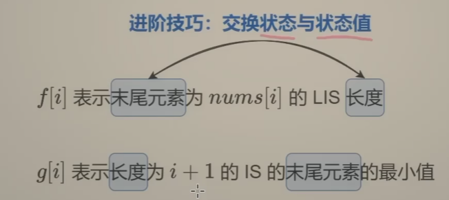
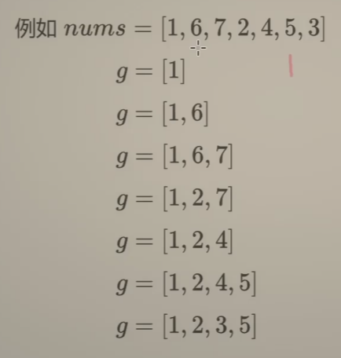

# 300最长递增子序列（中等）

[300. 最长递增子序列 - 力扣（LeetCode）](https://leetcode.cn/problems/longest-increasing-subsequence/)

## 题目描述

给你一个整数数组 `nums` ，找到其中最长严格递增子序列的长度。

**子序列** 是由数组派生而来的序列，删除（或不删除）数组中的元素而不改变其余元素的顺序。例如，`[3,6,2,7]` 是数组 `[0,3,1,6,2,2,7]` 的

子序列

。


 

**示例 1：**

```
输入：nums = [10,9,2,5,3,7,101,18]
输出：4
解释：最长递增子序列是 [2,3,7,101]，因此长度为 4 。
```

**示例 2：**

```
输入：nums = [0,1,0,3,2,3]
输出：4
```

**示例 3：**

```
输入：nums = [7,7,7,7,7,7,7]
输出：1
```

 

**提示：**

- `1 <= nums.length <= 2500`
- `-104 <= nums[i] <= 104`

 

**进阶：**

- 你能将算法的时间复杂度降低到 `O(n log(n))` 吗?

## 我的C++解法

### 记忆化搜索

```cpp
class Solution {
public:
    int lengthOfLIS(vector<int>& nums) {
        int n = nums.size();
        vector<int> memo(n,-1); // -1表示没有修改
        for(int i=0;i<n;i++){
            int& res = memo[i];
            if(res!=-1) return res;
            res = 0;
            for(int j=0;j<i;j++){
                if(nums[j]<nums[i]) res = max(res,memo[j]+1);
            }
        }
        int ans = 0;
        for(int i=0;i<n;i++){
            ans = max(ans,memo[i]);
        }
        return ans+1;
    }
};
```

结果：


### 递推

```cpp
class Solution {
public:
    int lengthOfLIS(vector<int>& nums) {
        int n = nums.size();
        vector<int> dp(n,0);
        int ans = 0;
        for(int i=0;i<n;i++){
            for(int j=0;j<i;j++){
                if(nums[j]<nums[i]){
                    dp[i] = max(dp[i],dp[j]+1);
                }
            }
            ans = max(ans,dp[i]);
        }
        return ans+1;
    }
};
```

结果：


## C++参考答案

**dp[i]表示i之前包括i的以nums[i]结尾的最长递增子序列的长度**


位置i的最长升序子序列等于j从0到i-1各个位置的最长升序子序列 + 1 的最大值。

所以：if (nums[i] > nums[j]) dp[i] = max(dp[i], dp[j] + 1);


每一个i，对应的dp[i]（即最长递增子序列）起始大小至少都是1.


dp[i] 是有0到i-1各个位置的最长递增子序列 推导而来，那么遍历i一定是从前向后遍历。

j其实就是遍历0到i-1，那么是从前到后，还是从后到前遍历都无所谓，只要吧 0 到 i-1 的元素都遍历了就行了。 所以默认习惯 从前向后遍历。


```cpp
class Solution {
public:
    int lengthOfLIS(vector<int>& nums) {
        if (nums.size() <= 1) return nums.size();
        vector<int> dp(nums.size(), 1);
        int result = 0;
        for (int i = 1; i < nums.size(); i++) {
            for (int j = 0; j < i; j++) {
                if (nums[i] > nums[j]) dp[i] = max(dp[i], dp[j] + 1);
            }
            if (dp[i] > result) result = dp[i]; // 取长的子序列
        }
        return result;
    }
};
```

- 时间复杂度: O(n^2)
- 空间复杂度: O(n)

### 记忆化搜索

```cpp
class Solution {
public:
    int lengthOfLIS(vector<int> &nums) {
        int n = nums.size();
        vector<int> memo(n); // 本题可以初始化成 0，表示没有计算过
        auto dfs = [&](auto&& dfs, int i) -> int {
            int &res = memo[i]; // 注意这里是引用
            if (res > 0) { // 之前计算过
                return res;
            }
            for (int j = 0; j < i; j++) {
                if (nums[j] < nums[i]) {
                    res = max(res, dfs(dfs, j));
                }
            }
            return ++res;
        };
        int ans = 0;
        for (int i = 0; i < n; i++) {
            ans = max(ans, dfs(dfs, i));
        }
        return ans;
    }
};
```

- 时间复杂度：O(*n*2)，其中 *n* 为 *nums* 的长度。由于每个状态只会计算一次，动态规划的时间复杂度 = 状态个数 × 单个状态的计算时间。本题中状态个数等于 O(*n*)，单个状态的计算时间为 O(*n*)，所以动态规划的时间复杂度为 O(*n*2)。
- 空间复杂度：O(*n*)。

### 方法二：递推

```cpp
class Solution {
public:
    int lengthOfLIS(vector<int> &nums) {
        int n = nums.size();
        vector<int> f(n);
        for (int i = 0; i < n; i++) {
            f[i] = 0;
            for (int j = 0; j < i; j++) {
                if (nums[j] < nums[i]) {
                    f[i] = max(f[i], f[j]);
                }
            }
            f[i]++;
        }
        return ranges::max(f);
    }
};
```

- 时间复杂度：O(*n*2)，其中 *n* 为 *nums* 的长度。
- 空间复杂度：O(*n*)。

### 贪心+二分查找

考虑时间复杂度的优化，技巧：交换状态和状态值

二分查找是指在g数组中进行查找



比如nums=[1,6,7,2,4,5,3]

遍历到1元素，本身可以作为长度为1的末尾元素的最小，g[0] = 1

遍历到6，经过二分查找，6比所有的数都大，因此可以夹在g数组的末尾（append）

g[0] = 1;g[1] = 6

如此循环下去



不得不说想出这个思路的也是神人了

```cpp
class Solution {
public:
    int lengthOfLIS(vector<int> &nums) {
        vector<int> g;
        for (int x : nums) {
            auto it = ranges::lower_bound(g, x);
            if (it == g.end()) {
                g.push_back(x); // >=x 的 g[j] 不存在
            } else {
                *it = x;
            }
        }
        return g.size();
    }
};
```

结果：


### 继续压缩空间

进行原地修改，直接把g填入nums中去

```cpp
class Solution {
public:
    int lengthOfLIS(vector<int> &nums) {
        auto end = nums.begin();
        for (int x : nums) {
            auto it = lower_bound(nums.begin(), end, x);
            *it = x;
            if (it == end) { // >=x 的 g[j] 不存在
                ++end;
            }
        }
        return end - nums.begin();
    }
};
```

结果：


## C++收获

### C++查找数组中的最值

<center>关键词：数组最值<center>

<center>关键词：ranges::max<center>

在C++20中，`std::ranges::max` 是一个新引入的函数，用于从给定范围内找到最大值。它是 C++ 标准库的一部分，专门设计用于与范围（如 `std::vector`、`std::array` 等）一起使用，并且利用了范围的概念，这是 C++20 引入的一个核心特性。

#### 函数原型

`std::ranges::max` 函数的原型如下：

```cpp
template <std::ranges::input_range R, std::indirectly_comparable<iterator_t<R>> Projection = identity>
constexpr auto max(R&& r, Projection proj = {}) -> decltype(auto);
```

#### 参数

- `R`：表示输入范围的类型，可以是任何实现了 `std::ranges::input_range` 概念的容器或迭代器。
- `Projection`：一个可选的投影函数，用于从每个元素中提取用于比较的部分。默认是 `std::identity`，意味着直接使用元素本身进行比较。

#### 返回值

- 返回一个表示范围内最大值的值。如果范围为空，返回值是未定义的。

#### 使用示例

以下是如何在 C++20 中使用 `std::ranges::max` 函数的示例：

```cpp
#include <iostream>
#include <vector>
#include <ranges>

int main() {
    std::vector<int> v = {1, 2, 3, 4, 5};

    // 找到最大值
    auto max_value = std::ranges::max(v);

    std::cout << "The maximum value is: " << max_value << std::endl;

    return 0;
}
```

在这个例子中，`std::ranges::max` 函数遍历 `v` 中的所有元素，并返回最大值。

#### 注意事项

1. **范围必须非空**：如果范围为空，`std::ranges::max` 的行为是未定义的。因此，在使用之前，你可能需要检查范围是否为空。

2. **投影函数**：你可以提供一个投影函数来指定如何从元素中提取用于比较的值。这在处理复杂对象时非常有用。

3. **性能**：`std::ranges::max` 通常通过遍历整个范围来工作，因此其时间复杂度为 O(n)，其中 n 是范围中元素的数量。

4. **C++20 特性**：`std::ranges::max` 是 C++20 的一部分，因此需要 C++20 兼容的编译器。

`std::ranges::max` 是处理范围和容器时的一个非常有用的工具，它简化了在现代 C++ 代码中查找最大值的常见任务。


在C++中，要获取数组中的最小值或最大值而不使用传统的`for`循环，你可以使用标准库中的`std::min_element`和`std::max_element`函数。这些函数定义在`<algorithm>`头文件中。

#### 获取最大值

使用`std::max_element`函数，你可以找到数组中的最大元素：

```cpp
#include <iostream>
#include <algorithm>

int main() {
    int arr[] = {10, 20, 30, 40, 50};
    int n = sizeof(arr) / sizeof(arr[0]);

    // 获取数组中的最大值
    int* max_element = std::max_element(arr, arr + n);

    std::cout << "Maximum element is: " << *max_element << std::endl;

    return 0;
}
```

#### 获取最小值

使用`std::min_element`函数，你可以找到数组中的最小元素：

```cpp
#include <iostream>
#include <algorithm>

int main() {
    int arr[] = {10, 20, 30, 40, 50};
    int n = sizeof(arr) / sizeof(arr[0]);

    // 获取数组中的最小值
    int* min_element = std::min_element(arr, arr + n);

    std::cout << "Minimum element is: " << *min_element << std::endl;

    return 0;
}
```

#### 注意事项

- `std::max_element` 和 `std::min_element` 函数返回的是指向找到的元素的指针，而不是元素的值。因此，你需要通过解引用指针来获取实际的值。
- 这两个函数需要随机访问迭代器，因此它们适用于普通数组和`std::vector`等容器，但不适用于如`std::list`这样的容器，后者不支持随机访问。
- 这些函数默认按升序比较元素。如果你需要按降序排序，可以提供自定义的比较函数。

这些函数提供了一种高效且简洁的方式来查找数组或容器中的最小值和最大值，而无需编写显式的循环。


### C++中的二分查找

<center>关键词：二分查找<center>

在C++中，二分查找（Binary Search）是一种在有序数组中查找特定元素的高效算法。二分查找通过每次将搜索范围缩小一半来快速定位目标值，其时间复杂度为 O(log n)，其中 n 是数组中元素的数量。

#### 算法原理

二分查找的基本思想是：
1. 比较数组中间的元素与目标值。
2. 如果中间元素正好是目标值，则查找成功。
3. 如果目标值小于中间元素，则在数组的左半部分继续查找。
4. 如果目标值大于中间元素，则在数组的右半部分继续查找。
5. 重复上述过程，直到找到目标值或搜索范围为空。

#### 标准库实现

C++标准库中的 `<algorithm>` 头文件提供了 `std::binary_search` 函数，用于执行二分查找。

```cpp
#include <algorithm>
#include <vector>

bool binarySearch(const std::vector<int>& nums, int target) {
    return std::binary_search(nums.begin(), nums.end(), target);
}
```

#### 自定义二分查找函数

你也可以自己实现二分查找函数，这样你可以更灵活地处理查找逻辑。

```cpp
#include <iostream>
#include <vector>

int binarySearch(const std::vector<int>& nums, int target) {
    int left = 0;
    int right = nums.size() - 1;

    while (left <= right) {
        int mid = left + (right - left) / 2; // 防止溢出
        if (nums[mid] == target) {
            return mid; // 找到目标值，返回索引
        } else if (nums[mid] < target) {
            left = mid + 1;
        } else {
            right = mid - 1;
        }
    }
    return -1; // 未找到目标值，返回-1
}

int main() {
    std::vector<int> nums = {1, 2, 3, 4, 5};
    int target = 3;
    int result = binarySearch(nums, target);
    if (result != -1) {
        std::cout << "Element found at index " << result << std::endl;
    } else {
        std::cout << "Element not found" << std::endl;
    }
    return 0;
}
```

#### 注意事项

1. **数组必须是有序的**：二分查找算法的前提是数组已经排序。
2. **返回值**：通常，二分查找返回目标元素的索引或一个表示未找到（如 `-1`）的特殊值。
3. **边界条件**：在计算中间索引时，使用 `left + (right - left) / 2` 可以避免整数溢出。

二分查找是计算机科学中常用的算法之一，适用于需要在有序数据集中快速查找元素的场景。

### 查找元素目标位置

<center>关键词：查找位置<center>

<center>关键词：lower_bound<center>

在C++20中，`std::ranges::lower_bound` 是一个算法，用于在有序范围内查找第一个不小于给定值的元素的迭代器。这个算法是标准库中 `std::lower_bound` 的范围版本，它利用了范围的概念，使得代码更加简洁和现代化。

#### 函数原型

`std::ranges::lower_bound` 的函数原型如下：

```cpp
template<ForwardIterator I, Sentinel<I> S, typename T>
constexpr I lower_bound(I first, S last, T&& value);
```

- `I` 和 `S` 分别表示迭代器和哨兵（sentinel），用于定义搜索范围。
- `T` 是要查找的值的类型。

#### 参数

- `first` 和 `last` 定义了要搜索的范围。
- `value` 是要查找的值。

#### 返回值

返回一个迭代器，指向范围中第一个不小于 `value` 的元素。如果所有元素都小于 `value`，则返回 `last`。

#### 使用示例

以下是使用 `std::ranges::lower_bound` 的示例：

```cpp
#include <iostream>
#include <vector>
#include <algorithm>
#include <ranges>

int main() {
    std::vector<int> vec = {1, 2, 4, 4, 5, 6, 8};

    // 查找第一个不小于 4 的元素
    auto it = std::ranges::lower_bound(vec, 4);

    if (it != vec.end()) {
        std::cout << "The first element not less than 4 is: " << *it << std::endl;
    } else {
        std::cout << "All elements are less than 4." << std::endl;
    }

    return 0;
}
```

在这个例子中，`std::ranges::lower_bound` 查找并返回指向第一个不小于 `4` 的元素的迭代器。

#### 注意事项

1. 范围必须是有序的。
2. `std::ranges::lower_bound` 通常用于查找元素的插入位置，或者确定一个元素是否存在于有序范围内。
3. 如果需要自定义比较逻辑，可以提供第三个参数作为比较函数或 Lambda 表达式。

`std::ranges::lower_bound` 是 C++20 中处理范围和容器的强大工具之一，它提供了一种简洁和高效的方式来执行二分查找。

## 我的python解答

见昨天的解答

## python参考答案

动态规划

```python
class Solution:
    def lengthOfLIS(self, nums: List[int]) -> int:
        if len(nums) <= 1:
            return len(nums)
        dp = [1] * len(nums)
        result = 1
        for i in range(1, len(nums)):
            for j in range(0, i):
                if nums[i] > nums[j]:
                    dp[i] = max(dp[i], dp[j] + 1)
            result = max(result, dp[i]) #取长的子序列
        return result
```

### 记忆化搜索

```py
class Solution:
    def lengthOfLIS(self, nums: List[int]) -> int:
        @cache
        def dfs(i: int) -> int:
            res = 0
            for j in range(i):
                if nums[j] < nums[i]:
                    res = max(res, dfs(j))
            return res + 1
        return max(dfs(i) for i in range(len(nums)))
```

### 递推

```py
class Solution:
    def lengthOfLIS(self, nums: List[int]) -> int:
        f = [0] * len(nums)
        for i, x in enumerate(nums):
            for j, y in enumerate(nums[:i]):
                if x > y:
                    f[i] = max(f[i], f[j])
            f[i] += 1
        return max(f)
```

### 贪心+二分

```py
class Solution:
    def lengthOfLIS(self, nums: List[int]) -> int:
        g = []
        for x in nums:
            j = bisect_left(g, x)
            if j == len(g):  # >=x 的 g[j] 不存在
                g.append(x)
            else:
                g[j] = x
        return len(g)
```

结果：


### 原地修改

```py
class Solution:
    def lengthOfLIS(self, nums: List[int]) -> int:
        ng = 0  # g 的长度
        for x in nums:
            j = bisect_left(nums, x, 0, ng)
            nums[j] = x
            if j == ng:  # >=x 的 g[j] 不存在
                ng += 1 
        return ng
```

结果：


## python收获

### 二分查找

<center>关键词：二分查找<center>

在Python中，并没有内置的二分查找函数，但是你可以轻松地使用`bisect`模块来实现二分查找的功能。`bisect`模块提供了一个用于维护有序列表的函数，同时提供了二分查找的功能。

以下是如何使用`bisect`模块进行二分查找的示例：

#### 1. 使用 `bisect_left` 进行二分查找

`bisect_left` 函数会返回列表中第一个不小于目标值的元素的索引。

```python
import bisect

def binary_search(arr, target):
    # 找到第一个不小于目标值的元素的索引
    index = bisect.bisect_left(arr, target)
    if index != len(arr) and arr[index] == target:
        return index
    return -1

# 示例
arr = [1, 2, 3, 4, 5, 6, 7, 8, 9]
target = 5
result = binary_search(arr, target)
print("Index of", target, "is", result)
```

#### 2. 使用 `bisect_right` 进行二分查找

`bisect_right` 函数会返回列表中第一个大于目标值的元素的索引。

```python
import bisect

def binary_search(arr, target):
    # 找到第一个大于目标值的元素的索引
    index = bisect.bisect_right(arr, target)
    if index != len(arr) and arr[index - 1] == target:
        return index - 1
    return -1

# 示例
arr = [1, 2, 3, 4, 5, 6, 7, 8, 9]
target = 5
result = binary_search(arr, target)
print("Index of", target, "is", result)
```

#### 3. 使用 `bisect` 进行二分插入

如果你需要找到元素应该插入的位置以保持列表的有序性，可以使用 `bisect` 函数。

```python
import bisect

def binary_insert(arr, target):
    index = bisect.bisect(arr, target)
    arr.insert(index, target)
    return arr

# 示例
arr = [1, 2, 3, 4, 5, 6, 7, 8, 9]
target = 5
result = binary_insert(arr, target)
print("Array after insertion:", result)
```

#### 注意事项

1. **列表必须是有序的**：`bisect` 模块的函数都要求列表是有序的。
2. **返回值**：`bisect_left` 和 `bisect_right` 返回的是索引，而不是元素值。如果未找到目标值，`bisect_left` 返回数组长度，`bisect_right` 返回数组长度或最后一个元素的索引。
3. **时间复杂度**：`bisect` 模块的函数时间复杂度为 O(log n)。

`bisect` 模块是Python中处理有序列表的强大工具，它不仅可以用于二分查找，还可以用于维护有序列表的插入和删除操作。