# 674最长连续递增序列

[674. 最长连续递增序列 - 力扣（LeetCode）](https://leetcode.cn/problems/longest-continuous-increasing-subsequence/description/)

## 题目描述

给定一个未经排序的整数数组，找到最长且 **连续递增的子序列**，并返回该序列的长度。

**连续递增的子序列** 可以由两个下标 `l` 和 `r`（`l < r`）确定，如果对于每个 `l <= i < r`，都有 `nums[i] < nums[i + 1]` ，那么子序列 `[nums[l], nums[l + 1], ..., nums[r - 1], nums[r]]` 就是连续递增子序列。

 

**示例 1：**

```
输入：nums = [1,3,5,4,7]
输出：3
解释：最长连续递增序列是 [1,3,5], 长度为3。
尽管 [1,3,5,7] 也是升序的子序列, 但它不是连续的，因为 5 和 7 在原数组里被 4 隔开。 
```

**示例 2：**

```
输入：nums = [2,2,2,2,2]
输出：1
解释：最长连续递增序列是 [2], 长度为1。
```

 

**提示：**

- `1 <= nums.length <= 104`
- `-109 <= nums[i] <= 109`

## 我的C++解法

### 双指针

```cpp
class Solution {
public:
    int findLengthOfLCIS(vector<int>& nums) {
        int n = nums.size();
        int ans=1;
        for(int i=1;i<n;i++){
            int tmp = 1;
            for(int j = i;j<n;j++){
                if(nums[j-1]<nums[j]){
                    tmp += 1;
                    ans = max(ans,tmp);
                }
                else{
                    i = j;
                    break;
                }
            }
        }
        return ans;
    }
};
```

结果：

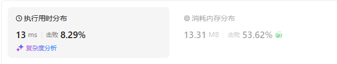

### 记忆化搜索

```cpp
class Solution {
public:
    int findLengthOfLCIS(vector<int>& nums) {
        // 记忆化搜索
        int n = nums.size();
        vector<int> memo(n,0);
        auto dfs = [&](auto&& dfs,int i)->int{
            int& res = memo[i];
            if(res!=0)  return res;
            if(i<=0 || nums[i]<=nums[i-1])  return res = 1;
            return res = dfs(dfs,i-1)+1;
        };
        int ans = 1;
        for(int i=0;i<n;i++){
            ans = max(ans,dfs(dfs,i));
        }
        return ans;
    }
};
```

结果：

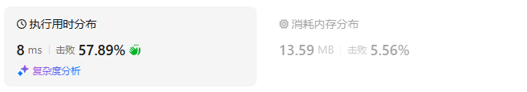

### 递推

```cpp
class Solution {
public:
    int findLengthOfLCIS(vector<int>& nums) {
        // 递推
        int n = nums.size();
        vector<int> dp(n+1,0);
        dp[0] = dp[1] = 1;
        for(int i=1;i<n;i++){
            if(nums[i]>nums[i-1])   dp[i+1] = dp[i]+1;
            else dp[i+1] = 1;
        }
        return ranges::max(dp);
    }
};
```

结果：

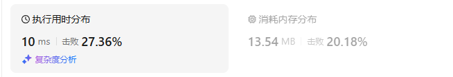

### 优化

```cpp
class Solution {
public:
    int findLengthOfLCIS(vector<int>& nums) {
        // 尝试优化
        vector<int> g;
        g.push_back(nums[0]);
        int ans = 1;
        for(int x:nums){
            if(x>g.back()){
                g.push_back(x);
                int n = g.size();
                ans = max(ans,n);
            }
            else{
                g.clear();
                g.push_back(x);
            }
        }
        return ans;
    }
};
```

结果：

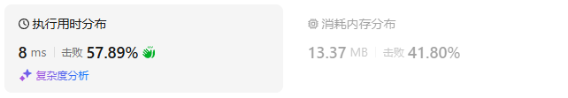

```cpp
class Solution {
public:
    int findLengthOfLCIS(vector<int>& nums) {
        int n = nums.size();
        int g=1;
        int ans = 1;
        for(int i=1;i<n;i++){
            if(nums[i]>nums[i-1]){
                g++;
                ans = max(ans,g);
            }
            else{
                g=1;
            }
        }
        return ans;
    }
};
```

结果：

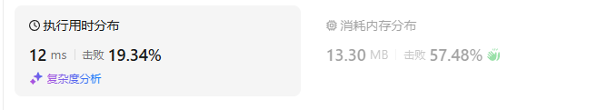

怎么感觉搞的跟负优化了似的

## C++参考答案

**dp[i]：以下标i为结尾的连续递增的子序列长度为dp[i]**。


如果 nums[i] > nums[i - 1]，那么以 i 为结尾的连续递增的子序列长度 一定等于 以i - 1为结尾的连续递增的子序列长度 + 1 。

即：dp[i] = dp[i - 1] + 1;


以下标i为结尾的连续递增的子序列长度最少也应该是1，即就是nums[i]这一个元素。

所以dp[i]应该初始1;


从递推公式上可以看出， dp[i + 1]依赖dp[i]，所以一定是从前向后遍历。

```cpp
class Solution {
public:
    int findLengthOfLCIS(vector<int>& nums) {
        if (nums.size() == 0) return 0;
        int result = 1;
        vector<int> dp(nums.size() ,1);
        for (int i = 1; i < nums.size(); i++) {
            if (nums[i] > nums[i - 1]) { // 连续记录
                dp[i] = dp[i - 1] + 1;
            }
            if (dp[i] > result) result = dp[i];
        }
        return result;
    }
};
```

- 时间复杂度：O(n)
- 空间复杂度：O(n)


可以用贪心来做，也就是遇到nums[i] > nums[i - 1]的情况，count就++，否则count为1，记录count的最大值就可以了。

```cpp
class Solution {
public:
    int findLengthOfLCIS(vector<int>& nums) {
        if (nums.size() == 0) return 0;
        int result = 1; // 连续子序列最少也是1
        int count = 1;
        for (int i = 1; i < nums.size(); i++) {
            if (nums[i] > nums[i - 1]) { // 连续记录
                count++;
            } else { // 不连续，count从头开始
                count = 1;
            }
            if (count > result) result = count;
        }
        return result;
    }
};
```

- 时间复杂度：O(n)
- 空间复杂度：O(1)

## C++收获


## 我的python解答

### 双指针（小暴力）

```python
class Solution:
    def findLengthOfLCIS(self, nums: List[int]) -> int:
        # 暴力枚举：略
        # 贪心思想：如果在判断(i,j)是否是连续递增序列时，从左向右进行判断，如果判断到k发现不是连续递增，则i可以直接跳到k+1；ans可以选择性更新为k-i+1
        n = len(nums)
        # 双指针
        i = 0
        ans = 1
        for i in range(n-1):
            tmp = 1
            for j in range(i,n-1):
                if nums[j]<nums[j+1]:
                    tmp += 1
                    ans = max(ans,tmp)
                else:
                    i = j+1
                    break
        return ans
```

结果：

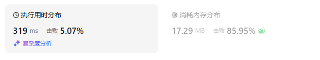

### 记忆化搜索

```python
class Solution:
    def findLengthOfLCIS(self, nums: List[int]) -> int:
        n = len(nums)
        @cache
        def dfs(i:int):
            if i<=0 or nums[i]<=nums[i-1]:
                return 1
            # if nums[i]<=nums[i-1]:  return dfs(i-1)
            return dfs(i-1)+1 if nums[i]>nums[i-1] else dfs(i-1)
        return max(dfs(i) for i in range(n))
```

结果：

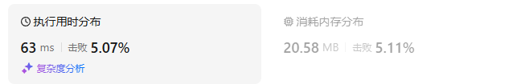

实际上并不需要最后在return上面进行判断，直接返回dfs(i-1)+1即可，因为当前元素不大于前一个元素的情况已经考虑过了

```python
class Solution:
    def findLengthOfLCIS(self, nums: List[int]) -> int:
        n = len(nums)
        @cache
        def dfs(i:int):
            if i<=0 or nums[i]<=nums[i-1]:
                return 1
            return dfs(i-1)+1
        return max(dfs(i) for i in range(n))
```

结果：

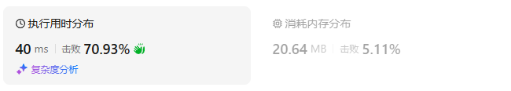

### 递推

```python
class Solution:
    def findLengthOfLCIS(self, nums: List[int]) -> int:
        # 递推
        n = len(nums)
        f = [0]*(n+1)
        f[0] = 1
        for i in range(n-1):
            f[i+1] = f[i]+1 if nums[i]<nums[i+1] else  1
        if nums[n-1]>nums[n-2]: f[n] += f[n-1]
        return max(f)
```

结果：

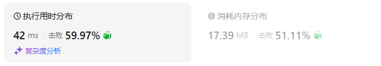

### 尝试优化：

把状态和结果反着存储

```python
class Solution:
    def findLengthOfLCIS(self, nums: List[int]) -> int:
        # 尝试优化
        # 把状态和结果反过来？
        g = [nums[0]]
        ans = 1
        for x in nums:
            if x>g[len(g)-1]:
                g.append(x)
            else:
                ans = max(ans,len(g))
                g.clear()
                g.append(x)
        return max(ans,len(g))
```

结果：

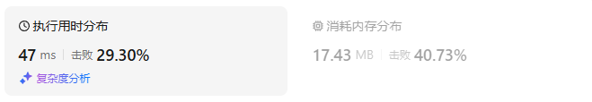

使用一个变量存储长度而不是一个数组

```python
class Solution:
    def findLengthOfLCIS(self, nums: List[int]) -> int:
        # 尝试优化
        # 把状态和结果反过来？
        n = len(nums)
        gn = 1
        ans = 1
        for i in range(1,n):
            if nums[i]>nums[i-1]:
                gn += 1
            else:
                ans = max(ans,gn)
                gn = 1
        return max(ans,gn)
```

结果：

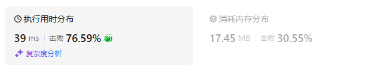

## python参考答案

```python
class Solution:
    def findLengthOfLCIS(self, nums: List[int]) -> int:
        if len(nums) == 0:
            return 0
        result = 1
        dp = [1] * len(nums)
        for i in range(len(nums)-1):
            if nums[i+1] > nums[i]: #连续记录
                dp[i+1] = dp[i] + 1
            result = max(result, dp[i+1])
        return result
```

```python
class Solution:
    def findLengthOfLCIS(self, nums: List[int]) -> int:
        if not nums:
            return 0

        max_length = 1
        current_length = 1

        for i in range(1, len(nums)):
            if nums[i] > nums[i - 1]:
                current_length += 1
                max_length = max(max_length, current_length)
            else:
                current_length = 1

        return max_length
```

```python
class Solution:
    def findLengthOfLCIS(self, nums: List[int]) -> int:
        if len(nums) == 0:
            return 0
        result = 1 #连续子序列最少也是1
        count = 1
        for i in range(len(nums)-1):
            if nums[i+1] > nums[i]: #连续记录
                count += 1
            else: #不连续，count从头开始
                count = 1
            result = max(result, count)
        return result
```

## python收获