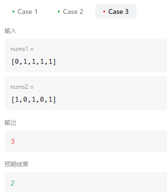
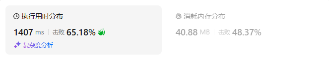

# 718最长重复子数组（中等）

[718. 最长重复子数组 - 力扣（LeetCode）](https://leetcode.cn/problems/maximum-length-of-repeated-subarray/description/)

## 题目描述

给两个整数数组 `nums1` 和 `nums2` ，返回 *两个数组中 **公共的** 、长度最长的子数组的长度* 。

 

**示例 1：**

```
输入：nums1 = [1,2,3,2,1], nums2 = [3,2,1,4,7]
输出：3
解释：长度最长的公共子数组是 [3,2,1] 。
```

**示例 2：**

```
输入：nums1 = [0,0,0,0,0], nums2 = [0,0,0,0,0]
输出：5
```

 

**提示：**

- `1 <= nums1.length, nums2.length <= 1000`
- `0 <= nums1[i], nums2[i] <= 100`

## 我的C++解法

```cpp
class Solution {
public:
    int findLength(vector<int>& nums1, vector<int>& nums2) {
        int m = nums1.size();
        int n = nums2.size();
        vector<vector<int>> dp(m+1,vector<int>(n+1,0));
        int ans = 0;
        for(int i=0;i<m;i++){
            for(int j=0;j<n;j++){
                if(nums1[i] == nums2[j]){
                    dp[i+1][j+1] = dp[i][j] + 1;
                    ans = max(ans,dp[i+1][j+1]);
                }
            }
        }
        return ans;
    }
};
```

结果：


## C++参考答案

用二维数组可以记录两个字符串的所有比较情况，这样就比较好推 递推公式了。


dp\[i][j] ：以下标i - 1为结尾的A，和以下标j - 1为结尾的B，最长重复子数组长度为dp\[i][j]。 （**特别注意**： “以下标i - 1为结尾的A” 标明一定是 以A[i-1]为结尾的字符串 ）

其实dp\[i][j]的定义也就决定着，我们在遍历dp[i][j]的时候i 和 j都要从1开始。


根据dp[i][j]的定义，dp\[i][j]的状态只能由dp\[i - 1][j - 1]推导出来。

即当A[i - 1] 和B[j - 1]相等的时候，dp\[i][j] = dp\[i - 1][j - 1] + 1;

根据递推公式可以看出，遍历i 和 j 要从1开始！


根据dp\[i][j]的定义，dp\[i][0] 和dp\[0][j]其实都是没有意义的！

但dp\[i][0] 和dp\[0][j]要初始值，因为 为了方便递归公式dp\[i][j] = dp\[i - 1][j - 1] + 1;

所以dp\[i][0] 和dp\[0][j]初始化为0。

举个例子A[0]如果和B[0]相同的话，dp\[1][1] = dp\[0][0] + 1，只有dp\[0][0]初始为0，正好符合递推公式逐步累加起来。


外层for循环遍历A，内层for循环遍历B。(内外无所谓)


拿示例1中，A: [1,2,3,2,1]，B: [3,2,1,4,7]为例，画一个dp数组的状态变化，如下：


```cpp
class Solution {
public:
    int findLength(vector<int>& nums1, vector<int>& nums2) {
        vector<vector<int>> dp (nums1.size() + 1, vector<int>(nums2.size() + 1, 0));
        int result = 0;
        for (int i = 1; i <= nums1.size(); i++) {
            for (int j = 1; j <= nums2.size(); j++) {
                if (nums1[i - 1] == nums2[j - 1]) {
                    dp[i][j] = dp[i - 1][j - 1] + 1;
                }
                if (dp[i][j] > result) result = dp[i][j];
            }
        }
        return result;
    }
};
```

- 时间复杂度：O(n × m)，n 为A长度，m为B长度
- 空间复杂度：O(n × m)


空间优化

可以看出dp\[i][j]都是由dp\[i - 1][j - 1]推出。那么压缩为一维数组，也就是dp[j]都是由dp[j - 1]推出。

也就是相当于可以把上一层dp\[i - 1][j]拷贝到下一层dp\[i][j]来继续用。

**此时遍历B数组的时候，就要从后向前遍历，这样避免重复覆盖**。

```cpp
class Solution {
public:
    int findLength(vector<int>& A, vector<int>& B) {
        vector<int> dp(vector<int>(B.size() + 1, 0));
        int result = 0;
        for (int i = 1; i <= A.size(); i++) {
            for (int j = B.size(); j > 0; j--) {
                if (A[i - 1] == B[j - 1]) {
                    dp[j] = dp[j - 1] + 1;
                } else dp[j] = 0; // 注意这里不相等的时候要有赋0的操作
                if (dp[j] > result) result = dp[j];
            }
        }
        return result;
    }
};
```

- 时间复杂度：$O(n × m)$，n 为A长度，m为B长度
- 空间复杂度：$O(m)$

## C++收获


## 我的python解答

### 记忆化搜索

考虑选或者不选

```python
class Solution:
    def findLength(self, nums1: List[int], nums2: List[int]) -> int:
        # 最常见的思路是双指针遍历两个数组
        # 想起来了KMP算法？
        m, n = len(nums1), len(nums2)
        # # 交换，使得nums2始终是个数最小的
        # if m<n:
        #     m,n = n,m
        #     nums1, nums2 = nums2, nums1
        @cache
        def dfs(i:int, j:int):
            if i<0 or j<0:  return 0
            if nums1[i]==nums2[j]:
                return max(dfs(i-1,j-1)+1,dfs(i-1,j),dfs(i,j-1))
            return max(dfs(i-1,j-1),dfs(i-1,j),dfs(i,j-1))
        return dfs(m-1,n-1)
```

结果：



本来以为这个思路是正确的，实际带入进去发现确实是错误的，错在了if里面，并没有保障连续啊

```python
class Solution:
    def findLength(self, nums1: List[int], nums2: List[int]) -> int:
        m , n = len(nums1), len(nums2)
        @cache
        def dfs(i:int, j:int):
            # 表示以i，j为结尾的数组的公共子数组最大长度
            if i<0 or j<0:
                return 0
            if nums1[i] == nums2[j]:
                return dfs(i-1,j-1)+1
            return 0
        ans = 0
        for i in range(m):
            for j in range(n):
                ans = max(ans,dfs(i,j))
        return ans
```

内存爆了

### 递推

```python
class Solution:
    def findLength(self, nums1: List[int], nums2: List[int]) -> int:
        m , n = len(nums1), len(nums2)
        f = [[0]*(n+1) for _ in range(m+1)]
        ans = 0
        for i in range(m):
            for j in range(n):
                if nums1[i] == nums2[j]:
                    f[i+1][j+1] = f[i][j]+1
                    ans = max(ans,f[i+1][j+1])
        return ans
```

结果：



### 优化空间

优化不出来

## python参考答案

```python
class Solution:
    def findLength(self, nums1: List[int], nums2: List[int]) -> int:
        # 创建一个二维数组 dp，用于存储最长公共子数组的长度
        dp = [[0] * (len(nums2) + 1) for _ in range(len(nums1) + 1)]
        # 记录最长公共子数组的长度
        result = 0

        # 遍历数组 nums1
        for i in range(1, len(nums1) + 1):
            # 遍历数组 nums2
            for j in range(1, len(nums2) + 1):
                # 如果 nums1[i-1] 和 nums2[j-1] 相等
                if nums1[i - 1] == nums2[j - 1]:
                    # 在当前位置上的最长公共子数组长度为前一个位置上的长度加一
                    dp[i][j] = dp[i - 1][j - 1] + 1
                # 更新最长公共子数组的长度
                if dp[i][j] > result:
                    result = dp[i][j]

        # 返回最长公共子数组的长度
        return result
```

```python
class Solution:
    def findLength(self, nums1: List[int], nums2: List[int]) -> int:
        # 创建一个一维数组 dp，用于存储最长公共子数组的长度
        dp = [0] * (len(nums2) + 1)
        # 记录最长公共子数组的长度
        result = 0

        # 遍历数组 nums1
        for i in range(1, len(nums1) + 1):
            # 用于保存上一个位置的值
            prev = 0
            # 遍历数组 nums2
            for j in range(1, len(nums2) + 1):
                # 保存当前位置的值，因为会在后面被更新
                current = dp[j]
                # 如果 nums1[i-1] 和 nums2[j-1] 相等
                if nums1[i - 1] == nums2[j - 1]:
                    # 在当前位置上的最长公共子数组长度为上一个位置的长度加一
                    dp[j] = prev + 1
                    # 更新最长公共子数组的长度
                    if dp[j] > result:
                        result = dp[j]
                else:
                    # 如果不相等，将当前位置的值置为零
                    dp[j] = 0
                # 更新 prev 变量为当前位置的值，供下一次迭代使用
                prev = current

        # 返回最长公共子数组的长度
        return result
```

## python收获