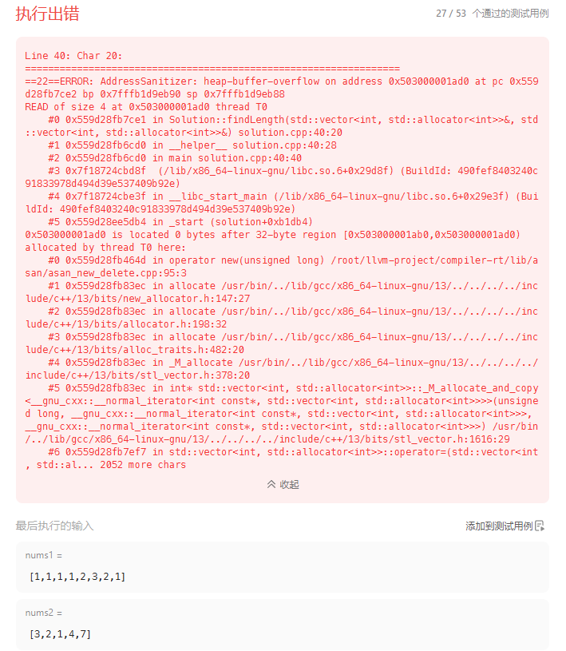
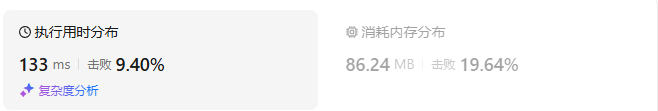
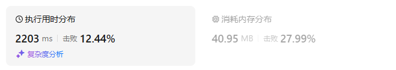
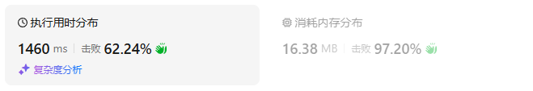

# 718最长重复子数组（中等）

[718. 最长重复子数组 - 力扣（LeetCode）](https://leetcode.cn/problems/maximum-length-of-repeated-subarray/description/)

## 题目描述

给两个整数数组 `nums1` 和 `nums2` ，返回 *两个数组中 **公共的** 、长度最长的子数组的长度* 。

 

**示例 1：**

```
输入：nums1 = [1,2,3,2,1], nums2 = [3,2,1,4,7]
输出：3
解释：长度最长的公共子数组是 [3,2,1] 。
```

**示例 2：**

```
输入：nums1 = [0,0,0,0,0], nums2 = [0,0,0,0,0]
输出：5
```

 

**提示：**

- `1 <= nums1.length, nums2.length <= 1000`
- `0 <= nums1[i], nums2[i] <= 100`

## 我的C++解法

```cpp
class Solution {
public:
    int findLength(vector<int>& nums1, vector<int>& nums2) {
        // 试着考虑滑动窗口问题
        // 那就必然是先对齐，然后移动小数组
        // 思路是小数组的尾部和长数组的首部对齐，然后移动小数组，直到没有重合
        int m = nums1.size();
        int n = nums2.size();
        if(m==0 || n==0)    return 0;
        // 始终保持num1为长数组，nums2为短数组
        vector<int> A;
        vector<int> B;
        if(m<n){
            A = nums2;
            B = nums1;
            swap(m,n);
        }
        else{
            A = nums1;
            B = nums2;
        }
        int ans = 0;
        int intersection = 1;// 重叠部分长度
        int tmp = 0;
        while(intersection<n){
            for(int i=0,j = n-intersection;i<intersection,j<n;i++,j++){
                if(A[i] == B[j]){
                    tmp++;
                    ans = max(ans,tmp);
                }
                else    tmp = 0;
            }
            intersection++;
        }       
        return ans;
    }
};
```

在debug之后这样子不行，因为它只枚举了小数组从0完全嵌入大数组的过程，没有考虑从完全嵌入再到完全分离这个过程

不得不承认滑动窗口怎么这么难写

```cpp
class Solution {
public:
    int findLength(vector<int>& nums1, vector<int>& nums2) {
        // 试着考虑滑动窗口问题
        // 那就必然是先对齐，然后移动小数组
        // 思路是小数组的尾部和长数组的首部对齐，然后移动小数组，直到没有重合
        int m = nums1.size();
        int n = nums2.size();
        if(m==0 || n==0)    return 0;
        // 始终保持num1为长数组，nums2为短数组
        vector<int> A;
        vector<int> B;
        if(m<n){
            A = nums2;
            B = nums1;
            swap(m,n);
        }
        else{
            A = nums1;
            B = nums2;
        }
        int ans = 0;
        int intersection = 1;// 重叠部分长度
        int tmp = 0;
        while(intersection<=n){
            for(int i=0,j = n-intersection;i<intersection,j<n;i++,j++){
                if(A[i] == B[j]){
                    tmp++;
                    ans = max(ans,tmp);
                }
                else    tmp = 0;
            }
            tmp = 0;
            intersection++;
        }       
        tmp = 0;
        for(int k = 0;k<m-n;k++){
            // 在内部移动
            for(int i=m+k-n-1,j=0;i<m+k-1,j<n;i++,j++){
                if(A[i]==B[j])  ans = max(ans,++tmp);
                else    tmp=0;
            }
            tmp=0;
        }
        tmp = 0;
        for(int k=0;k<n-1;k++){
            // 移出
            for(int i=m-n+k+1,j=0;i<m,j<n-k-1;i++,j++){
                if(A[i]==B[j])  ans = max(ans,++tmp);
                else    tmp=0;                
            }
            tmp=0;
        }
        return ans;
    }
};
```

纯纯的暴力，直接爆栈了



## C++参考答案

容易想到一个暴力解法，即枚举数组 `A` 中的起始位置 `i` 与数组 `B` 中的起始位置 `j`，然后计算 `A[i:]` 与 `B[j:]` 的最长公共前缀 `k`。最终答案即为所有的最长公共前缀的最大值。

> 这里借用了 `Python` 表示数组的方法，`A[i:]` 表示数组 `A` 中索引 `i` 到数组末尾的范围对应的子数组。

这个过程的伪代码如下：

```ruby
ans = 0
for i in [0 .. A.length - 1]
    for j in [0 .. B.length - 1]
        k = 0
        while (A[i+k] == B[j+k]) do   # and i+k < A.length etc.
            k += 1
        end while
        ans = max(ans, k)
    end for
end for
```

虽然该暴力解法的最坏时间复杂度为 *O*(*n*3)，但通过观察该暴力解法，我们可以提出几个时间复杂度更优秀的解法。

### 方法一：动态规划

**思路及算法**

暴力解法的过程中，我们发现最坏情况下对于任意 `i` 与 `j` ，`A[i]` 与 `B[j]` 比较了 min(*i*+1,*j*+1) 次。这也是导致了该暴力解法时间复杂度过高的根本原因。

不妨设 `A` 数组为 `[1, 2, 3]`，`B` 两数组为为 `[1, 2, 4]` ，那么在暴力解法中 `A[2]` 与 `B[2]` 被比较了三次。这三次比较分别是我们计算 `A[0:]` 与 `B[0:]` 最长公共前缀、 `A[1:]` 与 `B[1:]` 最长公共前缀以及 `A[2:]` 与 `B[2:]` 最长公共前缀时产生的。

我们希望优化这一过程，使得任意一对 `A[i]` 和 `B[j]` 都只被比较一次。这样我们自然而然想到利用这一次的比较结果。如果 `A[i] == B[j]`，那么我们知道 `A[i:]` 与 `B[j:]` 的最长公共前缀为 `A[i + 1:]` 与 `B[j + 1:]` 的最长公共前缀的长度加一，否则我们知道 `A[i:]` 与 `B[j:]` 的最长公共前缀为零。

这样我们就可以提出动态规划的解法：令 `dp[i][j]` 表示 `A[i:]` 和 `B[j:]` 的最长公共前缀，那么答案即为所有 `dp[i][j]` 中的最大值。如果 `A[i] == B[j]`，那么 `dp[i][j] = dp[i + 1][j + 1] + 1`，否则 `dp[i][j] = 0`。

> 这里借用了 `Python` 表示数组的方法，`A[i:]` 表示数组 `A` 中索引 `i` 到数组末尾的范围对应的子数组。

考虑到这里 `dp[i][j]` 的值从 `dp[i + 1][j + 1]` 转移得到，所以我们需要倒过来，首先计算 `dp[len(A) - 1][len(B) - 1]`，最后计算 `dp[0][0]`。

```cpp
class Solution {
public:
    int findLength(vector<int>& A, vector<int>& B) {
        int n = A.size(), m = B.size();
        vector<vector<int>> dp(n + 1, vector<int>(m + 1, 0));
        int ans = 0;
        for (int i = n - 1; i >= 0; i--) {
            for (int j = m - 1; j >= 0; j--) {
                dp[i][j] = A[i] == B[j] ? dp[i + 1][j + 1] + 1 : 0;
                ans = max(ans, dp[i][j]);
            }
        }
        return ans;
    }
};
```

结果：



**复杂度分析**

- 时间复杂度： *O*(*N*×*M*)。
- 空间复杂度： *O*(*N*×*M*)。

> `N` 表示数组 `A` 的长度，`M` 表示数组 `B` 的长度。
>
> 空间复杂度还可以再优化，利用滚动数组可以优化到 *O*(min(*N*,*M*))。

### 方法二：滑动窗口

**思路及算法**

我们注意到之所以两位置会比较多次，是因为重复子数组在两个数组中的位置可能不同。以 `A = [3, 6, 1, 2, 4]`, `B = [7, 1, 2, 9]` 为例，它们的最长重复子数组是 `[1, 2]`，在 `A` 与 `B` 中的开始位置不同。

但如果我们知道了开始位置，我们就可以根据它们将 `A` 和 `B` 进行「对齐」，即：

```
A = [3, 6, 1, 2, 4]
B =    [7, 1, 2, 9]
           ↑  ↑
```

此时，最长重复子数组在 `A` 和 `B` 中的开始位置相同，我们就可以对这两个数组进行一次遍历，得到子数组的长度，伪代码如下：

```python
ans = 0
len = min(A.length, B.length)
k = 0
for i in [0 .. len - 1] do
    if (A[i] == B[i]) then
        k = k + 1
    else
        k = 0
    end if
    ans = max(ans, k)
end for
```


> 注意这里指定了 `A[i]` 对齐 `B[i]`，在实际代码实现中会通过指定初始位置 `addA` 与 `addB` 的方式来对齐，因此表达式会略有差别。

我们可以枚举 `A` 和 `B` 所有的对齐方式。对齐的方式有两类：第一类为 `A` 不变，`B` 的首元素与 `A` 中的某个元素对齐；第二类为 `B` 不变，`A` 的首元素与 `B` 中的某个元素对齐。对于每一种对齐方式，我们计算它们相对位置相同的重复子数组即可。


```cpp
class Solution {
public:
    int maxLength(vector<int>& A, vector<int>& B, int addA, int addB, int len) {
        int ret = 0, k = 0;
        for (int i = 0; i < len; i++) {
            if (A[addA + i] == B[addB + i]) {
                k++;
            } else {
                k = 0;
            }
            ret = max(ret, k);
        }
        return ret;
    }
    int findLength(vector<int>& A, vector<int>& B) {
        int n = A.size(), m = B.size();
        int ret = 0;
        for (int i = 0; i < n; i++) {
            int len = min(m, n - i);
            int maxlen = maxLength(A, B, i, 0, len);
            ret = max(ret, maxlen);
        }
        for (int i = 0; i < m; i++) {
            int len = min(n, m - i);
            int maxlen = maxLength(A, B, 0, i, len);
            ret = max(ret, maxlen);
        }
        return ret;
    }
};
```

结果：


**复杂度分析**

- 时间复杂度： *O*((*N*+*M*)×min(*N*,*M*))。
- 空间复杂度： *O*(1)。

> `N` 表示数组 `A` 的长度，`M` 表示数组 `B` 的长度。

### 动态规划改变定义方式

定义dp\[i][j]为 以下标i为结尾的A，和以下标j 为结尾的B，最长重复子数组长度。

那么 第一行和第一列毕竟要进行初始化，如果nums1[i] 与 nums2[0] 相同的话，对应的 dp[i][0]就要初始为1， 因为此时最长重复子数组为1。 nums2[j] 与 nums1[0]相同的话，同理。

```cpp
class Solution {
public:
    int findLength(vector<int>& nums1, vector<int>& nums2) {
        vector<vector<int>> dp (nums1.size() + 1, vector<int>(nums2.size() + 1, 0));
        int result = 0;

        // 要对第一行，第一列经行初始化
        for (int i = 0; i < nums1.size(); i++) if (nums1[i] == nums2[0]) dp[i][0] = 1;
        for (int j = 0; j < nums2.size(); j++) if (nums1[0] == nums2[j]) dp[0][j] = 1;

        for (int i = 0; i < nums1.size(); i++) {
            for (int j = 0; j < nums2.size(); j++) {
                if (nums1[i] == nums2[j] && i > 0 && j > 0) { // 防止 i-1 出现负数
                    dp[i][j] = dp[i - 1][j - 1] + 1;
                }
                if (dp[i][j] > result) result = dp[i][j];
            }
        }
        return result;
    }
};
```

这种写法 一定要多写一段初始化的过程。

而且为了让 `if (dp[i][j] > result) result = dp[i][j];` 收集到全部结果，两层for训练一定从0开始遍历，这样需要加上 `&& i > 0 && j > 0`的判断。

## C++收获


## 我的python解答


## python参考答案

```python
class Solution:
    def findLength(self, A: List[int], B: List[int]) -> int:
        n, m = len(A), len(B)
        dp = [[0] * (m + 1) for _ in range(n + 1)]
        ans = 0
        for i in range(n - 1, -1, -1):
            for j in range(m - 1, -1, -1):
                dp[i][j] = dp[i + 1][j + 1] + 1 if A[i] == B[j] else 0
                ans = max(ans, dp[i][j])
        return ans
```

结果：



```python
class Solution:
    def findLength(self, A: List[int], B: List[int]) -> int:
        def maxLength(addA: int, addB: int, length: int) -> int:
            ret = k = 0
            for i in range(length):
                if A[addA + i] == B[addB + i]:
                    k += 1
                    ret = max(ret, k)
                else:
                    k = 0
            return ret
        
        n, m = len(A), len(B)
        ret = 0
        for i in range(n):
            length = min(m, n - i)
            ret = max(ret, maxLength(i, 0, length))
        for i in range(m):
            length = min(n, m - i)
            ret = max(ret, maxLength(0, i, length))
        return ret
```

结果：



## python收获