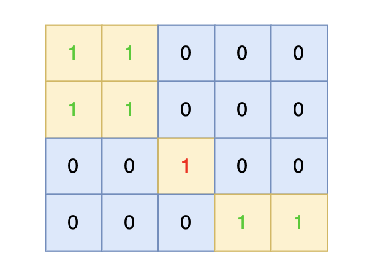
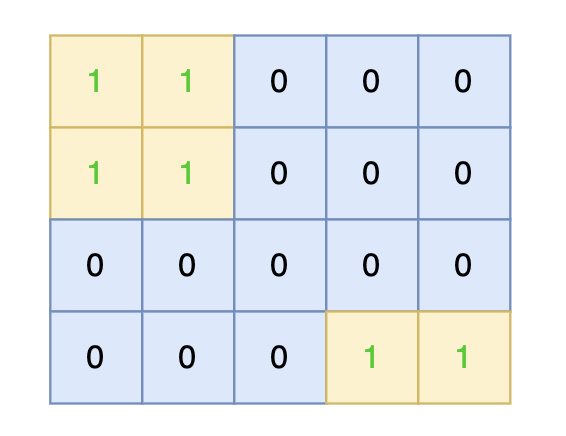
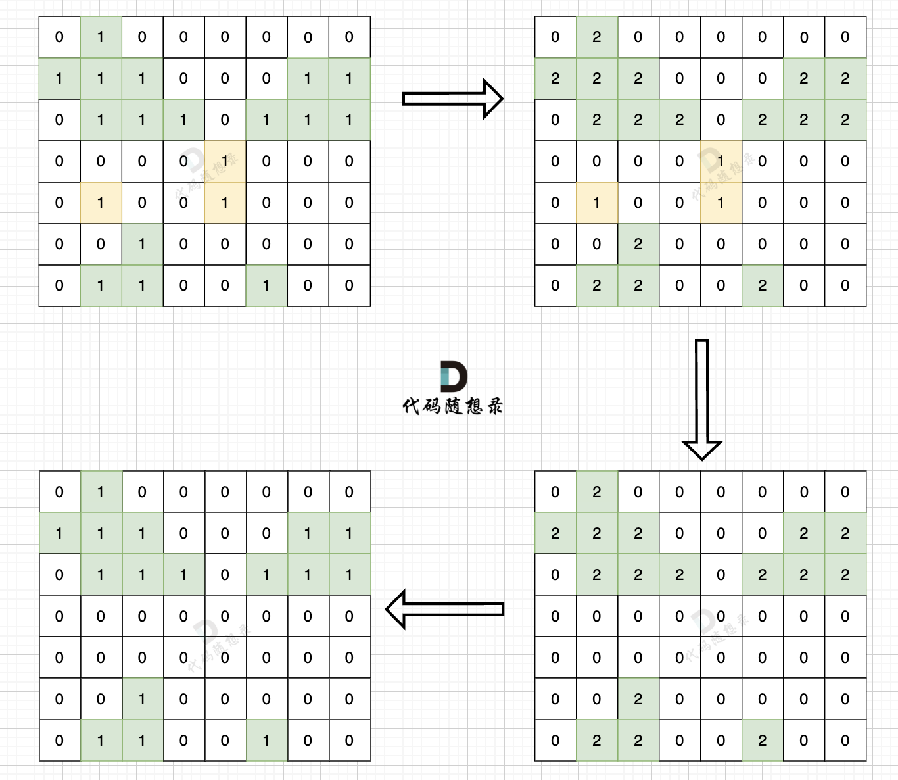

# 102沉没孤岛

[102. 沉没孤岛 (kamacoder.com)](https://kamacoder.com/problempage.php?pid=1174)

## 题目描述

###### 题目描述

给定一个由 1（陆地）和 0（水）组成的矩阵，岛屿指的是由水平或垂直方向上相邻的陆地单元格组成的区域，且完全被水域单元格包围。孤岛是那些位于矩阵内部、所有单元格都不接触边缘的岛屿。


现在你需要将所有孤岛“沉没”，即将孤岛中的所有陆地单元格（1）转变为水域单元格（0）。

###### 输入描述

第一行包含两个整数 N, M，表示矩阵的行数和列数。

之后 N 行，每行包含 M 个数字，数字为 1 或者 0，表示岛屿的单元格。

###### 输出描述

输出将孤岛“沉没”之后的岛屿矩阵。 注意：每个元素后面都有一个空格

###### 输入示例

```
4 5
1 1 0 0 0
1 1 0 0 0
0 0 1 0 0
0 0 0 1 1
```

###### 输出示例

```
1 1 0 0 0
1 1 0 0 0
0 0 0 0 0
0 0 0 1 1
```

###### 提示信息




将孤岛沉没。





数据范围：

1 <= M, N <= 50。

## 我的C++解法

直接给我深度优先遍历

第一次只改变边缘的岛屿为-1

第二次直接遍历整个数组，遇到-1变为1，遇到1变为0，边改边输出。

```cpp
#include <iostream>
#include <vector>
using namespace std;

void dfs(vector<vector<int>>& island,int i, int j, int n, int m){
    // 此次DFS的唯一目的就是修改临岸的岛屿为-1
    if(i<0 || j<0 || i>=n || j>=m || island[i][j]!=1){
        return;
    }
    island[i][j] = -1;
    dfs(island,i-1,j,n,m);
    dfs(island,i+1,j,n,m);
    dfs(island,i,j-1,n,m);
    dfs(island,i,j+1,n,m);
    return;
}

int main(){
    // 现在初步的想法是像100题一样，先把边缘岛屿变为2，然后遍历，遇见1边0
    // 或者是先把边缘岛屿变-1，遇见0不变，遇见1变0，遇见-1变1
    int n,m;
    cin>>n>>m;
    vector<vector<int>> island(n,vector<int>(m,0));
    for(int i=0;i<n;i++){
        for(int j=0;j<m;j++){
            cin>>island[i][j];
        }
    }
    for(int i=0;i<n;i++){
        if(island[i][0]==1){
            dfs(island,i,0,n,m);
        }
        if(island[i][m-1]==1){
            dfs(island,i,m-1,n,m);
        }
    }
    for(int j=0;j<m;j++){
        if(island[0][j]==1){
            dfs(island,0,j,n,m);
        }
        if(island[n-1][j]==1){
            dfs(island,n-1,j,n,m);
        }
    }
    // 修改元素
    for(int i=0;i<n;i++){
        for(int j=0;j<m;j++){
            switch(island[i][j]){
                case 0:
                    island[i][j] = 0;
                    break;
                case -1:
                    island[i][j] = 1;
                    break;
                case 1:
                    island[i][j] = 0;
                    break;
            }
            cout<<island[i][j]<<" ";
        }
        cout<<endl;
    }
    
}
```

结果：


## C++参考答案

思路依然是从地图周边出发，将周边空格相邻的陆地都做上标记，然后在遍历一遍地图，遇到 陆地 且没做过标记的，那么都是地图中间的 陆地 ，全部改成水域就行。

有的录友可能想，我在定义一个 visited 二维数组，单独标记周边的陆地，然后遍历地图的时候同时对 数组board 和 数组visited 进行判断，决定 陆地是否变成水域。

这样做其实就有点麻烦了，不用额外定义空间了，标记周边的陆地，可以直接改陆地为其他特殊值作为标记。

步骤一：深搜或者广搜将地图周边的 1 （陆地）全部改成 2 （特殊标记）

步骤二：将水域中间 1 （陆地）全部改成 水域（0）

步骤三：将之前标记的 2 改为 1 （陆地）

如图：



```cpp
#include <iostream>
#include <vector>
using namespace std;
int dir[4][2] = {-1, 0, 0, -1, 1, 0, 0, 1}; // 保存四个方向
void dfs(vector<vector<int>>& grid, int x, int y) {
    grid[x][y] = 2;
    for (int i = 0; i < 4; i++) { // 向四个方向遍历
        int nextx = x + dir[i][0];
        int nexty = y + dir[i][1];
        // 超过边界
        if (nextx < 0 || nextx >= grid.size() || nexty < 0 || nexty >= grid[0].size()) continue;
        // 不符合条件，不继续遍历
        if (grid[nextx][nexty] == 0 || grid[nextx][nexty] == 2) continue;
        dfs (grid, nextx, nexty);
    }
    return;
}

int main() {
    int n, m;
    cin >> n >> m;
    vector<vector<int>> grid(n, vector<int>(m, 0));
    for (int i = 0; i < n; i++) {
        for (int j = 0; j < m; j++) {
            cin >> grid[i][j];
        }
    }

    // 步骤一：
    // 从左侧边，和右侧边 向中间遍历
    for (int i = 0; i < n; i++) {
        if (grid[i][0] == 1) dfs(grid, i, 0);
        if (grid[i][m - 1] == 1) dfs(grid, i, m - 1);
    }

    // 从上边和下边 向中间遍历
    for (int j = 0; j < m; j++) {
        if (grid[0][j] == 1) dfs(grid, 0, j);
        if (grid[n - 1][j] == 1) dfs(grid, n - 1, j);
    }
    // 步骤二、步骤三
    for (int i = 0; i < n; i++) {
        for (int j = 0; j < m; j++) {
            if (grid[i][j] == 1) grid[i][j] = 0;
            if (grid[i][j] == 2) grid[i][j] = 1;
        }
    }
    for (int i = 0; i < n; i++) {
        for (int j = 0; j < m; j++) {
            cout << grid[i][j] << " ";
        }
        cout << endl;
    }
}
```

## C++收获


## 我的python解答

```python
n, m = map(int,input().split())
island = [[0]*m for _ in range(n)]
for i in range(n):
    island[i] = list(map(int,input().split()))

def dfs(i:int,j:int):
    if i<0 or j<0 or i>=n or j>=m or island[i][j] != 1:
        return
    island[i][j] = -1
    dfs(i-1,j)
    dfs(i,j-1)
    dfs(i,j+1)
    dfs(i+1,j)
    return

for i in range(n):
    if island[i][0]==1:
        dfs(i,0)
    if island[i][m-1]==1:
        dfs(i,m-1)
for j in range(m):
    if island[0][j]==1:
        dfs(0,j)
    if island[n-1][j]==1:
        dfs(n-1,j)
for i in range(n):
    for j in range(m):
        if island[i][j]==1:
            island[i][j] = 0
        elif island[i][j] == -1:
            island[i][j] = 1
    # print(" ".join(island[i][j] for j in range(m)))
    print(' '.join(map(str, island[i])))
```

结果：


## python参考答案

```python
def dfs(grid, x, y):
    grid[x][y] = 2
    directions = [(-1, 0), (0, -1), (1, 0), (0, 1)]  # 四个方向
    for dx, dy in directions:
        nextx, nexty = x + dx, y + dy
        # 超过边界
        if nextx < 0 or nextx >= len(grid) or nexty < 0 or nexty >= len(grid[0]):
            continue
        # 不符合条件，不继续遍历
        if grid[nextx][nexty] == 0 or grid[nextx][nexty] == 2:
            continue
        dfs(grid, nextx, nexty)

def main():
    n, m = map(int, input().split())
    grid = [[int(x) for x in input().split()] for _ in range(n)]

    # 步骤一：
    # 从左侧边，和右侧边 向中间遍历
    for i in range(n):
        if grid[i][0] == 1:
            dfs(grid, i, 0)
        if grid[i][m - 1] == 1:
            dfs(grid, i, m - 1)

    # 从上边和下边 向中间遍历
    for j in range(m):
        if grid[0][j] == 1:
            dfs(grid, 0, j)
        if grid[n - 1][j] == 1:
            dfs(grid, n - 1, j)

    # 步骤二、步骤三
    for i in range(n):
        for j in range(m):
            if grid[i][j] == 1:
                grid[i][j] = 0
            if grid[i][j] == 2:
                grid[i][j] = 1

    # 打印结果
    for row in grid:
        print(' '.join(map(str, row)))

if __name__ == "__main__":
    main()
```

```python
from collections import deque

n, m = list(map(int, input().split()))
g = []
for _ in range(n):
    row = list(map(int,input().split()))
    g.append(row)
    
directions = [(1,0),(-1,0),(0,1),(0,-1)]
count = 0

def bfs(r,c,mode):
    global count 
    q = deque()
    q.append((r,c))
    count += 1
    
    while q:
        r, c = q.popleft()
        if mode:
            g[r][c] = 2
            
        for di in directions:
            next_r = r + di[0]
            next_c = c + di[1]
            if next_c < 0 or next_c >= m or next_r < 0 or next_r >= n:
                continue
            if g[next_r][next_c] == 1:
                q.append((next_r,next_c))
                if mode:
                    g[r][c] = 2
                    
                count += 1
    

for i in range(n):
    if g[i][0] == 1: bfs(i,0,True)
    if g[i][m-1] == 1: bfs(i, m-1,True)
    
for j in range(m):
    if g[0][j] == 1: bfs(0,j,1)
    if g[n-1][j] == 1: bfs(n-1,j,1)

for i in range(n):
    for j in range(m):
        if g[i][j] == 2:
            g[i][j] = 1
        else:
            g[i][j] = 0
            
for row in g:
    print(" ".join(map(str, row)))
```

## python收获