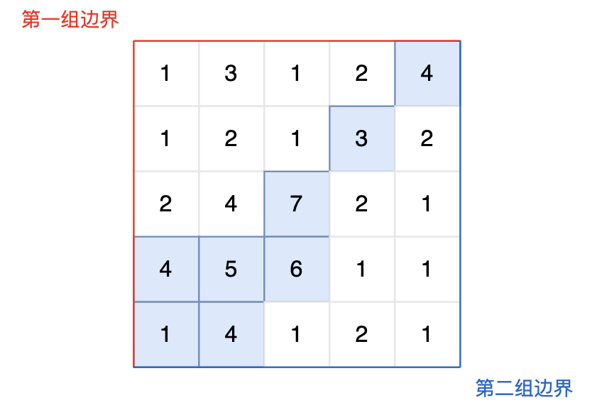
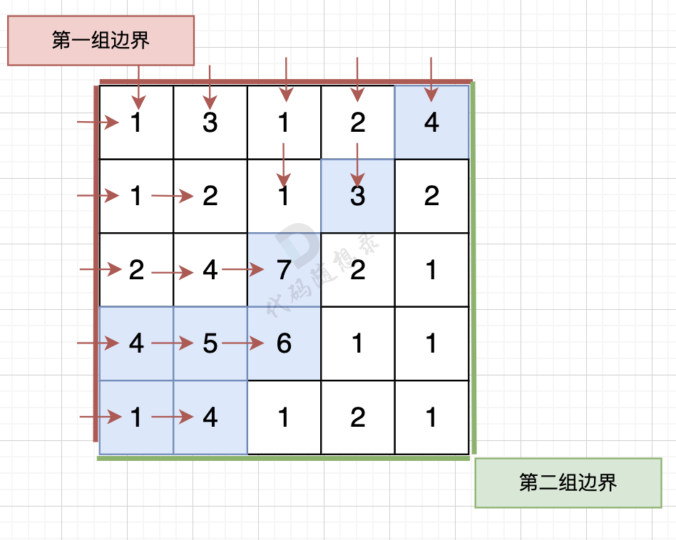
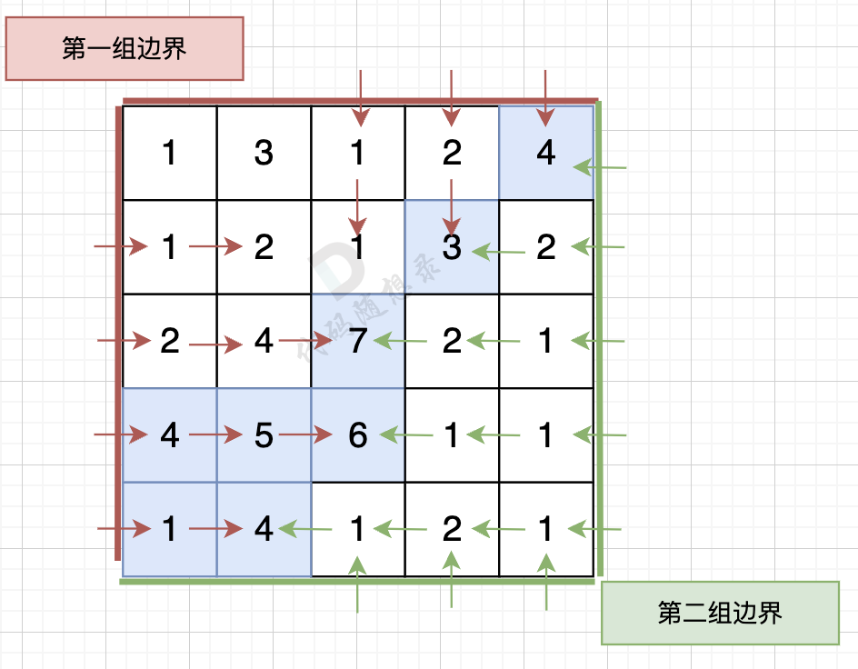

# 103水流问题

[103. 水流问题 (kamacoder.com)](https://kamacoder.com/problempage.php?pid=1175)

## 题目描述

###### 题目描述

现有一个 N × M 的矩阵，每个单元格包含一个数值，这个数值代表该位置的相对高度。矩阵的左边界和上边界被认为是第一组边界，而矩阵的右边界和下边界被视为第二组边界。


矩阵模拟了一个地形，当雨水落在上面时，水会根据地形的倾斜向低处流动，但只能从较高或等高的地点流向较低或等高并且相邻（上下左右方向）的地点。我们的目标是确定那些单元格，从这些单元格出发的水可以达到第一组边界和第二组边界。

###### 输入描述

第一行包含两个整数 N 和 M，分别表示矩阵的行数和列数。 

后续 N 行，每行包含 M 个整数，表示矩阵中的每个单元格的高度。

###### 输出描述

输出共有多行，每行输出两个整数，用一个空格隔开，表示可达第一组边界和第二组边界的单元格的坐标，输出顺序任意。

###### 输入示例

```
5 5
1 3 1 2 4
1 2 1 3 2
2 4 7 2 1
4 5 6 1 1
1 4 1 2 1
```

###### 输出示例

```
0 4
1 3
2 2
3 0
3 1
3 2
4 0
4 1
```

###### 提示信息




图中的蓝色方块上的雨水既能流向第一组边界，也能流向第二组边界。所以最终答案为所有蓝色方块的坐标。 


**数据范围：**

1 <= M, N <= 100。

## 我的C++解法

```cpp
#include <iostream>
#include <vector>
using namespace std;

// 如果一个节点满足题意，则其上下左右四个方向中大于等于它的一定也满足题意
// 主管感觉上，两组边界需要两个bool来进行返回。
pair<bool,bool> dfs(vector<vector<int>>& grid,vector<vector<pair<bool,bool>>>& edge,int i,int j, int n, int m){
    // 深度优先搜索，返回两个bool，第一个表示能否道道第一组边界，第二个表示能否到达第二组边界
    if(i==0 || j==0 || i==n-1 || j==m-1)  return edge[i][j];
    // bool return_first = false;
    // bool return_second = false;
    // if(edge[i][j].first == true)    return_first = true;
    // if(edge[i][j].second == true)   return_second = true;
    if(edge[i][j].first == true || edge[i][j].second == true)   return edge[i][j];
    pair<bool,bool> up = {false,false};
    if(grid[i][j]>=grid[i-1][j]){// 可以计算up
        up = dfs(grid,edge,i-1,j,n,m);
    }
    pair<bool,bool> down = {false,false};
    pair<bool,bool> left = {false,false};
    pair<bool,bool> right = {false,false};
    if(grid[i][j]>=grid[i+1][j]){
        down = dfs(grid,edge,i+1,j,n,m);
    }
    if(grid[i][j]>=grid[i][j-1]){
        left = dfs(grid,edge,i,j-1,n,m);
    }
    if(grid[i][j]>=grid[i][j+1]){
        right = dfs(grid,edge,i,j+1,n,m);
    }
    edge[i][j].first = up.first || down.first || left.first || right.first;
    edge[i][j].second = up.second || down.second || left.second || right.second;
    return edge[i][j];
}


int main(){
    int n,m;
    cin>>n>>m;
    vector<vector<int>> grid(n,vector<int>(m,0));
    for(int i=0;i<n;i++){
        for(int j=0;j<0;j++){
            cin>>grid[i][j];
        }
    }
    vector<vector<pair<bool,bool>>> edge(n,vector<pair<bool,bool>>(m,{false,false}));
    for(int i=0;i<n;i++){
        edge[i][0].first = true;
        edge[i][m-1].second = true;
    }
    for(int j=0;j<m;j++){
        edge[0][j].first = true;
        edge[n-1][j].second = true;
    }
    // 完成对edge数组的初始化
    // vector<pair<int,int>> ans;
    for(int i=0;i<n;i++){
        for(int j=0;j<m;j++){
            dfs(grid,edge,i,j,n,m);
            if(edge[i][j].first && edge[i][j].second){
                // ans.push_back({i,j});
                // ans.push_back(make_pair(i,j));
                cout<<i<<" "<<j<<endl;
            }
        }
    }
    // for(int i=0;i<n;i++){
    //     for(int j=0;j<m;j++){
    //         cout<<"["<<edge[i][j].first<<","<<edge[i][j].second<<"] ";
    //     }
    //     cout<<endl;
    // }
}
```

结果：内存超限，以及，在测试例上只输出了0 4

## C++参考答案

### 直白思路

```cpp
#include <iostream>
#include <vector>
using namespace std;
int n, m;
int dir[4][2] = {-1, 0, 0, -1, 1, 0, 0, 1};

// 从 x，y 出发 把可以走的地方都标记上
void dfs(vector<vector<int>>& grid, vector<vector<bool>>& visited, int x, int y) {
    if (visited[x][y]) return;

    visited[x][y] = true;

    for (int i = 0; i < 4; i++) {
        int nextx = x + dir[i][0];
        int nexty = y + dir[i][1];
        if (nextx < 0 || nextx >= n || nexty < 0 || nexty >= m) continue;
        if (grid[x][y] < grid[nextx][nexty]) continue; // 高度不合适

        dfs (grid, visited, nextx, nexty);
    }
    return;
}
bool isResult(vector<vector<int>>& grid, int x, int y) {
    vector<vector<bool>> visited(n, vector<bool>(m, false));

    // 深搜，将x,y出发 能到的节点都标记上。
    dfs(grid, visited, x, y);
    bool isFirst = false;
    bool isSecond = false;

    // 以下就是判断x，y出发，是否到达第一组边界和第二组边界
    // 第一边界的上边
    for (int j = 0; j < m; j++) {
        if (visited[0][j]) {
            isFirst = true;
            break;
        }
    }
    // 第一边界的左边
    for (int i = 0; i < n; i++) {
        if (visited[i][0]) {
            isFirst = true;
            break;
        }
    }
    // 第二边界右边
    for (int j = 0; j < m; j++) {
        if (visited[n - 1][j]) {
            isSecond = true;
            break;
        }
    }
    // 第二边界下边
    for (int i = 0; i < n; i++) {
        if (visited[i][m - 1]) {
            isSecond = true;
            break;
        }
    }
    if (isFirst && isSecond) return true;
    return false;
}


int main() {
    cin >> n >> m;
    vector<vector<int>> grid(n, vector<int>(m, 0));
    for (int i = 0; i < n; i++) {
        for (int j = 0; j < m; j++) {
            cin >> grid[i][j];
        }
    }
    // 遍历每一个点，看是否能同时到达第一组边界和第二组边界
    for (int i = 0; i < n; i++) {
        for (int j = 0; j < m; j++) {
            if (isResult(grid, i, j)) {
                cout << i << " " << j << endl;
            }
        }
    }
}
```

这种思路很直白，但很明显，以上代码超时了。 来看看时间复杂度。

遍历每一个节点，是 m * n，遍历每一个节点的时候，都要做深搜，深搜的时间复杂度是： m * n

那么整体时间复杂度 就是 O(m^2 * n^2) ，这是一个四次方的时间复杂度。

### [#](https://programmercarl.com/kamacoder/0103.水流问题.html#优化)优化

那么我们可以 反过来想，从第一组边界上的节点 逆流而上，将遍历过的节点都标记上。

同样从第二组边界的边上节点 逆流而上，将遍历过的节点也标记上。

然后**两方都标记过的节点就是既可以流太平洋也可以流大西洋的节点**。

从第一组边界边上节点出发，如图：



从第二组边界上节点出发，如图：



按照这样的逻辑，就可以写出如下遍历代码：（详细注释）

```cpp
#include <iostream>
#include <vector>
using namespace std;
int n, m;
int dir[4][2] = {-1, 0, 0, -1, 1, 0, 0, 1};
void dfs(vector<vector<int>>& grid, vector<vector<bool>>& visited, int x, int y) {
    if (visited[x][y]) return;

    visited[x][y] = true;

    for (int i = 0; i < 4; i++) {
        int nextx = x + dir[i][0];
        int nexty = y + dir[i][1];
        if (nextx < 0 || nextx >= n || nexty < 0 || nexty >= m) continue;
        if (grid[x][y] > grid[nextx][nexty]) continue; // 注意：这里是从低向高遍历

        dfs (grid, visited, nextx, nexty);
    }
    return;
}


int main() {

    cin >> n >> m;
    vector<vector<int>> grid(n, vector<int>(m, 0));

    for (int i = 0; i < n; i++) {
        for (int j = 0; j < m; j++) {
            cin >> grid[i][j];
        }
    }
    // 标记从第一组边界上的节点出发，可以遍历的节点
    vector<vector<bool>> firstBorder(n, vector<bool>(m, false));

    // 标记从第一组边界上的节点出发，可以遍历的节点
    vector<vector<bool>> secondBorder(n, vector<bool>(m, false));

    // 从最上和最下行的节点出发，向高处遍历
    for (int i = 0; i < n; i++) {
        dfs (grid, firstBorder, i, 0); // 遍历最左列，接触第一组边界
        dfs (grid, secondBorder, i, m - 1); // 遍历最右列，接触第二组边界
    }

    // 从最左和最右列的节点出发，向高处遍历
    for (int j = 0; j < m; j++) {
        dfs (grid, firstBorder, 0, j); // 遍历最上行，接触第一组边界
        dfs (grid, secondBorder, n - 1, j); // 遍历最下行，接触第二组边界
    }
    for (int i = 0; i < n; i++) {
        for (int j = 0; j < m; j++) {
            // 如果这个节点，从第一组边界和第二组边界出发都遍历过，就是结果
            if (firstBorder[i][j] && secondBorder[i][j]) cout << i << " " << j << endl;;
        }
    }
}
```

时间复杂度为 O(n * m) 。

空间复杂度为：O(n * m) 这个就不难理解了。开了几个 n * m 的数组。

结果：


## C++收获


## 我的python解答


## python参考答案

```python
first = set()
second = set()
directions = [[-1, 0], [0, 1], [1, 0], [0, -1]]

def dfs(i, j, graph, visited, side):
    if visited[i][j]:
        return
    
    visited[i][j] = True
    side.add((i, j))
    
    for x, y in directions:
        new_x = i + x
        new_y = j + y
        if (
            0 <= new_x < len(graph)
            and 0 <= new_y < len(graph[0])
            and int(graph[new_x][new_y]) >= int(graph[i][j])
        ):
            dfs(new_x, new_y, graph, visited, side)

def main():
    global first
    global second
    
    N, M = map(int, input().strip().split())
    graph = []
    for _ in range(N):
        row = input().strip().split()
        graph.append(row)
    
    # 是否可到达第一边界
    visited = [[False] * M for _ in range(N)]
    for i in range(M):
        dfs(0, i, graph, visited, first)
    for i in range(N):
        dfs(i, 0, graph, visited, first)
    
    # 是否可到达第二边界
    visited = [[False] * M for _ in range(N)]
    for i in range(M):
        dfs(N - 1, i, graph, visited, second)
    for i in range(N):
        dfs(i, M - 1, graph, visited, second)

    # 可到达第一边界和第二边界
    res = first & second
    
    for x, y in res:
        print(f"{x} {y}")
    
    
if __name__ == "__main__":
    main()
```

结果：


## python收获