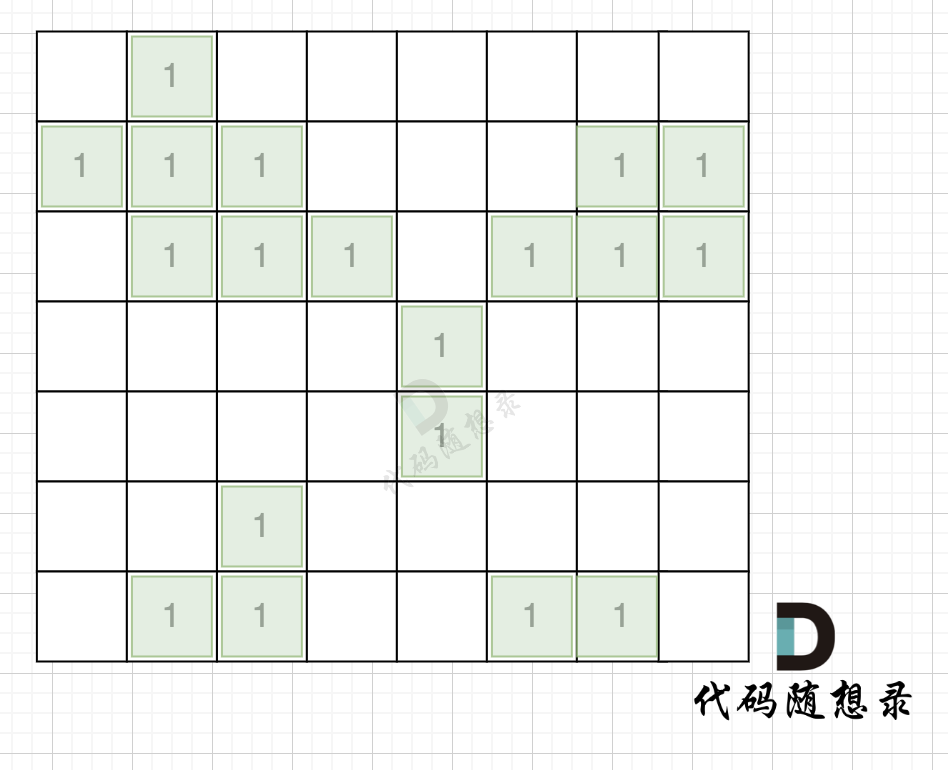

# 104建造最大岛屿

phttps://kamacoder.com/problempage.php?pid=1176

## 题目描述

###### 题目描述

给定一个由 1（陆地）和 0（水）组成的矩阵，你最多可以将矩阵中的一格水变为一块陆地，在执行了此操作之后，矩阵中最大的岛屿面积是多少。


岛屿面积的计算方式为组成岛屿的陆地的总数。岛屿是被水包围，并且通过水平方向或垂直方向上相邻的陆地连接而成的。你可以假设矩阵外均被水包围。

###### 输入描述

第一行包含两个整数 N, M，表示矩阵的行数和列数。之后 N 行，每行包含 M 个数字，数字为 1 或者 0，表示岛屿的单元格。

###### 输出描述

输出一个整数，表示最大的岛屿面积。

###### 输入示例

```
4 5
1 1 0 0 0
1 1 0 0 0
0 0 1 0 0
0 0 0 1 1
```

###### 输出示例

```
6
```

###### 提示信息


对于上面的案例，有两个位置可将 0 变成 1，使得岛屿的面积最大，即 6。


数据范围：

1 <= M, N <= 50。

## 我的C++解法

```cpp
#include <iostream>
#include <vector>
using namespace std;
// 从贪心的角度来理解，要想变一个成陆地得到的结果最大，那就需要的是两个对角连接的岛屿
// 否则就是最大岛屿面积+1
// 遍历到岛屿的边界后就尝试访问对焦元素。
// 边界条件满足：相邻四个区块最少有两个是水。

bool isEdge(vector<vector<int>>& grid,int i,int j){
    int count = 0;
    if(grid[i-1][j]==0) count++;
    if(grid[i][j-1]==0) count++;
    if(grid[i+1][j]==0) count++;
    if(grid[i][j+1]==0) count++;
    return count>=2;
}

int dfs(vector<vector<int>>& grid,int i,int j,int n,int m,bool can_change){// 返回变1后的最大面积
    // 实际上感觉是一个记忆化搜索的问题，遍历到岛屿的边界，对旁边岛屿选或者不选
    if(i<=0 || i>n || j<=0 || j>m || grid[i][j]!=1){
        return 0;
    }
    grid[i][j] = 2;
    int area = 1;
    if(isEdge(grid,i,j) && can_change){
        // 当前是边缘节点 且可以改变对角元素
        int up = dfs(grid,i-1,j,n,m,false);
        int left = dfs(grid,i,j-1,n,m,false);
        int down = dfs(grid,i+1,j,n,m,false);
        int right = dfs(grid,i,j+1,n,m,false);
    }
    int up = dfs(grid,i-1,j,n,m);
    int left = dfs(grid,i,j-1,n,m);
    int down = dfs(grid,i+1,j,n,m);
    int right = dfs(grid,i,j+1,n,m);
    
}

int main(){
    int n,m;
    cin>>n>>m;
    vector<vector<int>> grid(n+2,vector<int>(m+2,0));
    for(int i=1;i<n+1;i++){
        for(int j=1;j<m+1;j++){
            cin>>grid[n][m];
        }
    }
    // 在边缘围了一圈水。
    vector<vector<bool>> visited(n+2,vector<bool>(m+2,false));
    
}
```

没A出来，总感觉思路怪怪的

最暴力的就是逐个把0变成1，然后在这种条件下统计最大面积。

次之的应该就是动态规划了。

我还是欠考虑了，看看答案吧。

## C++参考答案

每次深搜遍历计算最大岛屿面积，我们都做了很多重复的工作。

只要用一次深搜把每个岛屿的面积记录下来就好。

第一步：一次遍历地图，得出各个岛屿的面积，并做编号记录。可以使用map记录，key为岛屿编号，value为岛屿面积

第二步：再遍历地图，遍历0的方格（因为要将0变成1），并**统计该1（由0变成的1）周边岛屿面积**，将其相邻面积相加在一起，遍历所有 0 之后，就可以得出 选一个0变成1 之后的最大面积。

拿如下地图的岛屿情况来举例： （1为陆地）



第一步，则遍历题目，并将岛屿到编号和面积上的统计，过程如图所示：


本过程代码如下：

```cpp
int dir[4][2] = {0, 1, 1, 0, -1, 0, 0, -1}; // 四个方向
void dfs(vector<vector<int>>& grid, vector<vector<bool>>& visited, int x, int y, int mark) {
    if (visited[x][y] || grid[x][y] == 0) return; // 终止条件：访问过的节点 或者 遇到海水
    visited[x][y] = true; // 标记访问过
    grid[x][y] = mark; // 给陆地标记新标签
    count++;
    for (int i = 0; i < 4; i++) {
        int nextx = x + dir[i][0];
        int nexty = y + dir[i][1];
        if (nextx < 0 || nextx >= grid.size() || nexty < 0 || nexty >= grid[0].size()) continue;  // 越界了，直接跳过
        dfs(grid, visited, nextx, nexty, mark);
    }
}

int largestIsland(vector<vector<int>>& grid) {
    int n = grid.size(), m = grid[0].size();
    vector<vector<bool>> visited = vector<vector<bool>>(n, vector<bool>(m, false)); // 标记访问过的点
    unordered_map<int ,int> gridNum;
    int mark = 2; // 记录每个岛屿的编号
    bool isAllGrid = true; // 标记是否整个地图都是陆地
    for (int i = 0; i < n; i++) {
        for (int j = 0; j < m; j++) {
            if (grid[i][j] == 0) isAllGrid = false;
            if (!visited[i][j] && grid[i][j] == 1) {
                count = 0;
                dfs(grid, visited, i, j, mark); // 将与其链接的陆地都标记上 true
                gridNum[mark] = count; // 记录每一个岛屿的面积
                mark++; // 记录下一个岛屿编号
            }
        }
    }
}
```

这个过程时间复杂度 n * n 。可能有录友想：分明是两个for循环下面套这一个dfs，时间复杂度怎么回事 n * n呢？

其实大家可以仔细看一下代码，**n \* n这个方格地图中，每个节点我们就遍历一次，并不会重复遍历**。

第二步过程如图所示：


也就是遍历每一个0的方格，并统计其相邻岛屿面积，最后取一个最大值。

这个过程的时间复杂度也为 n * n。

所以整个解法的时间复杂度，为 n * n + n * n 也就是 n^2。

当然这里还有一个优化的点，就是 可以不用 visited数组，因为有mark来标记，所以遍历过的grid[i][j]是不等于1的。

代码如下：

```cpp
int dir[4][2] = {0, 1, 1, 0, -1, 0, 0, -1}; // 四个方向
void dfs(vector<vector<int>>& grid, int x, int y, int mark) {
    if (grid[x][y] != 1 || grid[x][y] == 0) return; // 终止条件：访问过的节点 或者 遇到海水
    grid[x][y] = mark; // 给陆地标记新标签
    count++;
    for (int i = 0; i < 4; i++) {
        int nextx = x + dir[i][0];
        int nexty = y + dir[i][1];
        if (nextx < 0 || nextx >= n || nexty < 0 || nexty >= m) continue;  // 越界了，直接跳过
        dfs(grid, nextx, nexty, mark);
    }
}

int main() {
    cin >> n >> m;
    vector<vector<int>> grid(n, vector<int>(m, 0));

    for (int i = 0; i < n; i++) {
        for (int j = 0; j < m; j++) {
            cin >> grid[i][j];
        }
    }
    unordered_map<int ,int> gridNum;
    int mark = 2; // 记录每个岛屿的编号
    bool isAllGrid = true; // 标记是否整个地图都是陆地
    for (int i = 0; i < n; i++) {
        for (int j = 0; j < m; j++) {
            if (grid[i][j] == 0) isAllGrid = false;
            if (grid[i][j] == 1) {
                count = 0;
                dfs(grid, i, j, mark); // 将与其链接的陆地都标记上 true
                gridNum[mark] = count; // 记录每一个岛屿的面积
                mark++; // 记录下一个岛屿编号
            }
        }
    }
```

整体代码如下：

```cpp
#include <iostream>
#include <vector>
#include <unordered_set>
#include <unordered_map>
using namespace std;
int n, m;
int count;

int dir[4][2] = {0, 1, 1, 0, -1, 0, 0, -1}; // 四个方向
void dfs(vector<vector<int>>& grid, vector<vector<bool>>& visited, int x, int y, int mark) {
    if (visited[x][y] || grid[x][y] == 0) return; // 终止条件：访问过的节点 或者 遇到海水
    visited[x][y] = true; // 标记访问过
    grid[x][y] = mark; // 给陆地标记新标签
    count++;
    for (int i = 0; i < 4; i++) {
        int nextx = x + dir[i][0];
        int nexty = y + dir[i][1];
        if (nextx < 0 || nextx >= n || nexty < 0 || nexty >= m) continue;  // 越界了，直接跳过
        dfs(grid, visited, nextx, nexty, mark);
    }
}

int main() {
    cin >> n >> m;
    vector<vector<int>> grid(n, vector<int>(m, 0));

    for (int i = 0; i < n; i++) {
        for (int j = 0; j < m; j++) {
            cin >> grid[i][j];
        }
    }
    vector<vector<bool>> visited(n, vector<bool>(m, false)); // 标记访问过的点
    unordered_map<int ,int> gridNum;
    int mark = 2; // 记录每个岛屿的编号
    bool isAllGrid = true; // 标记是否整个地图都是陆地
    for (int i = 0; i < n; i++) {
        for (int j = 0; j < m; j++) {
            if (grid[i][j] == 0) isAllGrid = false;
            if (!visited[i][j] && grid[i][j] == 1) {
                count = 0;
                dfs(grid, visited, i, j, mark); // 将与其链接的陆地都标记上 true
                gridNum[mark] = count; // 记录每一个岛屿的面积
                mark++; // 记录下一个岛屿编号
            }
        }
    }
    if (isAllGrid) {
        cout << n * m << endl; // 如果都是陆地，返回全面积
        return 0; // 结束程序
    }

    // 以下逻辑是根据添加陆地的位置，计算周边岛屿面积之和
    int result = 0; // 记录最后结果
    unordered_set<int> visitedGrid; // 标记访问过的岛屿
    for (int i = 0; i < n; i++) {
        for (int j = 0; j < m; j++) {
            count = 1; // 记录连接之后的岛屿数量
            visitedGrid.clear(); // 每次使用时，清空
            if (grid[i][j] == 0) {
                for (int k = 0; k < 4; k++) {
                    int neari = i + dir[k][1]; // 计算相邻坐标
                    int nearj = j + dir[k][0];
                    if (neari < 0 || neari >= n || nearj < 0 || nearj >= m) continue;
                    if (visitedGrid.count(grid[neari][nearj])) continue; // 添加过的岛屿不要重复添加
                    // 把相邻四面的岛屿数量加起来
                    count += gridNum[grid[neari][nearj]];
                    visitedGrid.insert(grid[neari][nearj]); // 标记该岛屿已经添加过
                }
            }
            result = max(result, count);
        }
    }
    cout << result << endl;

}
```

结果：


## C++收获


## 我的python解答


## python参考答案

```python
from typing import List
from collections import defaultdict

class Solution:
    def __init__(self):
        self.direction = [(1,0),(-1,0),(0,1),(0,-1)]
        self.res = 0
        self.count = 0
        self.idx = 1
        self.count_area = defaultdict(int)

    def max_area_island(self, grid: List[List[int]]) -> int:
        if not grid or len(grid) == 0 or len(grid[0]) == 0:
            return 0

        for i in range(len(grid)):
            for j in range(len(grid[0])):
                if grid[i][j] == 1:
                    self.count = 0
                    self.idx += 1
                    self.dfs(grid,i,j)
        # print(grid)
        self.check_area(grid)
        # print(self.count_area)
        
        if self.check_largest_connect_island(grid=grid):
            return self.res + 1
        return max(self.count_area.values())
    
    def dfs(self,grid,row,col):
        grid[row][col] = self.idx
        self.count += 1
        for dr,dc in self.direction:
            _row = dr + row 
            _col = dc + col 
            if 0<=_row<len(grid) and 0<=_col<len(grid[0]) and grid[_row][_col] == 1:
                self.dfs(grid,_row,_col)
        return

    def check_area(self,grid):
        m, n = len(grid), len(grid[0])
        for row in range(m):
            for col in range(n):
                  self.count_area[grid[row][col]] = self.count_area.get(grid[row][col],0) + 1
        return

    def check_largest_connect_island(self,grid):
        m, n = len(grid), len(grid[0])
        has_connect = False
        for row in range(m):
            for col in range(n):
                if grid[row][col] == 0:
                    has_connect = True
                    area = 0
                    visited = set()
                    for dr, dc in self.direction:
                        _row = row + dr 
                        _col = col + dc
                        if 0<=_row<len(grid) and 0<=_col<len(grid[0]) and grid[_row][_col] != 0 and grid[_row][_col] not in visited:
                            visited.add(grid[_row][_col])
                            area += self.count_area[grid[_row][_col]]
                            self.res = max(self.res, area)
                            
        return has_connect


def main():
    m, n = map(int, input().split())
    grid = []

    for i in range(m):
        grid.append(list(map(int,input().split())))

    
    sol = Solution()
    print(sol.max_area_island(grid))

if __name__ == '__main__':
    main()
```

结果：


```python
import collections

directions = [[-1, 0], [0, 1], [0, -1], [1, 0]]
area = 0

def dfs(i, j, grid, visited, num):
    global area
    
    if visited[i][j]:
        return

    visited[i][j] = True
    grid[i][j] = num  # 标记岛屿号码
    area += 1
    
    for x, y in directions:
        new_x = i + x
        new_y = j + y
        if (
            0 <= new_x < len(grid)
            and 0 <= new_y < len(grid[0])
            and grid[new_x][new_y] == "1"
        ):
            dfs(new_x, new_y, grid, visited, num)
    

def main():
    global area
    
    N, M = map(int, input().strip().split())
    grid = []
    for i in range(N):
        grid.append(input().strip().split())
    visited = [[False] * M for _ in range(N)]
    rec = collections.defaultdict(int)
    
    cnt = 2
    for i in range(N):
        for j in range(M):
            if grid[i][j] == "1":
                area = 0
                dfs(i, j, grid, visited, cnt)
                rec[cnt] = area  # 纪录岛屿面积
                cnt += 1
    
    res = 0
    for i in range(N):
        for j in range(M):
            if grid[i][j] == "0":
                max_island = 1  # 将水变为陆地，故从1开始计数
                v = set()
                for x, y in directions:
                    new_x = i + x
                    new_y = j + y
                    if (
                        0 <= new_x < len(grid)
                        and 0 <= new_y < len(grid[0])
                        and grid[new_x][new_y] != "0"
                        and grid[new_x][new_y] not in v  # 岛屿不可重复
                    ):
                        max_island += rec[grid[new_x][new_y]]
                        v.add(grid[new_x][new_y])
                res = max(res, max_island)

    if res == 0:
        return max(rec.values())  # 无水的情况
    return res
    
if __name__ == "__main__":
    print(main())
```

结果：


## python收获