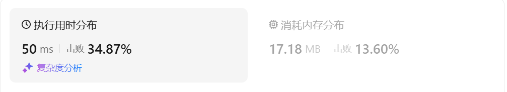

# 983最低票价（中等）

[983. 最低票价 - 力扣（LeetCode）](https://leetcode.cn/problems/minimum-cost-for-tickets/description/)

## 题目描述

在一个火车旅行很受欢迎的国度，你提前一年计划了一些火车旅行。在接下来的一年里，你要旅行的日子将以一个名为 `days` 的数组给出。每一项是一个从 `1` 到 `365` 的整数。

火车票有 **三种不同的销售方式** ：

- 一张 **为期一天** 的通行证售价为 `costs[0]` 美元；
- 一张 **为期七天** 的通行证售价为 `costs[1]` 美元；
- 一张 **为期三十天** 的通行证售价为 `costs[2]` 美元。

通行证允许数天无限制的旅行。 例如，如果我们在第 `2` 天获得一张 **为期 7 天** 的通行证，那么我们可以连着旅行 7 天：第 `2` 天、第 `3` 天、第 `4` 天、第 `5` 天、第 `6` 天、第 `7` 天和第 `8` 天。

返回 *你想要完成在给定的列表 `days` 中列出的每一天的旅行所需要的最低消费* 。

 

**示例 1：**

```
输入：days = [1,4,6,7,8,20], costs = [2,7,15]
输出：11
解释： 
例如，这里有一种购买通行证的方法，可以让你完成你的旅行计划：
在第 1 天，你花了 costs[0] = $2 买了一张为期 1 天的通行证，它将在第 1 天生效。
在第 3 天，你花了 costs[1] = $7 买了一张为期 7 天的通行证，它将在第 3, 4, ..., 9 天生效。
在第 20 天，你花了 costs[0] = $2 买了一张为期 1 天的通行证，它将在第 20 天生效。
你总共花了 $11，并完成了你计划的每一天旅行。
```

**示例 2：**

```
输入：days = [1,2,3,4,5,6,7,8,9,10,30,31], costs = [2,7,15]
输出：17
解释：
例如，这里有一种购买通行证的方法，可以让你完成你的旅行计划： 
在第 1 天，你花了 costs[2] = $15 买了一张为期 30 天的通行证，它将在第 1, 2, ..., 30 天生效。
在第 31 天，你花了 costs[0] = $2 买了一张为期 1 天的通行证，它将在第 31 天生效。 
你总共花了 $17，并完成了你计划的每一天旅行。
```

 

**提示：**

- `1 <= days.length <= 365`
- `1 <= days[i] <= 365`
- `days` 按顺序严格递增
- `costs.length == 3`
- `1 <= costs[i] <= 1000`

## 我的C++解法

我认为是一个回溯问题

```cpp
class Solution {
public:
    int backtrack(vector<int>& days,int index,int last_day,vector<int>& costs){
        if(index>=days.size()){
            return 0;
        }
        for(int i= index;i<days.size();i++){
            if(last_day>=days[i]){
                continue;
            }
            else{
                int s1 = backtrack(days,i,days[i],costs)+costs[0];
                int s2 = backtrack(days,i,days[i]+6,costs)+costs[1];
                int s3 = backtrack(days,i,days[i]+29,costs)+costs[2];
                return min(min(s1,s2),s3);
            }
        }
        return 0;
    }

    int mincostTickets(vector<int>& days, vector<int>& costs) {
        // 我认为这是一个回溯问题
        return backtrack(days,0,0,costs);
    }
};
```

结果：超时

这样写下来，发现就是记忆化搜索啊

```cpp
class Solution {
public:
    int mincostTickets(vector<int>& days, vector<int>& costs) {
        // 我认为这是一个回溯问题
        int n = days.size();
        vector<vector<int>> memo(n,vector<int>(days.back(),-1));
        auto dfs = [&](auto& dfs,int i, int j){
            int& ans = memo[i][j];
            if(ans!=-1) return ans;
            if(i>=n)    return ans = 0;
            for(int k=i;k<n;k++){
                if(j>=days[k])  continue;
                else{
                    int s1 = dfs(dfs,k,days[k])+costs[0];
                    int s2 = dfs(dfs,k,days[k]+6)+costs[1];
                    int s3 = dfs(dfs,k,days[k]+29)+costs[2];
                    return ans = min(min(s1,s2),s3);
                }
            }
            return ans;
        };
        return dfs(dfs,0,0);
    }
};
```

结果：错误

## C++参考答案

### 记忆化搜索

考虑到整个递归过程中有大量重复递归调用（递归入参相同）。由于递归函数没有副作用，同样的入参无论计算多少次，算出来的结果都是一样的，因此可以用**记忆化搜索**来优化：

- 如果一个状态（递归入参）是第一次遇到，那么可以在返回前，把状态及其结果记到一个 *memo* 数组中。
- 如果一个状态不是第一次遇到（*memo* 中保存的结果不等于 *memo* 的初始值），那么可以直接返回 *memo* 中保存的结果。

**注意**：*memo* 数组的**初始值**一定不能等于要记忆化的值！例如初始值设置为 0，并且要记忆化的 *dfs*(*i*) 也等于 0，那就没法判断 0 到底表示第一次遇到这个状态，还是表示之前遇到过了，从而导致记忆化失效。一般把初始值设置为 −1。

本题由于 *costs*[*i*] 均为正数，不会算出 0，把初始值设置为 0 也可以。

```cpp
class Solution {
public:
    int mincostTickets(vector<int>& days, vector<int>& costs) {
        int last_day = days.back();
        unordered_set<int> day_set(days.begin(), days.end());
        vector<int> memo(last_day + 1);
        auto dfs = [&](auto&& dfs, int i) -> int {
            if (i <= 0) {
                return 0;
            }
            int& res = memo[i]; // 注意这里是引用
            if (res) { // 之前计算过
                return res;
            }
            if (!day_set.count(i)) {
                return res = dfs(dfs, i - 1);
            }
            return res = min({dfs(dfs, i - 1) + costs[0],
                              dfs(dfs, i - 7) + costs[1],
                              dfs(dfs, i - 30) + costs[2]});
        };
        return dfs(dfs, last_day);
    }
};
```

结果：


- 时间复杂度：O(*D*)，其中 *D*=*days*[*n*−1]，*n* 为 *days* 的长度。由于每个状态只会计算一次，动态规划的时间复杂度 = 状态个数 × 单个状态的计算时间。本题状态个数等于 O(*D*)，单个状态的计算时间为 O(1)，所以总的时间复杂度为 O(*D*)。
- 空间复杂度：O(*D*)。保存多少状态，就需要多少空间。

### 递推

我们可以去掉递归中的「递」，只保留「归」的部分，即自底向上计算。

具体来说，*f*[*i*] 的定义和 *dfs*(*i*) 的定义是一样的，都表示 1 到 *i* 天的最小花费。

相应的递推式（状态转移方程）也和 *dfs* 一样：

*f*[*i*]=min(*f*[*i*−1]+*costs*[0],*f*[*i*−7]+*costs*[1],*f*[*i*−30]+*costs*[2])

由于 *f*[0]=0 且负数 *i* 的状态值也为 0，我们可以把负数 *i* 视作 0，上式等价于

*f*[*i*]=min(*f*[*i*−1]+*costs*[0],*f*[max(*i*−7,0)]+*costs*[1],*f*[max(*i*−30,0)]+*costs*[2])

初始值 *f*[0]=0，翻译自递归边界 *dfs*(0)=0。

答案为 *f*[*D*]，翻译自递归入口 *dfs*(*D*)。

```cpp
class Solution {
public:
    int mincostTickets(vector<int>& days, vector<int>& costs) {
        int last_day = days.back();
        unordered_set<int> day_set(days.begin(), days.end());
        vector<int> f(last_day + 1);
        for (int i = 1; i <= last_day; i++) {
            if (!day_set.contains(i)) {
                f[i] = f[i - 1];
            } else {
                f[i] = min({f[i - 1] + costs[0],
                            f[max(i - 7, 0)] + costs[1],
                            f[max(i - 30, 0)] + costs[2]});
            }
        }
        return f[last_day];
    }
};
```

结果：


## C++收获

把原数组进行哈希表化，可以极大提高检索效率

## 我的python解答

尝试使用记忆化搜索

```python
class Solution:
    def mincostTickets(self, days: List[int], costs: List[int]) -> int:
        n = len(days)
        @cache
        def dfs(i:int,j:int):
            # i表示现在遍历days到第几个，j表示最后一天的真实值
            if i>=n:
                return 0
            for k in range(i,n):
                if j>=days[k]:
                    continue
                else:
                    s3 = dfs(k,j+29)+costs[2]
                    s2 = dfs(k,j+6)+costs[1]
                    s1 = dfs(k,j)+costs[0]
                    return min(s1,s2,s3)
            return 0
        return dfs(0,0)
```

结果：说超过最大深度，爆栈了。突然发现是递归弄错了，不应该是j+。。。

```python
class Solution:
    def mincostTickets(self, days: List[int], costs: List[int]) -> int:
        n = len(days)
        @cache
        def dfs(i:int,j:int):
            # i表示现在遍历days到第几个，j表示最后一天的真实值
            if i>=n:
                return 0
            for k in range(i,n):
                if j>=days[k]:
                    continue
                else:
                    s3 = dfs(k,days[k]+29)+costs[2]
                    s2 = dfs(k,days[k]+6)+costs[1]
                    s1 = dfs(k,days[k])+costs[0]
                    return min(s1,s2,s3)
            return 0
        return dfs(0,0)
```

结果：



```python
class Solution:
    def mincostTickets(self, days: List[int], costs: List[int]) -> int:
        last_day = days[-1]
        @cache
        def dfs(i:int):
            # i表示现在遍历days到第几个，j表示最后一天的真实值
            if i<=0:
                return 0
            if i not in days:
                return dfs(i-1)
            return min(dfs(i-1)+costs[0],dfs(i-7)+costs[1],dfs(i-30)+costs[2])
        return dfs(last_day)
```

结果：


尝试使用递推：

```python
class Solution:
    def mincostTickets(self, days: List[int], costs: List[int]) -> int:
        f = [0]*(days[-1]+1)
        for i in range(1,days[-1]+1):
            if i not in days:
                f[i] = f[i-1]
            else:
                f[i] = min(f[i-1]+costs[0],f[max(i-7,0)]+costs[1],f[max(i-30,0)]+costs[2])
        return f[-1]
```

结果：


## python参考答案

### 记忆化搜索

```py
class Solution:
    def mincostTickets(self, days: List[int], costs: List[int]) -> int:
        last_day = days[-1]
        days = set(days)
        @cache  # 缓存装饰器，避免重复计算 dfs 的结果（记忆化）
        def dfs(i: int) -> int:
            if i <= 0:
                return 0
            if i not in days:
                return dfs(i - 1)
            return min(dfs(i - 1) + costs[0], dfs(i - 7) + costs[1], dfs(i - 30) + costs[2])
        return dfs(last_day)
```

结果：


### 递推

```py
class Solution:
    def mincostTickets(self, days: List[int], costs: List[int]) -> int:
        last_day = days[-1]
        days = set(days)
        f = [0] * (last_day + 1)
        for i in range(1, last_day + 1):
            if i not in days:
                f[i] = f[i - 1]
            else:
                f[i] = min(f[i - 1] + costs[0], 
                           f[max(i - 7, 0)] + costs[1],
                           f[max(i - 30, 0)] + costs[2])
        return f[-1]
```

结果：


## python收获