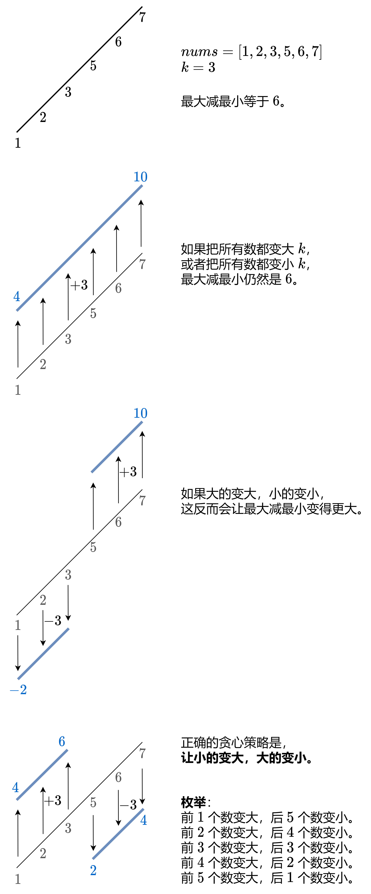

# 910最小差值Ⅱ（中等）

[910. 最小差值 II - 力扣（LeetCode）](https://leetcode.cn/problems/smallest-range-ii/description/)

## 题目描述

给你一个整数数组 `nums`，和一个整数 `k` 。

对于每个下标 `i`（`0 <= i < nums.length`），将 `nums[i]` 变成 `nums[i] + k` 或 `nums[i] - k` 。

`nums` 的 **分数** 是 `nums` 中最大元素和最小元素的差值。

在更改每个下标对应的值之后，返回 `nums` 的最小 **分数** 。

 

**示例 1：**

```
输入：nums = [1], k = 0
输出：0
解释：分数 = max(nums) - min(nums) = 1 - 1 = 0 。
```

**示例 2：**

```
输入：nums = [0,10], k = 2
输出：6
解释：将数组变为 [2, 8] 。分数 = max(nums) - min(nums) = 8 - 2 = 6 。
```

**示例 3：**

```
输入：nums = [1,3,6], k = 3
输出：3
解释：将数组变为 [4, 6, 3] 。分数 = max(nums) - min(nums) = 6 - 3 = 3 。
```

 

**提示：**

- `1 <= nums.length <= 104`
- `0 <= nums[i] <= 104`
- `0 <= k <= 104`

## 我的C++解法

要想最小，那就往平均数上面去凑，比如这个数组的平均数是n，如果某个数大于n，则进行-k操作，如果小于n，则进行+k操作，这样就能让数组尽可能在平均数上波动，得到的结果最小。

实际上没有必要对每一个数字都进行判断和加减操作，只把最大的-k，最小的+k，得到的结果就是max-min-2k

上面的说法是错误的，给出的示例就不满足。

尝试了一下根据平均值进行划分的操作，测试可以过去，但是遇到`[7,8,8]`,k=5的时候就过不去了，因为此时数据都集中在ave上，应该整体进行扩大或者缩小。

修改之后发现还是过不去，遇到示例`[7,8,8,5,2],k=4`输出的是6而不是预期的5。这是因为7，8，8，5是比较集中的，2是离散出去的，应该对2进行加4操作，其他的进行减4操作。

40min了，做不出来，看答案了

## C++参考答案



为了方便枚举，先把 *nums* 从小到大排序。

答案初始化为 *nums*[*n*−1]−*nums*[0]，对应着把所有数都变大或者变小的情况。

考虑把 *nums*[0] 到 *nums*[*i*−1] 都变大 *k*，把 *nums*[*i*] 到 *nums*[*n*−1] 都变小 *k*。

如此变化后，数组的最大值要么是 *nums*[*i*−1]+*k*，要么是 *nums*[*n*−1]−*k*，即

max(*nums*[*i*−1]+*k*,*nums*[*n*−1]−*k*)

数组的最小值要么是 *nums*[0]+*k*，要么是 *nums*[*i*]−*k*，即

min(*nums*[0]+*k*,*nums*[*i*]−*k*)

最大值最小值之差为

max(*nums*[*i*−1]+*k*,*nums*[*n*−1]−*k*)−min(*nums*[0]+*k*,*nums*[*i*]−*k*)

枚举 *i*=1,2,3,⋯,*n*−1，用上式更新答案的最小值。

```cpp
class Solution {
public:
    int smallestRangeII(vector<int>& nums, int k) {
        ranges::sort(nums);
        int ans = nums.back() - nums[0];
        for (int i = 1; i < nums.size(); i++) {
            int mx = max(nums[i - 1] + k, nums.back() - k);
            int mn = min(nums[0] + k, nums[i] - k);
            ans = min(ans, mx - mn);
        }
        return ans;
    }
};
```

结果：


- 时间复杂度：O(*n*log*n*)，其中 *n* 是 *nums* 的长度。瓶颈在排序上。
- 空间复杂度：O(1)。忽略排序的栈开销。

## C++收获


## 我的python解答

```python
class Solution:
    def smallestRangeII(self, nums: List[int], k: int) -> int:
        nums.sort()
        ans = nums[-1] - nums[0]
        nums[0] += k
        min_n = nums[0]
        max_n = nums[0]
        for i in range(1,len(nums)):
            if nums[i]+k-min_n <= abs(nums[i]-k-min_n):
                nums[i] += k
            else:
                nums[i] -= k
            min_n = min(min_n,nums[i])
            max_n = max(max_n,nums[i])
        return max_n - min_n
```

错误了

## python参考答案

```py
class Solution:
    def smallestRangeII(self, nums: List[int], k: int) -> int:
        nums.sort()
        ans = nums[-1] - nums[0]
        for x, y in pairwise(nums):
            mx = max(x + k, nums[-1] - k)
            mn = min(nums[0] + k, y - k)
            ans = min(ans, mx - mn)
        return ans
```

结果：


## python收获

### pairwise函数

<center>关键词：pairwise<center>

`pairwise` 是 Python 3.10 版本中新增到 `itertools` 模块的一个函数，它用于从给定的可迭代对象中生成连续重叠的元素对。这意味着每一对元素中的第一个元素会与下一对元素中的第二个元素重叠。此函数非常适合用于需要处理相邻元素对的场景，如计算差异、比较操作等。

#### 基本用法

```python
from itertools import pairwise
data = [1, 2, 3, 4, 5]
pairs = pairwise(data)
for pair in pairs:
    print(pair)  # 输出：(1, 2) (2, 3) (3, 4) (4, 5)
```

#### 特点

- 如果输入的可迭代对象元素少于两个，则 `pairwise` 不会生成任何元素对。
- 返回的迭代器生成的元素对是按顺序的，并且只包含相邻的元素对。

#### 应用场景

- **数据处理**：在需要依次处理相邻元素对的数据分析和转换过程中非常有用。
- **迭代器操作**：对于大型数据集，可以避免一次性加载所有数据，而是逐对处理数据，减少内存消耗。
- **算法实现**：在实现一些算法时，需要访问相邻元素对，如计算差值或者比较操作。

#### 实用案例

计算相邻元素差值：

```python
from itertools import pairwise
data = [10, 15, 20, 25, 30]
differences = [y - x for x, y in pairwise(data)]
print(differences)  # 输出：[5, 5, 5, 5]
```

在这个例子中，我们使用 `pairwise` 函数来计算列表中相邻元素之间的差值。

#### 注意事项

- `pairwise` 函数返回的是一个迭代器，如果你需要一个列表，可以使用 `list()` 函数来转换。
- 在 Python 3.10 之前的版本中没有 `pairwise` 函数，但可以通过简单的循环来实现类似的功能。

#### 替代实现

在 Python 3.10 之前的版本中，可以通过以下方式实现类似的功能：

```python
data = "abcdef"
for i in range(len(data) - 1):
    print((data[i], data[i+1]))
```

这将输出与 `pairwise` 相同的相邻元素对。

`pairwise` 是一个非常实用的函数，特别是在处理连续元素对时，可以简化代码并提高效率。