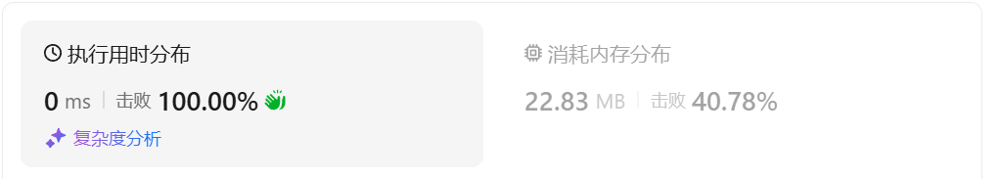

# 3184构成整天的下标对数目Ⅰ

[3184. 构成整天的下标对数目 I - 力扣（LeetCode）](https://leetcode.cn/problems/count-pairs-that-form-a-complete-day-i/description/)

## 题目描述

给你一个整数数组 `hours`，表示以 **小时** 为单位的时间，返回一个整数，表示满足 `i < j` 且 `hours[i] + hours[j]` 构成 **整天** 的下标对 `i`, `j` 的数目。

**整天** 定义为时间持续时间是 24 小时的 **整数倍** 。

例如，1 天是 24 小时，2 天是 48 小时，3 天是 72 小时，以此类推。

 

**示例 1：**

**输入：** hours = [12,12,30,24,24]

**输出：** 2

**解释：**

构成整天的下标对分别是 `(0, 1)` 和 `(3, 4)`。

**示例 2：**

**输入：** hours = [72,48,24,3]

**输出：** 3

**解释：**

构成整天的下标对分别是 `(0, 1)`、`(0, 2)` 和 `(1, 2)`。

 

**提示：**

- `1 <= hours.length <= 100`
- `1 <= hours[i] <= 109`

## 我的C++解法

直接进行一个枚的举

```cpp
class Solution {
public:
    int countCompleteDayPairs(vector<int>& hours) {
        //逐个求和再求余
        int ans =0;
        for(int i = 0;i<hours.size()-1;i++){
            for(int j = i+1;j<hours.size();j++){
                if((hours[i]+hours[j])%24==0)   ans++;
            }
        }
        return ans;
    }
};
```

结果：



## C++参考答案


## C++收获


## 我的python解答

```python
class Solution:
    def countCompleteDayPairs(self, hours: List[int]) -> int:
        ans = 0
        for i in range(1,len(hours)):
            for j in range(i):
                if (hours[i]+hours[j])%24==0:
                    ans += 1
        return ans
```

结果：


## python参考答案


## python收获