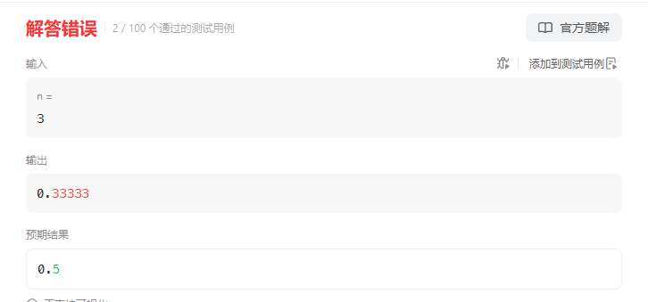
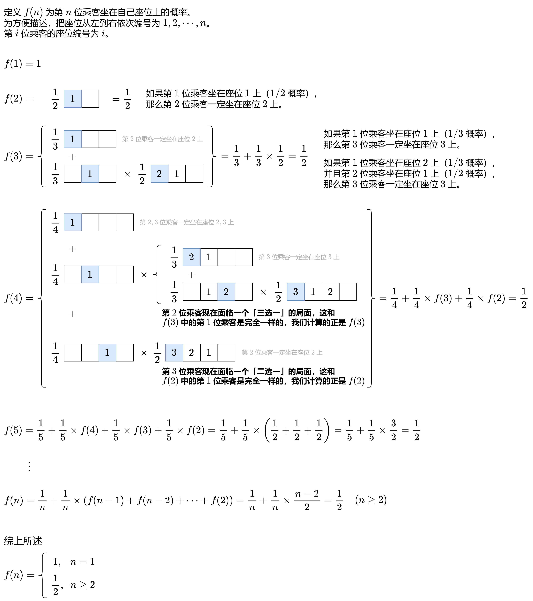

# 1227飞机座位分配概率（中等）

[1227. 飞机座位分配概率 - 力扣（LeetCode）](https://leetcode.cn/problems/airplane-seat-assignment-probability/description/)

## 题目描述

有 `n` 位乘客即将登机，飞机正好有 `n` 个座位。第一位乘客的票丢了，他随便选了一个座位坐下。

剩下的乘客将会：

- 如果他们自己的座位还空着，就坐到自己的座位上，
- 当他们自己的座位被占用时，随机选择其他座位

第 `n` 位乘客坐在自己的座位上的概率是多少？

 

**示例 1：**

```
输入：n = 1
输出：1.00000
解释：第一个人只会坐在自己的位置上。
```

**示例 2：**

```
输入: n = 2
输出: 0.50000
解释：在第一个人选好座位坐下后，第二个人坐在自己的座位上的概率是 0.5。
```

 

**提示：**

- `1 <= n <= 10^5`

## 我的C++解法

这是一个数学概率问题，条件概率

要想最后一个乘客坐在自己的位置上，那就需要其他的n-1位都不坐在最后一个乘客的位置上。

先举例三个人的情况，总共3个座位，总共有A33 = 6种座位方式，其中前两位只坐在前两个座位的情况有两种，因此结果是2/6=0.3333

四个人的情况：A33/A44

五个人：A44/A55

因此本问题的解就是1/N

```cpp
class Solution {
public:
    double nthPersonGetsNthSeat(int n) {
        return double(1.0/n);
    }
};
```

结果：



看了答案之后发现我少考虑了，当没有人占用自己的座位的时候，大家还是坐自己的位置。

## C++参考答案

点击图片放大查看：



```cpp
class Solution {
public:
    double nthPersonGetsNthSeat(int n) {
        return n == 1 ? 1 : 0.5;
    }
};
```

结果：


## C++收获


## 我的python解答


## python参考答案

```py
class Solution:
    def nthPersonGetsNthSeat(self, n: int) -> float:
        return 1 if n == 1 else 0.5
```

结果：


## python收获