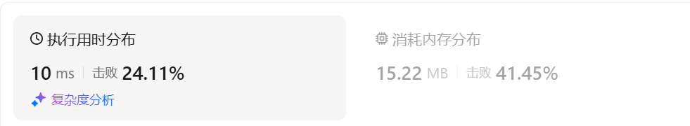
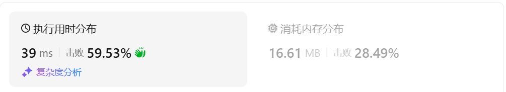

# 1929数组串联

[1929. 数组串联 - 力扣（LeetCode）](https://leetcode.cn/problems/concatenation-of-array/description/)

## 题目描述

给你一个长度为 `n` 的整数数组 `nums` 。请你构建一个长度为 `2n` 的答案数组 `ans` ，数组下标 **从 0 开始计数** ，对于所有 `0 <= i < n` 的 `i` ，满足下述所有要求：

- `ans[i] == nums[i]`
- `ans[i + n] == nums[i]`

具体而言，`ans` 由两个 `nums` 数组 **串联** 形成。

返回数组 `ans` 。

 

**示例 1：**

```
输入：nums = [1,2,1]
输出：[1,2,1,1,2,1]
解释：数组 ans 按下述方式形成：
- ans = [nums[0],nums[1],nums[2],nums[0],nums[1],nums[2]]
- ans = [1,2,1,1,2,1]
```

**示例 2：**

```
输入：nums = [1,3,2,1]
输出：[1,3,2,1,1,3,2,1]
解释：数组 ans 按下述方式形成：
- ans = [nums[0],nums[1],nums[2],nums[3],nums[0],nums[1],nums[2],nums[3]]
- ans = [1,3,2,1,1,3,2,1]
```

 

**提示：**

- `n == nums.length`
- `1 <= n <= 1000`
- `1 <= nums[i] <= 1000`

## 我的C++解法

直接拼接

```cpp
class Solution {
public:
    vector<int> getConcatenation(vector<int>& nums) {
        int n = nums.size();
        for (int i = 0; i < n; ++i){
            nums.push_back(nums[i]);
        }
        return nums;
    }
};
```

结果：




## C++参考答案


## C++收获


## 我的python解答

```python
class Solution:
    def getConcatenation(self, nums: List[int]) -> List[int]:
        nums.extend(nums)
        return nums
```

结果：


```python
class Solution:
    def getConcatenation(self, nums: List[int]) -> List[int]:
        return nums+nums
```

结果：



## python参考答案


## python收获