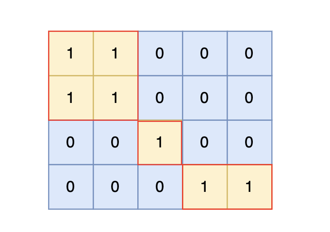

# 99岛屿数量

[99. 岛屿数量 (kamacoder.com)](https://kamacoder.com/problempage.php?pid=1171)

## 题目描述

###### 题目描述

给定一个由 1（陆地）和 0（水）组成的矩阵，你需要计算岛屿的数量。岛屿由水平方向或垂直方向上相邻的陆地连接而成，并且四周都是水域。你可以假设矩阵外均被水包围。

###### 输入描述

第一行包含两个整数 N, M，表示矩阵的行数和列数。

后续 N 行，每行包含 M 个数字，数字为 1 或者 0。

###### 输出描述

输出一个整数，表示岛屿的数量。如果不存在岛屿，则输出 0。

###### 输入示例

```
4 5
1 1 0 0 0
1 1 0 0 0
0 0 1 0 0
0 0 0 1 1
```

###### 输出示例

```
3
```

###### 提示信息




根据测试案例中所展示，岛屿数量共有 3 个，所以输出 3。


**数据范围：**

1 <= N, M <= 50

## 我的C++解法

之前学到了一点是不用再额外开辟一个二维数组保存是否访问过，直接在原数组上进行变化，把1变成2即可，0直接不访问。

```cpp
#include <iostream>
#include <vector>
using namespace std;
void bfs(vector<vector<int>>& island,int i,int j, int n, int m){
    if(i<0 || i>=n || j<0 || j>=m){
        return;
    }
    if(island[i][j] == 1){
        island[i][j] = 2;
        bfs(island,i-1,j,n,m);
        bfs(island,i+1,j,n,m);
        bfs(island,i,j-1,n,m);
        bfs(island,i,j+1,n,m);
        return;
    }
    return;
}

int main(){
    int n;// 行数
    int m;// 列数
    cin>>n>>m;
    vector<vector<int>> island(n,vector<int>(m,0));
    for(int i=0;i<n;i++){
        for(int j=0;j<m;j++){
            cin>>island[i][j];
        }
    }
    int ans=0;
    // 访问一个点之后只能向上下左右四个方向延申；之前学到的一个知识：如果当前元素为1，访问过之后则变为2
    for(int i=0;i<n;i++){
        for(int j=0;j<m;j++){
            if(island[i][j]==1){
                bfs(island,i,j,n,m);
                ans++;
            }
        }
    }
    std::cout << ans << std::endl;
}
```

结果：


## C++参考答案

### 深度优先搜索

```cpp
#include <iostream>
#include <vector>
using namespace std;

int dir[4][2] = {0, 1, 1, 0, -1, 0, 0, -1}; // 四个方向
void dfs(const vector<vector<int>>& grid, vector<vector<bool>>& visited, int x, int y) {
    for (int i = 0; i < 4; i++) {
        int nextx = x + dir[i][0];
        int nexty = y + dir[i][1];
        if (nextx < 0 || nextx >= grid.size() || nexty < 0 || nexty >= grid[0].size()) continue;  // 越界了，直接跳过
        if (!visited[nextx][nexty] && grid[nextx][nexty] == 1) { // 没有访问过的 同时 是陆地的

            visited[nextx][nexty] = true;
            dfs(grid, visited, nextx, nexty);
        }
    }
}

int main() {
    int n, m;
    cin >> n >> m;
    vector<vector<int>> grid(n, vector<int>(m, 0));
    for (int i = 0; i < n; i++) {
        for (int j = 0; j < m; j++) {
            cin >> grid[i][j];
        }
    }

    vector<vector<bool>> visited(n, vector<bool>(m, false));

    int result = 0;
    for (int i = 0; i < n; i++) {
        for (int j = 0; j < m; j++) {
            if (!visited[i][j] && grid[i][j] == 1) {
                visited[i][j] = true;
                result++; // 遇到没访问过的陆地，+1
                dfs(grid, visited, i, j); // 将与其链接的陆地都标记上 true
            }
        }
    }

    cout << result << endl;
}
```

```cpp
#include <iostream>
#include <vector>
using namespace std;
int dir[4][2] = {0, 1, 1, 0, -1, 0, 0, -1}; // 四个方向
void dfs(const vector<vector<int>>& grid, vector<vector<bool>>& visited, int x, int y) {
    if (visited[x][y] || grid[x][y] == 0) return; // 终止条件：访问过的节点 或者 遇到海水
    visited[x][y] = true; // 标记访问过
    for (int i = 0; i < 4; i++) {
        int nextx = x + dir[i][0];
        int nexty = y + dir[i][1];
        if (nextx < 0 || nextx >= grid.size() || nexty < 0 || nexty >= grid[0].size()) continue;  // 越界了，直接跳过
        dfs(grid, visited, nextx, nexty);
    }
}

int main() {
    int n, m;
    cin >> n >> m;
    vector<vector<int>> grid(n, vector<int>(m, 0));
    for (int i = 0; i < n; i++) {
        for (int j = 0; j < m; j++) {
            cin >> grid[i][j];
        }
    }

    vector<vector<bool>> visited(n, vector<bool>(m, false));

    int result = 0;
    for (int i = 0; i < n; i++) {
        for (int j = 0; j < m; j++) {
            if (!visited[i][j] && grid[i][j] == 1) {
                result++; // 遇到没访问过的陆地，+1
                dfs(grid, visited, i, j); // 将与其链接的陆地都标记上 true
            }
        }
    }
    cout << result << endl;
}
```

**版本一的写法**是 ：下一个节点是否能合法已经判断完了，传进dfs函数的就是合法节点。

**版本二的写法**是：不管节点是否合法，上来就dfs，然后在终止条件的地方进行判断，不合法再return。

**理论上来讲，版本一的效率更高一些**，因为避免了 没有意义的递归调用，在调用dfs之前，就做合法性判断。 但从写法来说，可能版本二 更利于理解一些。（不过其实都差不太多）

## C++收获


## 我的python解答

```python
n,m = map(int,input().split())
island = [[0]*m for _ in range(n)]
for i in range(n):
    island[i] = list(map(int,input().split()))
    
def bfs(island,i,j,n,m):
    if i<0 or i>=n or j<0 or j>=m:
        return
    elif island[i][j]==1:
        island[i][j] = 2
        bfs(island,i-1,j,n,m)
        bfs(island,i+1,j,n,m)
        bfs(island,i,j-1,n,m)
        bfs(island,i,j+1,n,m)
        return
    return
ans = 0
for i in range(n):
    for j in range(m):
        if island[i][j]==1:
            ans += 1
            bfs(island,i,j,n,m)
print(ans)
```

结果：


## python参考答案

### 深度优先搜索

```python
direction = [[0, 1], [1, 0], [0, -1], [-1, 0]]  # 四个方向：上、右、下、左


def dfs(grid, visited, x, y):
    """
    对一块陆地进行深度优先遍历并标记
    """
    for i, j in direction:
        next_x = x + i
        next_y = y + j
        # 下标越界，跳过
        if next_x < 0 or next_x >= len(grid) or next_y < 0 or next_y >= len(grid[0]):
            continue
        # 未访问的陆地，标记并调用深度优先搜索
        if not visited[next_x][next_y] and grid[next_x][next_y] == 1:
            visited[next_x][next_y] = True
            dfs(grid, visited, next_x, next_y)


if __name__ == '__main__':  
    # 版本一
    n, m = map(int, input().split())
    
    # 邻接矩阵
    grid = []
    for i in range(n):
        grid.append(list(map(int, input().split())))
    
    # 访问表
    visited = [[False] * m for _ in range(n)]
    
    res = 0
    for i in range(n):
        for j in range(m):
            # 判断：如果当前节点是陆地，res+1并标记访问该节点，使用深度搜索标记相邻陆地。
            if grid[i][j] == 1 and not visited[i][j]:
                res += 1
                visited[i][j] = True
                dfs(grid, visited, i, j)
    
    print(res)
```

```python
direction = [[0, 1], [1, 0], [0, -1], [-1, 0]]  # 四个方向：上、右、下、左


def dfs(grid, visited, x, y):
    """
    对一块陆地进行深度优先遍历并标记
    """
    # 与版本一的差别，在调用前增加判断终止条件
    if visited[x][y] or grid[x][y] == 0:
        return
    visited[x][y] = True

    for i, j in direction:
        next_x = x + i
        next_y = y + j
        # 下标越界，跳过
        if next_x < 0 or next_x >= len(grid) or next_y < 0 or next_y >= len(grid[0]):
            continue
        # 由于判断条件放在了方法首部，此处直接调用dfs方法
        dfs(grid, visited, next_x, next_y)


if __name__ == '__main__':
    # 版本二
    n, m = map(int, input().split())

    # 邻接矩阵
    grid = []
    for i in range(n):
        grid.append(list(map(int, input().split())))

    # 访问表
    visited = [[False] * m for _ in range(n)]

    res = 0
    for i in range(n):
        for j in range(m):
            # 判断：如果当前节点是陆地，res+1并标记访问该节点，使用深度搜索标记相邻陆地。
            if grid[i][j] == 1 and not visited[i][j]:
                res += 1
                dfs(grid, visited, i, j)

    print(res)
```

## python收获