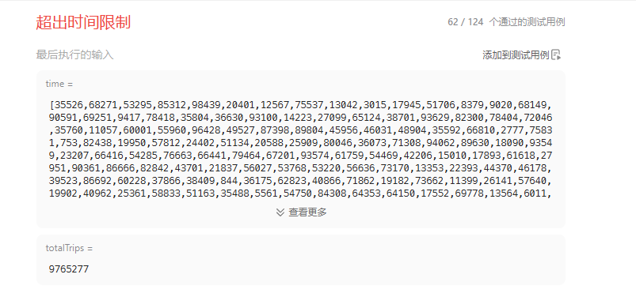

# 2187完成旅途的最少时间（中等）

[2187. 完成旅途的最少时间 - 力扣（LeetCode）](https://leetcode.cn/problems/minimum-time-to-complete-trips/description/)

## 题目描述

给你一个数组 `time` ，其中 `time[i]` 表示第 `i` 辆公交车完成 **一趟****旅途** 所需要花费的时间。

每辆公交车可以 **连续** 完成多趟旅途，也就是说，一辆公交车当前旅途完成后，可以 **立马开始** 下一趟旅途。每辆公交车 **独立** 运行，也就是说可以同时有多辆公交车在运行且互不影响。

给你一个整数 `totalTrips` ，表示所有公交车 **总共** 需要完成的旅途数目。请你返回完成 **至少** `totalTrips` 趟旅途需要花费的 **最少** 时间。

 

**示例 1：**

```
输入：time = [1,2,3], totalTrips = 5
输出：3
解释：
- 时刻 t = 1 ，每辆公交车完成的旅途数分别为 [1,0,0] 。
  已完成的总旅途数为 1 + 0 + 0 = 1 。
- 时刻 t = 2 ，每辆公交车完成的旅途数分别为 [2,1,0] 。
  已完成的总旅途数为 2 + 1 + 0 = 3 。
- 时刻 t = 3 ，每辆公交车完成的旅途数分别为 [3,1,1] 。
  已完成的总旅途数为 3 + 1 + 1 = 5 。
所以总共完成至少 5 趟旅途的最少时间为 3 。
```

**示例 2：**

```
输入：time = [2], totalTrips = 1
输出：2
解释：
只有一辆公交车，它将在时刻 t = 2 完成第一趟旅途。
所以完成 1 趟旅途的最少时间为 2 。
```

 

**提示：**

- `1 <= time.length <= 105`
- `1 <= time[i], totalTrips <= 107`

## 我的C++解法

直接暴力，必然超时

```cpp
class Solution {
public:
    long long minimumTime(vector<int>& time, int totalTrips) {
        // 这是一个数学问题
        // 当时间t除以time中的每一个数得到的整数表示走的趟数
        // 暴力解法就是遍历t，逐个求除法，求和，直到到达totalTrips
        sort(time.begin(),time.end());
        int maxtimes = totalTrips*time[0];
        int left = totalTrips%time[0];
        if(left==1) maxtimes+=1;
        long long ans= 0;
        for(int i=1;i<=maxtimes;i++){
            int tmp=0;
            for(int x:time){
                tmp+=(i/x);
            }
            if(tmp>=totalTrips){
                ans = i;
                break;
            }
        }
        return ans;
    }
};
```

结果：



## C++参考答案

二分

时间越多，可以完成的旅途也就越多，有**单调性**，可以**二分答案**。

问题变成：

- 每辆车都用时 *x*，总共能完成多少趟旅途？能否达到 *totalTrips*？

根据题意，我们可以完成$\sum^{n-1}_{i=0}\lfloor\frac{x}{time[i]}\rfloor$趟旅途，将它与 *totalTrips* 比较，如果比 *totalTrips* 小，说明二分的答案小了，更新二分区间左端点 *left*，否则更新二分区间右端点 *right*。


```cpp
class Solution {
public:
    long long minimumTime(vector<int>& time, int totalTrips) {
        auto check = [&](long long x) -> bool {
            long long sum = 0;
            for (int t : time) {
                sum += x / t;
                if (sum >= totalTrips) {
                    return true;
                }
            }
            return false;
        };

        auto [min_t, max_t] = ranges::minmax(time);
        int avg = (totalTrips - 1) / time.size() + 1;
        // 循环不变量：check(left) 恒为 false
        long long left = (long long) min_t * avg - 1;
        // 循环不变量：check(right) 恒为 true
        long long right = min((long long) max_t * avg, (long long) min_t * totalTrips);
        while (left + 1 < right) { // 开区间 (left, right) 不为空
            long long mid = (left + right) / 2;
            (check(mid) ? right : left) = mid;
        }
        // 此时 left 等于 right-1
        // check(left) = false 且 check(right) = true，所以答案是 right
        return right; // 最小的 true
    }
};
```

结果：


## C++收获


## 我的python解答

```python
class Solution:
    def minimumTime(self, time: List[int], totalTrips: int) -> int:
        time.sort()
        maxtimes = time[0] * totalTrips
        ans = 0
        for i in range(time[0],totalTrips+1):
            tmp = 0
            for x in time:
                tmp += (i//x)
                if tmp>=totalTrips:
                    ans = i
                    break
            if ans:
                return ans
        return ans
```

直接错误了都

## python参考答案

```py
class Solution:
    def minimumTime(self, time: List[int], totalTrips: int) -> int:
        min_t = min(time)
        avg = (totalTrips - 1) // len(time) + 1
        left = min_t * avg - 1  # 循环不变量：sum >= totalTrips 恒为 False
        right = min(max(time) * avg, min_t * totalTrips)  # 循环不变量：sum >= totalTrips 恒为 True
        while left + 1 < right:  # 开区间 (left, right) 不为空
            mid = (left + right) // 2
            if sum(mid // t for t in time) >= totalTrips:
                right = mid  # 缩小二分区间为 (left, mid)
            else:
                left = mid  # 缩小二分区间为 (mid, right)
        # 此时 left 等于 right-1
        # sum(left) < totalTrips 且 sum(right) >= totalTrips，所以答案是 right
        return right
```

结果：


```py
class Solution:
    def minimumTime(self, time: List[int], totalTrips: int) -> int:
        f = lambda x: sum(x // t for t in time)
        min_t = min(time)
        avg = (totalTrips - 1) // len(time) + 1
        # bisect_left 需要用左闭右开区间
        left = min_t * avg
        right = min(max(time) * avg, min_t * totalTrips)
        return bisect_left(range(right), totalTrips, left, key=f)
```

结果：


## python收获