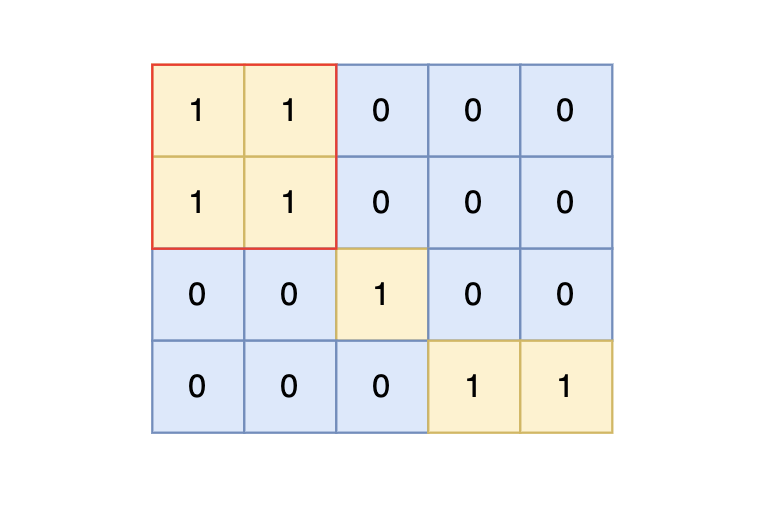

# 100岛屿的最大面积

[100. 岛屿的最大面积 (kamacoder.com)](https://kamacoder.com/problempage.php?pid=1172)

## 题目描述

###### 题目描述

给定一个由 1（陆地）和 0（水）组成的矩阵，计算岛屿的最大面积。岛屿面积的计算方式为组成岛屿的陆地的总数。岛屿由水平方向或垂直方向上相邻的陆地连接而成，并且四周都是水域。你可以假设矩阵外均被水包围。

###### 输入描述

第一行包含两个整数 N, M，表示矩阵的行数和列数。后续 N 行，每行包含 M 个数字，数字为 1 或者 0，表示岛屿的单元格。

###### 输出描述

输出一个整数，表示岛屿的最大面积。如果不存在岛屿，则输出 0。

###### 输入示例

```
4 5
1 1 0 0 0
1 1 0 0 0
0 0 1 0 0
0 0 0 1 1
```

###### 输出示例

```
4
```

###### 提示信息




样例输入中，岛屿的最大面积为 4。


数据范围：

1 <= M, N <= 50。

## 我的C++解法

```cpp
#include <iostream>
#include <vector>
using namespace std;

// void dfs(vector<vector<int>>& island,int i,int j,int n, int m,int& area,int& ans){
//     // 深度优先搜索
//     if(i<0 || j<0 || i>=n || j>=m || island[i][j]!=1){
//         if(ans<area)    ans = area;
//         area=0;
//         return;
//     }
//     for(int a=i;a<n;a++){
//         for(int b=j;b<m;b++){
//             if(island[a][b]==1){
//                 area+=1;
//                 island[a][b] = 2;
//                 dfs(island,a+1,b,n,m,area,ans);
//                 dfs(island,a-1,b,n,m,area,ans);
//                 dfs(island,a,b-1,n,m,area,ans);
//                 dfs(island,a,b+1,n,m,area,ans);
//             }
//         }
//     }
//     return;
// }
int dfs(vector<vector<int>>&island,int i,int j,int n,int m){
    if(i<0 || j<0 || i>=n || j>=m || island[i][j]!=1){
        return 0;
    }
    island[i][j] = 2;
    int area = 1;
    area += dfs(island,i+1,j,n,m);
    area += dfs(island,i-1,j,n,m);
    area += dfs(island,i,j-1,n,m);
    area += dfs(island,i,j+1,n,m);
    return area;
}

int main(){
    // 和99计算岛屿的个数很想，只不过这个要维护一个最大值。
    int n,m;
    cin>>n>>m;
    vector<vector<int>> island(n,vector<int>(m,0));
    for(int i=0;i<n;i++){
        for(int j=0;j<m;j++){
            cin>>island[i][j];
        }
    }
    int ans = 0;
    for(int i=0;i<n;i++){
        for(int j=0;j<m;j++){
            if(island[i][j]==1){
                int area = dfs(island,i,j,n,m);
                if(ans<area)    ans = area;
            }
        }
    }
    cout<< ans << endl;
}
```

结果：


广度优先

```cpp
#include <iostream>
#include <vector>
#include <queue>
using namespace std;

int bfs(vector<vector<int>>& island,queue<pair<int,int>>& que,int i, int j ,int n ,int m){
    // 广度优先遍历
    if(i<0 || j<0 || i>=n || j>=m || island[i][j]!=1){
        return 0;
    }
    int area = 0;
    island[i][j] = 2;
    que.push(make_pair(i,j));
    while(!que.empty()){
        auto out = que.front();
        que.pop();
        area ++;
        int a=out.first;
        int b=out.second;
        if(a-1>=0 && island[a-1][b]==1){
            island[a-1][b]=2;
            que.push(make_pair(a-1,b));
        }
        if(a+1<n && island[a+1][b]==1){
            island[a+1][b]=2;
            que.push(make_pair(a+1,b));
        }
        if(b-1>=0 && island[a][b-1]==1){
            island[a][b-1]=2;
            que.push(make_pair(a,b-1));
        }
        if(b+1<n && island[a][b+1]==1){
            island[a][b+1]=2;
            que.push(make_pair(a,b+1));
        }        
    }
    return area;
    
}

int main(){
    // 和99计算岛屿的个数很想，只不过这个要维护一个最大值。
    queue<pair<int,int>> que;
    int n,m;
    cin>>n>>m;
    vector<vector<int>> island(n,vector<int>(m,0));
    for(int i=0;i<n;i++){
        for(int j=0;j<m;j++){
            cin>>island[i][j];
        }
    }
    int ans = 0;
    for(int i=0;i<n;i++){
        for(int j=0;j<m;j++){
            if(island[i][j]==1){
                // int area = dfs(island,i,j,n,m);
                int area = bfs(island,que,i,j,n,m);
                if(ans<area)    ans = area;
            }
        }
    }
    cout<< ans << endl;
}
```

错误了，遇到实例

```txt
1 30
0 1 1 1 0 0 0 1 0 0 1 0 1 0 1 0 1 0 1 0 0 0 1 0 1 0 0 0 0 0
```

输出的是1而不是3，为什么？感觉哪都对啊

我是↑↓，第32行的判断条件写成n了，改成M就好了，结果：


## C++参考答案

### DFS

写法一，dfs只处理下一个节点，即在主函数遇到岛屿就计数为1，dfs处理接下来的相邻陆地

```cpp
// 版本一
#include <iostream>
#include <vector>
using namespace std;
int count;
int dir[4][2] = {0, 1, 1, 0, -1, 0, 0, -1}; // 四个方向
void dfs(vector<vector<int>>& grid, vector<vector<bool>>& visited, int x, int y) {
    for (int i = 0; i < 4; i++) {
        int nextx = x + dir[i][0];
        int nexty = y + dir[i][1];
        if (nextx < 0 || nextx >= grid.size() || nexty < 0 || nexty >= grid[0].size()) continue;  // 越界了，直接跳过
        if (!visited[nextx][nexty] && grid[nextx][nexty] == 1) { // 没有访问过的 同时 是陆地的
            visited[nextx][nexty] = true;
            count++;
            dfs(grid, visited, nextx, nexty);
        }
    }
}

int main() {
    int n, m;
    cin >> n >> m;
    vector<vector<int>> grid(n, vector<int>(m, 0));
    for (int i = 0; i < n; i++) {
        for (int j = 0; j < m; j++) {
            cin >> grid[i][j];
        }
    }
    vector<vector<bool>> visited(n, vector<bool>(m, false));
    int result = 0;
    for (int i = 0; i < n; i++) {
        for (int j = 0; j < m; j++) {
            if (!visited[i][j] && grid[i][j] == 1) {
                count = 1;  // 因为dfs处理下一个节点，所以这里遇到陆地了就先计数，dfs处理接下来的相邻陆地
                visited[i][j] = true;
                dfs(grid, visited, i, j); // 将与其链接的陆地都标记上 true
                result = max(result, count);
            }
        }
    }
    cout << result << endl;

}
```

写法二，dfs处理当前节点，即在主函数遇到岛屿就计数为0，dfs处理接下来的全部陆地

```cpp
// 版本二
#include <iostream>
#include <vector>
using namespace std;

int count;
int dir[4][2] = {0, 1, 1, 0, -1, 0, 0, -1}; // 四个方向
void dfs(vector<vector<int>>& grid, vector<vector<bool>>& visited, int x, int y) {
    if (visited[x][y] || grid[x][y] == 0) return; // 终止条件：访问过的节点 或者 遇到海水
    visited[x][y] = true; // 标记访问过
    count++;
    for (int i = 0; i < 4; i++) {
        int nextx = x + dir[i][0];
        int nexty = y + dir[i][1];
        if (nextx < 0 || nextx >= grid.size() || nexty < 0 || nexty >= grid[0].size()) continue;  // 越界了，直接跳过
        dfs(grid, visited, nextx, nexty);
    }
}

int main() {
    int n, m;
    cin >> n >> m;
    vector<vector<int>> grid(n, vector<int>(m, 0));
    for (int i = 0; i < n; i++) {
        for (int j = 0; j < m; j++) {
            cin >> grid[i][j];
        }
    }
    vector<vector<bool>> visited = vector<vector<bool>>(n, vector<bool>(m, false));
    int result = 0;
    for (int i = 0; i < n; i++) {
        for (int j = 0; j < m; j++) {
            if (!visited[i][j] && grid[i][j] == 1) {
                count = 0; // 因为dfs处理当前节点，所以遇到陆地计数为0，进dfs之后在开始从1计数
                dfs(grid, visited, i, j); // 将与其链接的陆地都标记上 true
                result = max(result, count);
            }
        }
    }
    cout << result << endl;
}
```

### BFS

```cpp
class Solution {
private:
    int count;
    int dir[4][2] = {0, 1, 1, 0, -1, 0, 0, -1}; // 四个方向
    void bfs(vector<vector<int>>& grid, vector<vector<bool>>& visited, int x, int y) {
        queue<int> que;
        que.push(x);
        que.push(y);
        visited[x][y] = true; // 加入队列就意味节点是陆地可到达的点
        count++;
        while(!que.empty()) {
            int xx = que.front();que.pop();
            int yy = que.front();que.pop();
            for (int i = 0 ;i < 4; i++) {
                int nextx = xx + dir[i][0];
                int nexty = yy + dir[i][1];
                if (nextx < 0 || nextx >= grid.size() || nexty < 0 || nexty >= grid[0].size()) continue; // 越界
                if (!visited[nextx][nexty] && grid[nextx][nexty] == 1) { // 节点没有被访问过且是陆地
                    visited[nextx][nexty] = true;
                    count++;
                    que.push(nextx);
                    que.push(nexty);
                }
            }
        }
    }

public:
    int maxAreaOfIsland(vector<vector<int>>& grid) {
        int n = grid.size(), m = grid[0].size();
        vector<vector<bool>> visited = vector<vector<bool>>(n, vector<bool>(m, false));
        int result = 0;
        for (int i = 0; i < n; i++) {
            for (int j = 0; j < m; j++) {
                if (!visited[i][j] && grid[i][j] == 1) {
                    count = 0;
                    bfs(grid, visited, i, j); // 将与其链接的陆地都标记上 true
                    result = max(result, count);
                }
            }
        }
        return result;
    }
};
```

## C++收获


## 我的python解答

```python
n,m = map(int,input().split())
island = [[0]*m for _ in range(n)]
for i in range(n):
    island[i]=list(map(int,input().split()))
def dfs(i,j):
    if i<0 or j<0 or i>=n or j>=m or island[i][j]!=1:
        return 0
    area = 1
    island[i][j] = 2
    area += dfs(i-1,j)
    area += dfs(i,j-1)
    area += dfs(i+1,j)
    area += dfs(i,j+1)
    return area
ans = 0
for i in range(n):
    for j in range(m):
        ans = max(ans,dfs(i,j))
print(ans)
```

结果：


## python参考答案

```python
# 四个方向
position = [[0, 1], [1, 0], [0, -1], [-1, 0]]
count = 0


def dfs(grid, visited, x, y):
    """
    深度优先搜索，对一整块陆地进行标记
    """
    global count  # 定义全局变量，便于传递count值
    for i, j in position:
        cur_x = x + i
        cur_y = y + j
        # 下标越界，跳过
        if cur_x < 0 or cur_x >= len(grid) or cur_y < 0 or cur_y >= len(grid[0]):
            continue
        if not visited[cur_x][cur_y] and grid[cur_x][cur_y] == 1:
            visited[cur_x][cur_y] = True
            count += 1
            dfs(grid, visited, cur_x, cur_y)


n, m = map(int, input().split())
# 邻接矩阵
grid = []
for i in range(n):
    grid.append(list(map(int, input().split())))
# 访问表
visited = [[False] * m for _ in range(n)]

result = 0  # 记录最终结果
for i in range(n):
    for j in range(m):
        if grid[i][j] == 1 and not visited[i][j]:
            count = 1
            visited[i][j] = True
            dfs(grid, visited, i, j)
            result = max(count, result)

print(result)
```

```python
from collections import deque

position = [[0, 1], [1, 0], [0, -1], [-1, 0]]  # 四个方向
count = 0


def bfs(grid, visited, x, y):
    """
    广度优先搜索对陆地进行标记
    """
    global count  # 声明全局变量
    que = deque()
    que.append([x, y])
    while que:
        cur_x, cur_y = que.popleft()
        for i, j in position:
            next_x = cur_x + i
            next_y = cur_y + j
            # 下标越界，跳过
            if next_x < 0 or next_x >= len(grid) or next_y < 0 or next_y >= len(grid[0]):
                continue
            if grid[next_x][next_y] == 1 and not visited[next_x][next_y]:
                visited[next_x][next_y] = True
                count += 1
                que.append([next_x, next_y])


n, m = map(int, input().split())
# 邻接矩阵
grid = []
for i in range(n):
    grid.append(list(map(int, input().split())))
visited = [[False] * m for _ in range(n)]  # 访问表

result = 0  # 记录最终结果
for i in range(n):
    for j in range(m):
        if grid[i][j] == 1 and not visited[i][j]:
            count = 1
            visited[i][j] = True
            bfs(grid, visited, i, j)
            res = max(result, count)

print(result)
```

## python收获