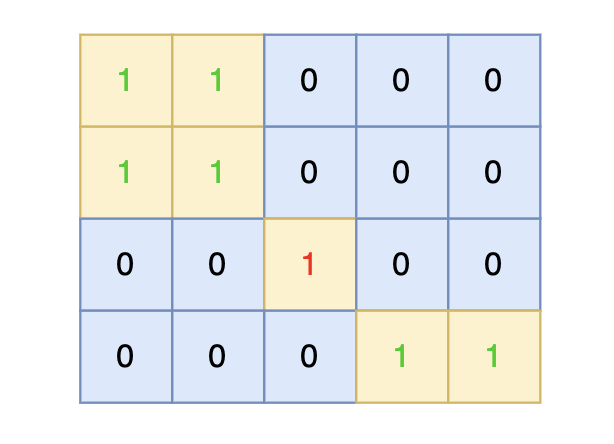

# 101孤岛的总面积

[101. 孤岛的总面积 (kamacoder.com)](https://kamacoder.com/problempage.php?pid=1173)

## 题目描述

###### 题目描述

给定一个由 1（陆地）和 0（水）组成的矩阵，岛屿指的是由水平或垂直方向上相邻的陆地单元格组成的区域，且完全被水域单元格包围。孤岛是那些位于矩阵内部、所有单元格都不接触边缘的岛屿。


现在你需要计算所有孤岛的总面积，岛屿面积的计算方式为组成岛屿的陆地的总数。

###### 输入描述

第一行包含两个整数 N, M，表示矩阵的行数和列数。之后 N 行，每行包含 M 个数字，数字为 1 或者 0。

###### 输出描述

输出一个整数，表示所有孤岛的总面积，如果不存在孤岛，则输出 0。

###### 输入示例

```
4 5
1 1 0 0 0
1 1 0 0 0
0 0 1 0 0
0 0 0 1 1
```

###### 输出示例

```
1
```

###### 提示信息




在矩阵中心部分的岛屿，因为没有任何一个单元格接触到矩阵边缘，所以该岛屿属于孤岛，总面积为 1。


数据范围：

1 <= M, N <= 50。

## 我的C++解法

### 深度优先搜索

中间注释的就是早期的想法，这样的话得到的结果会更大，因此先遍历边缘，把和边缘相连的岛屿变为2，不计入ans中，就可以了。

```cpp
#include <iostream>
#include <vector>
using namespace std;
int dfs(vector<vector<int>>& island,int i,int j,int n,int m){
    if(i<0 || j<0 || i>=n || j>=m || island[i][j]!=1){
        return 0;
    }
    int area = 1;
    island[i][j] = 2;
    area += dfs(island,i-1,j,n,m);
    area += dfs(island,i+1,j,n,m);
    area += dfs(island,i,j-1,n,m);
    area += dfs(island,i,j+1,n,m);
    return area;
}
int main(){
    int n,m;
    cin>>n>>m;
    vector<vector<int>> island(n,vector<int>(m,0));
    for(int i=0;i<n;i++){
        for(int j=0;j<m;j++){
            cin>>island[i][j];
        }
    }
    int ans = 0;
    // bool is_alone = false;
    // for(int i=0;i<n;i++){
    //     // i==0 || i==n-1 ? is_alone=false:is_alone=true;
    //     for(int j=0;j<m;j++){
    //         is_alone = (i==0 || i==n-1 || j==0 || j==m-1)? false:true;
    //         if(island[i][j]==1){
    //             ans += dfs(island,i,j,n,m,is_alone);
    //         }
    //     }
    // }
    for(int i=0;i<n;i++){
        dfs(island,i,0,n,m);
        dfs(island,i,m-1,n,m);
    }
    for(int j=0;j<m;j++){
        dfs(island,0,j,n,m);
        dfs(island,n-1,j,n,m);
    }
    for(int i=1;i<n-1;i++){
        for(int j=1;j<m-1;j++){
            if(island[i][j]==1){
                ans += dfs(island,i,j,n,m);
            }
        }
    }
    
    cout<<ans<<endl;
}
```

结果：


## C++参考答案

```cpp
#include <iostream>
#include <vector>
using namespace std;
int dir[4][2] = {-1, 0, 0, -1, 1, 0, 0, 1}; // 保存四个方向
int count; // 统计符合题目要求的陆地空格数量
void dfs(vector<vector<int>>& grid, int x, int y) {
    grid[x][y] = 0;
    count++;
    for (int i = 0; i < 4; i++) { // 向四个方向遍历
        int nextx = x + dir[i][0];
        int nexty = y + dir[i][1];
        // 超过边界
        if (nextx < 0 || nextx >= grid.size() || nexty < 0 || nexty >= grid[0].size()) continue;
        // 不符合条件，不继续遍历
        if (grid[nextx][nexty] == 0) continue;

        dfs (grid, nextx, nexty);
    }
    return;
}

int main() {
    int n, m;
    cin >> n >> m;
    vector<vector<int>> grid(n, vector<int>(m, 0));
    for (int i = 0; i < n; i++) {
        for (int j = 0; j < m; j++) {
            cin >> grid[i][j];
        }
    }

    // 从左侧边，和右侧边 向中间遍历
    for (int i = 0; i < n; i++) {
        if (grid[i][0] == 1) dfs(grid, i, 0);
        if (grid[i][m - 1] == 1) dfs(grid, i, m - 1);
    }
    // 从上边和下边 向中间遍历
    for (int j = 0; j < m; j++) {
        if (grid[0][j] == 1) dfs(grid, 0, j);
        if (grid[n - 1][j] == 1) dfs(grid, n - 1, j);
    }
    count = 0;
    for (int i = 0; i < n; i++) {
        for (int j = 0; j < m; j++) {
            if (grid[i][j] == 1) dfs(grid, i, j);
        }
    }
    cout << count << endl;
}
```

```cpp
#include <iostream>
#include <vector>
#include <queue>
using namespace std;
int count = 0;
int dir[4][2] = {0, 1, 1, 0, -1, 0, 0, -1}; // 四个方向
void bfs(vector<vector<int>>& grid, int x, int y) {
    queue<pair<int, int>> que;
    que.push({x, y});
    grid[x][y] = 0; // 只要加入队列，立刻标记
    count++;
    while(!que.empty()) {
        pair<int ,int> cur = que.front(); que.pop();
        int curx = cur.first;
        int cury = cur.second;
        for (int i = 0; i < 4; i++) {
            int nextx = curx + dir[i][0];
            int nexty = cury + dir[i][1];
            if (nextx < 0 || nextx >= grid.size() || nexty < 0 || nexty >= grid[0].size()) continue;  // 越界了，直接跳过
            if (grid[nextx][nexty] == 1) {
                que.push({nextx, nexty});
                count++;
                grid[nextx][nexty] = 0; // 只要加入队列立刻标记
            }
        }
    }
}

int main() {
    int n, m;
    cin >> n >> m;
    vector<vector<int>> grid(n, vector<int>(m, 0));
    for (int i = 0; i < n; i++) {
        for (int j = 0; j < m; j++) {
            cin >> grid[i][j];
        }
    }
    // 从左侧边，和右侧边 向中间遍历
    for (int i = 0; i < n; i++) {
        if (grid[i][0] == 1) bfs(grid, i, 0);
        if (grid[i][m - 1] == 1) bfs(grid, i, m - 1);
    }
    // 从上边和下边 向中间遍历
    for (int j = 0; j < m; j++) {
        if (grid[0][j] == 1) bfs(grid, 0, j);
        if (grid[n - 1][j] == 1) bfs(grid, n - 1, j);
    }
    count = 0;
    for (int i = 0; i < n; i++) {
        for (int j = 0; j < m; j++) {
            if (grid[i][j] == 1) bfs(grid, i, j);
        }
    }

    cout << count << endl;
}
```

## C++收获


## 我的python解答

### 深度优先搜索

```python
n,m = map(int,input().split())
island = [[0]*m for _ in range(n)]
for i in range(n):
    island[i] = list(map(int,input().split()))
def dfs(i,j):
    if i<0 or j<0 or i>=n or j>=m or island[i][j]!=1:
        return 0
    area = 1
    island[i][j] = 2
    area += dfs(i-1,j)
    area += dfs(i,j-1)
    area += dfs(i,j+1)
    area += dfs(i+1,j)
    return area
for i in range(n):
    dfs(i,0)
    dfs(i,m-1)
for j in range(m):
    dfs(0,j)
    dfs(n-1,j)
ans = 0
for i in range(1,n-1):
    for j in range(1,m-1):
        if island[i][j]==1:
            ans += dfs(i,j)
print(ans)
```

结果：


## python参考答案

```python
from collections import deque

# 处理输入
n, m = list(map(int, input().strip()))
g = []
for _ in range(n):
    row = list(map(int, input().strip()))
    g.append(row)

# 定义四个方向、孤岛面积（遍历完边缘后会被重置）
directions = [[0,1], [1,0], [-1,0], [0,-1]]
count = 0

# 广搜
def bfs(r, c):
    global count
    q = deque()
    q.append((r, c))
    g[r][c] = 0
    count += 1

    while q:
        r, c = q.popleft()
        for di in directions:
            next_r = r + di[0]
            next_c = c + di[1]
            if next_c < 0 or next_c >= m or next_r < 0 or next_r >= n:
                continue
            if g[next_r][next_c] == 1:
                q.append((next_r, next_c))
                g[next_r][next_c] = 0
                count += 1


for i in range(n):
    if g[i][0] == 1: bfs(i, 0)
    if g[i][m-1] == 1: bfs(i, m-1)

for i in range(m):
    if g[0][i] == 1: bfs(0, i)
    if g[n-1][i] == 1: bfs(n-1, i)

count = 0
for i in range(n):
    for j in range(m):
        if g[i][j] == 1: bfs(i, j)

print(count)
```

## python收获